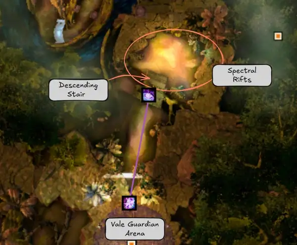
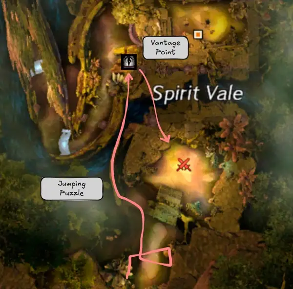
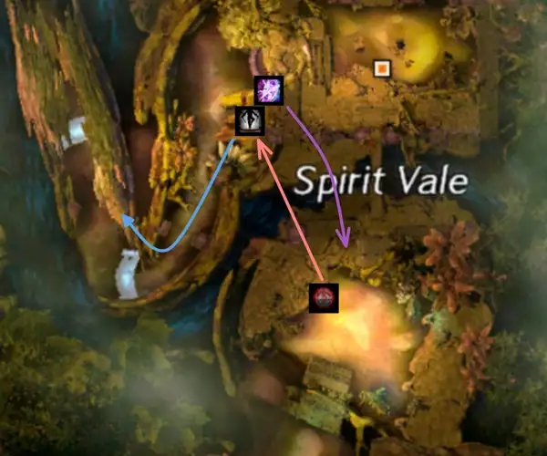
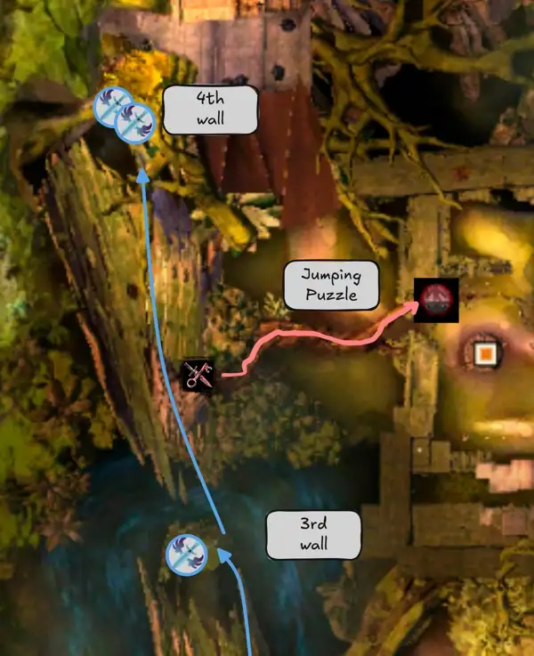
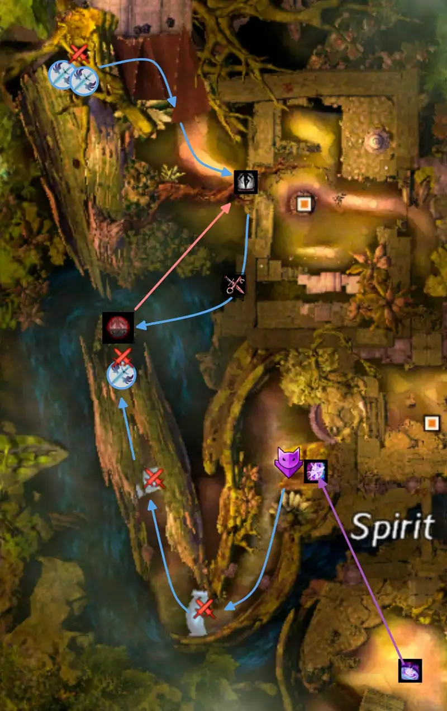
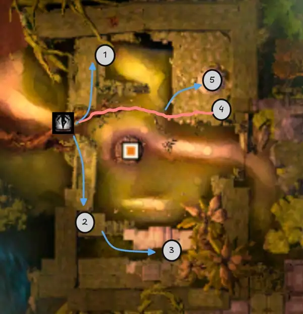
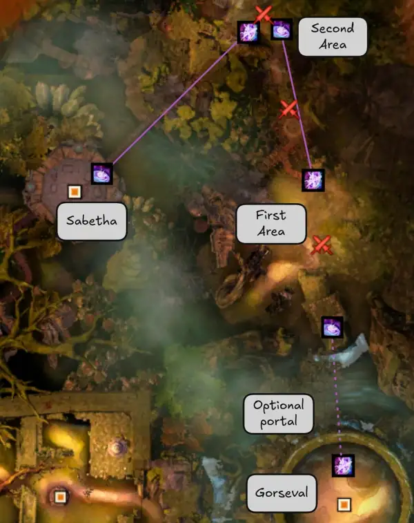
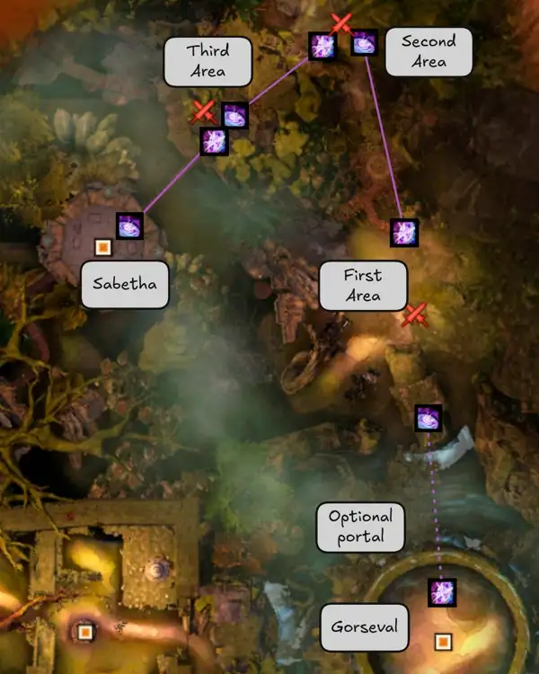

[< Wing 8](../wing-8/){: .btn }  [Return to Home](../index.html){: .btn } [Wing 2 >](../wing-2/){: .btn } 
{: .center}

# Spirit Vale
{: .no_toc}

| **Timer** |  12 minutes 30 seconds |
| **Timer Start** |  On entering combat with [Vale Guardian]. |

<b>Table of Contents</b>

1. TOC
{:toc}

---

Spirit Vale is a transition-heavy wing, with relatively little time spent in combat with bosses. Efficient movement and skips are thus extremely important, as the Infallible timer for this wing is notoriously difficult.

---

#### Main Points
{: .no_toc}

- [Vale Guardian] and [Gorseval] have similar strategies, aiming to keep the boss in the center of the arena and kill all adds in the split phases simultaneously.
- [Spirit Woods] can be heavily optimized using portals and skips.
- Several transitions in and out of bosses are similarly optimized.
- On [Sabetha], it can be worthwhile to ignore cannons based on your healing output, confidence and overall leeway on the timer.

---

## Composition

Spirit Vale compositions bring several classes focused on group mobility and portals. Groups will usually run at least two  [Mesmers] to provide  [Portals] at various points in the wing, flexing them as necessary between heal, boonDPS and DPS. Groups will sometimes run an additional  [Thief] or  [Mesmer] for out-of-bounds skips, with  [Thief] being the easier of the two to execute.

Solo-healing is common on all three bosses, and can be made much easier by supporting the off-heal sub with classes such as  [Luminary] and  [Ritualist]. Common choices for healers include:
-  [Troubadour] for role compression with the  [Mesmer] slot.
-  [Tempest] for its excellent [Seeker] control, often swapping to boonDPS  [Catalyst] after [Vale Guardian].
-  [Druid] for its excellent healing output, utility and seeker control, can struggle to provide boons during [Spirit Woods] due to low incoming damage.
-  [Luminary] also has incredible healing and good seeker control, and can swap to boonDPS after [Vale Guardian].

Stacking sigils such as  [Sigil of Bloodlust](https://wiki.guildwars2.com/wiki/Sigil_of_Bloodlust) or  [Sigil of Cruelty](https://wiki.guildwars2.com/wiki/Sigil_of_Cruelty) are highly recommended. You can stack them during [Spirit Woods], or even before [Vale Guardian] by killing the respawning [Pocket Raptors](https://wiki.guildwars2.com/wiki/Pocket_Raptor) on the cliff to the east before the boss arena.

---

#### Vale Guardian
{: .no_toc}
- Bring at least three  Condition builds to kill the [Red Guardian]. Classes with fast ramp-up, such as   [Willbender], are especially strong.
- Make sure you have enough [Seeker] control:
    -  [Mesmer]:  [Temporal Curtain] and/or  [Illusionary Wave](https://wiki.guildwars2.com/wiki/Illusionary_Wave)
    -  [Ranger]:  [Entangle](https://wiki.guildwars2.com/wiki/Entangle)
    -  [Tempest]:  [Aftershock!](https://wiki.guildwars2.com/wiki/%22Aftershock!%22)
    -  [Guardian]:  [Shield of Absorption](https://wiki.guildwars2.com/wiki/Shield_of_Absorption) and  [Line of Warding](https://wiki.guildwars2.com/wiki/Line_of_Warding)
    - Any class with [Shouts](https://wiki.guildwars2.com/wiki/Shout) can bring  [Relic of the Reaper](https://wiki.guildwars2.com/wiki/Relic_of_the_Reaper)
- This is the most difficult boss to solo-heal due to [Distributed Magic]. Group invulnerability, such as  ["Rebound!"],  ["We Will Never Yield!"],  [Tale of the August Queen] and  [Xinrae's Weapon] can help the off-heal subgroup survive. Personal invulnerability and healing should also be used if available.

#### Spirit Run
{: .no_toc}
- You will almost always see two  [Mesmers] running  [Mimic],  [Portal] and  [Blink] to optimize movement between rifts.
- If doing out-of-bounds skips, a third player will be on either a  [Mesmer] or  [Thief].
- If doing out-of-bounds skips, try to assign strong, self-sufficient power builds (such as  [Ritualist]) to kill the walls ahead of the main group.
- Run stacking sigils during these encounters to increase your DPS on the following bosses. Put the sigils on ascended weapons and share these weapons between templates to maintain stacks when swapping builds.

#### Gorseval
{: .no_toc}
- Ensure you have at least one source of reliable  [Aegis] or  [Stability] per subgroup.
- This boss can be done without a healer if you have sufficient CC to survive [Ghastly Rampage].

#### Sabetha
{: .no_toc}
- Ensure you have abundant  pull skills to speed up the pre-event.  [Temporal Curtain],  [Binding Blade](https://wiki.guildwars2.com/wiki/Binding_Blade) and  [Spectral Grasp](https://wiki.guildwars2.com/wiki/Spectral_Grasp) are best for this.
- Make sure you have either a ranged boon provider (such as  [Druid]) or a bursty boon provider (such as  [Troubadour]) as kite.

---

## Vale Guardian

The strategy for this boss differs from the standard PUG strat on two fundamental points:
- [Center tanking](#center-tanking) to minimize boss movement.
- Optimized [split phases](#three-way-split) to kill all three guardians at the same time.

---

### Center Tanking

Center Tanking is when you aim to keep the boss in the center of the arena. Compared to the standard side tanking strategy, this has the advantage of:
- Reducing time spent waiting for the boss to run to the edge at the beginning of the first and second phases.
- Keeping the boss immobile for most of the fight, increasing damage uptime overall.
- Place the group in a position where all three add spawn positions are equally accessible for the split phases.

It is highly recommended to being the fight by using  [Mass Invisibility] or another  [Stealth] source to approach the boss. This can save up to 3-4 seconds on the timer, as it starts counting from when you enter combat.

Being in the center, players should be careful to not stand in the dangerous portions of the arena, and good [Seeker] control is extremely important.

The tank should try to stay as close to the center as possible to avoid any boss movement. The exception is the final 33%, where they can pull it slightly to the side in order to give the squad a bit more maneuvering room.

---

### Three-Way Split

Optimized strategies aim to kill all three lesser guardians at the same time. This involves sending three DPS players to each guardian. The healer is usually the odd one out, and can decide to initially support one of the three groups (usually the  Condition players on the [Red Guardian]) before moving to the [Blue Guardian] for [Distributed Magic].

---

## Spirit Woods

This is the longest encounter in the wing, and the one where it's easiest to save time. Several tricks and optimizations have been found by the community, including an especially effective out-of-bounds skip that can save around a minute on the timer overall.

{: .note}
It is recommended to run a [marker pack] when doing these skips for the first time, as it shows the positions of most portals and the path of the out-of-bounds skip.

---

### Spectral Rifts

This event can be greatly sped up using portals to transport the group from rift to rift. It is also used to set up players in key positions in preparation for the following event, the [Spirit Race](#spirit-race).

Once [Vale Guardian] is dead, both  [Mesmers] should swap to a build that provides sufficient mobility between rifts (  [Example Build](https://gw2skills.net/editor/?PiwAw2xlRw0YhsLmJesTXPVA-DSJYjRHfZkZFkeCI/VBAqA-e)). Transition from [Vale Guardian]'s arena by providing a  [Portal] to the first area.

From here, use  [Temporal Curtain] to pull together the first group of adds in the rift area, cleave them down and trigger the beginning of the encounter.

The Spectral Rifts event follows a structure similar to normal runs, with the  [Mesmer] players providing portals from rift to rift and resetting their cooldowns with [Adrenal Mushrooms]. Alternate portals between the two players to comfortably cover all required movement.

---

### Out of Bounds Skip

This skip, when executed at its full potential, allows the group to:
- Completely bypass the Champion room event that occurs after [Spectral Rifts].
- Kill the final three [Ethereal Barriers] almost simultaneously, greatly speeding up [Spirit Race].
- Prepare a convenient portal to the [Cemetery].

Preparation begins right after [Vale Guardian] dies, with a  [Thief] or  [Mirage] doing a jumping puzzle around the [spectral rifts](#spectral-rifts) area to get into a position overlooking the beginning of the [Spirit Race].

[  Thief Jumping Puzzle](https://www.youtube.com/watch?v=JBfJQnLqe8Q){: .btn .center}

[  Mirage Jumping Puzzle](https://www.youtube.com/watch?v=yymicrOtW60){: .btn .center}

{: .note}
While this puzzle can be done by both  [Thief] or  [Mirage], it is easier on  [Thief].

They then prepare a   portal and glide down to join the rest of the group in stacking and capturing rifts. When this portal is close to running out, they can open it (the  [Mirage] using  [Mimic] and resetting it on an [Adrenal Mushroom]) to get to the vantage position and replace it.

Around a minute before the end of the Spectral Rifts event, this player should open their   portal and take it along with one of the other two  [Mesmer] players and three DPS. The  [Mesmer] can prepare their own portal on the vantage position and rejoin the group for the final few rifts. Meanwhile, the three DPS players plus the skip player glide down to the top of the log and run northwards, following the path that the group would normally take.

Out of these four players:
- One DPS should stop at the spawn location of the third wall.
- Two DPS will go ahead to the spawn location of the fourth and final wall.
- The skip player will do another small jumping puzzle to place a   portal in preparation for the cemetery. They can then glide back to the location of the third wall.

[  Thief Jumping Puzzle](https://www.youtube.com/watch?v=JBfJQnLqe8Q&start=110s){: .btn .center}

[  Mirage Jumping Puzzle](https://www.youtube.com/watch?v=yymicrOtW60&start=127s){: .btn .center}

{: .note}
Ideally, the skip group should reach their positions at the same time as when the main group captures the last rift. Time the portal so that it's as close as possible. 

---

### Spirit Race

Once the last rift is closed, the  [Mesmer] opens their  [Portal] to the vantage point, which the rest of the group takes. They can then glide down to begin the encounter.

The main group will only need to fully kill the first two [Ethereal Barriers].

The third barrier will be killed by the solo DPS, with the group joining them towards the end of the encounter. Once the wall is dead, they can take the   portal to the [Cemetery].

The fourth wall will be cleared by the remaining two DPS, who can then walk to the [Cemetery] once it's dead.

{: .warning}
These players need to be especially careful with their positioning: they must stand in a [specific location](./spirit-woods/safe_spot.webp) in order to hit the barrier but not trigger any spectral rifts.

---

### Cemetery

Designate one person each for buttons *#1*, *#2*, *#3* and *#5* (all of them except for the jumping puzzle one). Everyone else should go for *#4* to maximize the chances of at least one person making it through the jumping puzzle. Anyone failing the puzzle should go to *#5* instead.

While this is ongoing, a  [Mesmer] can place a  [Portal] in the center of the cemetery. Once all buttons have been pressed and the door blocking access to [Gorseval] has been opened, they can  [Mimic]  [Blink] forward, glide into the arena, and open their portal in front of the boss.

---

## Gorseval

This boss is played using the standard strategy with the addition of a four-way split in the split phases. Assign 2-3 players to each add, trying to balance out the damage profile for each group so that the adds ideally die at the same time. The rest of the fight plays out the same as in normal runs.

You can decide to run this fight without a healer. In this case, ensure you have enough passive sustain from classes such as  [Luminary] and  [Ritualist]. Ensure you are bringing at least one source of  [Aegis] or  [Stability] per subgroup for the boss's slam attack.

---

### Portal Out

It is possible to provide a portal out of Gorseval directly into the first area of the [Sabetha transition](#transition-to-sabetha). This is slightly tricky to do, but saves a significant amount of time.

During the second split phase, the group to the North-East will additionally kill the arena wall next to their spirit. This is not very difficult to do as the wall has a giant hitbox and can generally be cleaved down along with the add, but consider sending an additional player with that group just in case.

Then as soon as the final phase begins, the portal player can prepare their  [Portal Entre] in the center of the arena. The wall re-spawns when Gorseval begins his [Ghastly Rampage] (the  [Defiance Bar] mechanic), so just before that they should  [Blink] or walk out of the arena through the missing wall. They can then use the updraft to the North until the boss is dead, after which they glide down to the north and open their portal for the rest of the group.

{: .note}
The person placing the portal usually will be put into combat immediately after landing, so they will often not be able to swap builds. They should therefore be ready to do the entirety of Gorseval and the transition on the same build: usually this means running  [Mimic],  [Portal] and  [Blink] on Gorseval, relegating them to a support role.

---

## Transition to Sabetha

This transition requires players to kill a certain number of adds and get to the boss as fast as possible. Optimizing this transition is one of the most difficult parts of the wing, but also brings one of the greatest time gains.

### Initial Area

The encounter begins with the players moving from [Gorseval]'s arena to the first area. This area contains a large number of adds, which must be killed as quickly as possible. Two main methods exist to do this efficiently:
1. (Easy) Aggro all the adds and then stand [behind the staircase](https://www.youtube.com/watch?v=7viZ2b3w0u0&t=498s): this will attract them all via line-of-sight to a single location.
2. (Fast) Split into several [groups](https://www.youtube.com/watch?v=ZAXX-qu2Qrs&t=486) or [subgroups](https://www.youtube.com/watch?v=IiW3pQUQgLY&t=494s) to efficiently cover more ground. Commonly this involves three groups of 2-3 people, with one going left, one going right and the last going straight ahead. Ensure that each group has at least one  pull.

Once the first group is dead, the rest of the event is usually played in one of two different ways.
- A double portal strategy aiming on killing more adds towards the beginning of the transition.
- A triple portal strategy that distributes killing adds in three different locations.

---

### Double Portals

This strategy requires players to focus more on killing adds towards the beginning of the event, especially in the first area and along the elevated path to the second one. This way, you aim to clear the kill requirement early and port directly from the second area to the boss. However, it can be punishing to miss a bandit as you do not have much leeway in numbers.

While the main group is killing bandits in the first area, two things are happening: 
- A  [Mesmer] prepares their  [Portal] at the start of the walkway and makes their way up to the next area.
- A couple of DPS players also make their way up, killing all bandits they encounter on the way.

Once all adds in the first area have been cleared, the  [Mesmer] opens their portal, bringing the main group to the second area where they link up with the DPS coming up the walkway.

The second  [Mesmer] prepares their portal once they reach the second area and uses the jump pad to cross the ravine and make their way to [Sabetha]. The event should be complete once all bandits in the second area have been cleared, at which point they should instantly open their  [Portal] directly into the arena. You then have a couple of seconds (literally) before the boss spawns in and the final fight starts.

{: .note}
To facilitate template swaps, this player should be in  [Stealth] before jumping the ravine. Otherwise the nearby bandit sniper, which has a huge aggro range, will keep them and possibly other players in combat for the rest of the transition. It is recommended to use  [Mass Invisibility] coupled with  [Prismatic Understanding](https://wiki.guildwars2.com/wiki/Prismatic_Understanding) just before launching for this reason.

---

### Triple Portals

This strategy kills adds in three different locations, porting between all three and keeping the main group united throughout the event. Its advantage is that it gives the group access to more bandits overall, meaning it's less punishing to miss a few.

While the main group is killing bandits in the first area, a  [Mesmer] prepares their  [Portal] at the start of the walkway and makes their way up to the next area. Once all adds in the first area have been cleared, the  [Mesmer]  [Mimic] opens this portal, bringing the main group to the second area.

The second  [Mesmer] can either follow the first one at the beginning or take the portal with the rest of the group. Once they reach the second area, they should prepare their own  [Portal], cross the ravine using the jump pad and port the group to the third area once the adds in the second area are dead.

As soon as they take the second portal, the first  [Mesmer] prepares their own  [Portal] again and makes their way into the boss arena, opening it instantly once the main group has killed enough bandits in the third area to complete the event. You then have a couple of seconds (literally) before the boss spawns in and the final fight starts.

---

## Sabetha

This boss is played almost the same as normal runs. The main choice the squad will take here is which cannons to do.

Most groups will be able to comfortably kill the boss before the platform health becomes an issue, as long as you don't let too many heavy bombs explode. However, the fight becomes significantly easier to heal if you kill even one cannon, as this will leave a quarter of the arena free from shots. Commonly this is done with the third cannon, as it overlaps nicely with "Knuckles".

Other tips for Sabetha include:
- Prioritize bringing  [Time Bombs](https://wiki.guildwars2.com/wiki/Time_Bomb_(Spirit_Vale)) out of the group over anything else. If this becomes an issue, consider having a player intentionally bait them by standing closest to the boss.
- *DO NOT* skillsave on the split phase adds: continue your rotation naturally and aim to kill them as fast as possible.
- Try to have a boon player with a high boon radius or ranged boon capabilities kiting the [Flak Shots](https://wiki.guildwars2.com/wiki/Flak_Shot_(Sabetha)).

---

## Additional Resources

#### PoVs

{: .note}
This is a non-comprehensive list meant to display a diverse selection of perspectives and roles. You do not have to copy them exactly, in fact we encourage you to find whatever strategy that suits your group best.

| Classes | Link | Date | Notes |
|   BoonDPS, skips |  [PoV](https://www.youtube.com/watch?v=D44jWCOfqMY) | April 2026 | Jumping puzzle done with Mirage |
|   BoonDPS, Celestial Heal |  [PoV](https://www.youtube.com/watch?v=dRuZnw_FpWM) | May 2026 | Excellent PoV for very fast run with all out-of-bounds skips and double portal transition to Sabetha. |
|   BoonDPS, Skips |  [PoV](https://www.youtube.com/watch?v=fO8KcaE9g8I) | March 2026 | Jumping puzzle done with Thief |
|  DPS |  [PoV](https://www.youtube.com/watch?v=Vm1AnILa42g) | April 2026 | Solo Wall 3 on Spirit Race |
|  DPS |  [PoV](https://www.youtube.com/watch?v=IiW3pQUQgLY) | April 2026 | Wall 4 on Spirit Race |
|   DPS, BoonDPS |  [PoV](https://www.youtube.com/watch?v=ZAXX-qu2Qrs) | April 2026 | Champion room skip |
|   Heal, BoonDPS |  [PoV](https://www.youtube.com/watch?v=RhK7Q4_obR0)| February 2026 | Solo-Heal on VG, Champion room skip only |

---

#### Other Useful Links

- [  Thief Jumping Puzzle](https://www.youtube.com/watch?v=JBfJQnLqe8Q) - showcase of the [Spirit Race] out-of-bounds skip with thief.
- [  Mirage Jumping Puzzle](https://www.youtube.com/watch?v=yymicrOtW60) - showcase of the [Spirit Race] out-of-bounds skip with Mirage.

[< Wing 8](../wing-8/){: .btn } [Return to Home](../index.html){: .btn } [Wing 2 >](../wing-2/){: .btn }  [Return to Top](#spirit-vale){: .btn .fixed}
{: .center}

<!-- Links to other pages in the guide -->
[Vale Guardian]: #vale-guardian
[Spirit Woods]: #spirit-woods
[Spectral Rifts]: #spectral-rifts
[Spirit Race]: #spirit-race
[Cemetery]: #cemetery
[Gorseval]: #gorseval
[Sabetha]: #sabetha
[marker pack]: ../general.html#marker-packs

<!-- Links to classes and specializations -->
[Mesmer]: https://wiki.guildwars2.com/wiki/Mesmer
[Mesmers]: https://wiki.guildwars2.com/wiki/Mesmer
[Virtuoso]: https://wiki.guildwars2.com/wiki/Virtuoso
[Chronomancer]: https://wiki.guildwars2.com/wiki/Chronomancer
[Troubadour]: https://wiki.guildwars2.com/wiki/Troubadour
[Mirage]: https://wiki.guildwars2.com/wiki/Mirage
[Thief]: https://wiki.guildwars2.com/wiki/Thief
[Willbender]: https://wiki.guildwars2.com/wiki/Willbender
[Firebrand]: https://wiki.guildwars2.com/wiki/Firebrand
[Ritualist]: https://wiki.guildwars2.com/wiki/Ritualist
[Luminary]: https://wiki.guildwars2.com/wiki/Luminary
[Tempest]: https://wiki.guildwars2.com/wiki/Tempest
[Catalyst]: https://wiki.guildwars2.com/wiki/Catalyst
[Druid]: https://wiki.guildwars2.com/wiki/Druid
[Ranger]: https://wiki.guildwars2.com/wiki/Ranger
[Guardian]: https://wiki.guildwars2.com/wiki/Guardian

<!-- Links to skills -->
[Portal Entre]: https://wiki.guildwars2.com/wiki/Portal_Entre
[Portal]: https://wiki.guildwars2.com/wiki/Portal_Entre
[Portals]: https://wiki.guildwars2.com/wiki/Portal_Entre
[Blink]: https://wiki.guildwars2.com/wiki/Blink
[Mass Invisibility]: https://wiki.guildwars2.com/wiki/Mass_Invisibility
[Mimic]: https://wiki.guildwars2.com/wiki/Mimic
[Temporal Curtain]: https://wiki.guildwars2.com/wiki/Temportal_Curtain
["Rebound!"]: https://wiki.guildwars2.com/wiki/%22Rebound!%22
["We Will Never Yield!"]: https://wiki.guildwars2.com/wiki/%22We_Will_Never_Yield!%22
[Tale of the August Queen]: https://wiki.guildwars2.com/wiki/Tale_of_the_August_Queen
[Xinrae's Weapon]: https://wiki.guildwars2.com/wiki/Xinrae's_Weapon

<!-- Links to buffs and debuffs -->
[Quickness]: https://wiki.guildwars2.com/wiki/Quickness
[Alacrity]: https://wiki.guildwars2.com/wiki/Alacrity
[Stealth]: https://wiki.guildwars2.com/wiki/Stealth
[Aegis]: https://wiki.guildwars2.com/wiki/Aegis
[Stability]: https://wiki.guildwars2.com/wiki/Stability
[Immobilize]: https://wiki.guildwars2.com/wiki/Immobile

<!-- Links to enemies and enemy skills -->
[Seeker]: https://wiki.guildwars2.com/wiki/Seeker
[Red Guardian]: https://wiki.guildwars2.com/wiki/Red_Guardian
[Blue Guardian]: https://wiki.guildwars2.com/wiki/Blue_Guardian
[Distributed Magic]: https://wiki.guildwars2.com/wiki/Distributed_Magic_(Blue_Guardian)
[Ethereal Barriers]: https://wiki.guildwars2.com/wiki/Ethereal_Barrier
[Ghastly Rampage]: https://wiki.guildwars2.com/wiki/Ghastly_Rampage

<!-- Other -->
[Adrenal Mushroom]: https://wiki.guildwars2.com/wiki/Adrenal_Mushroom
[Adrenal Mushrooms]: https://wiki.guildwars2.com/wiki/Adrenal_Mushroom
[Defiance Bar]: https://wiki.guildwars2.com/wiki/Defiance_bar