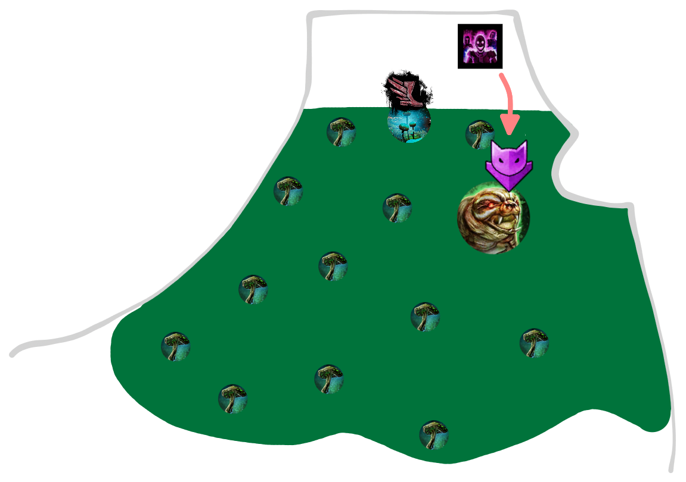
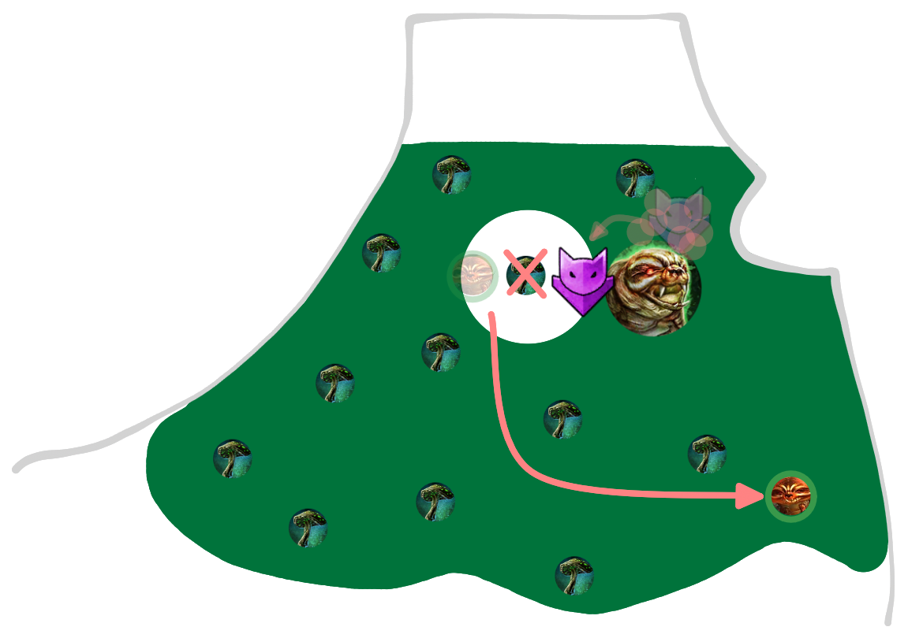
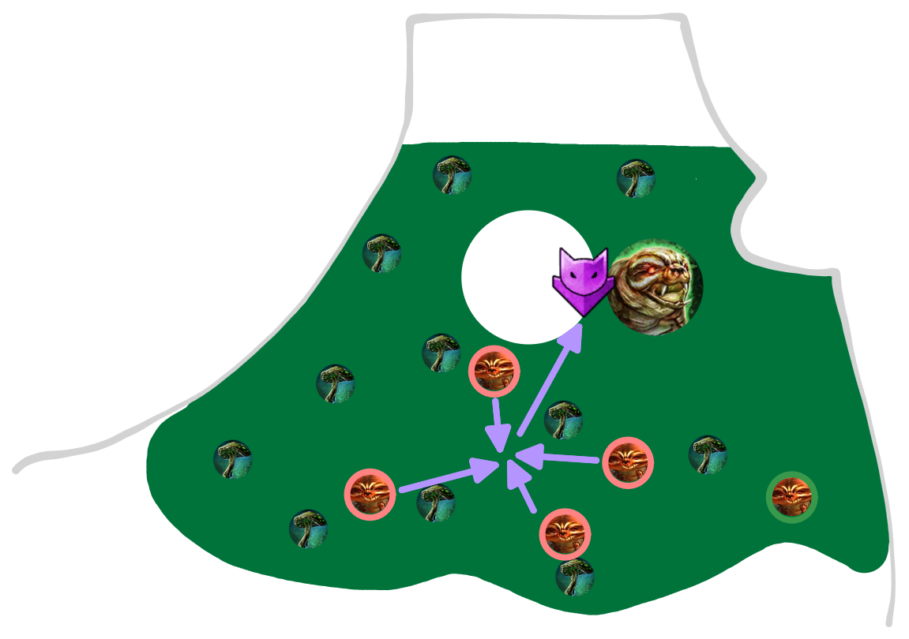
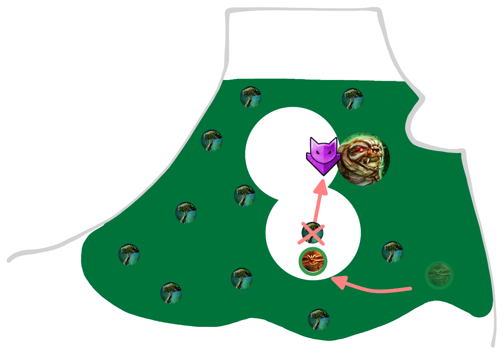
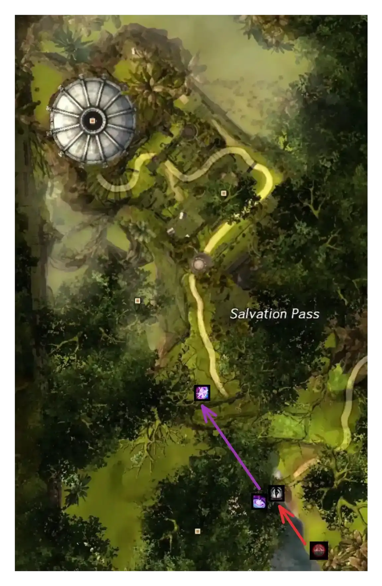
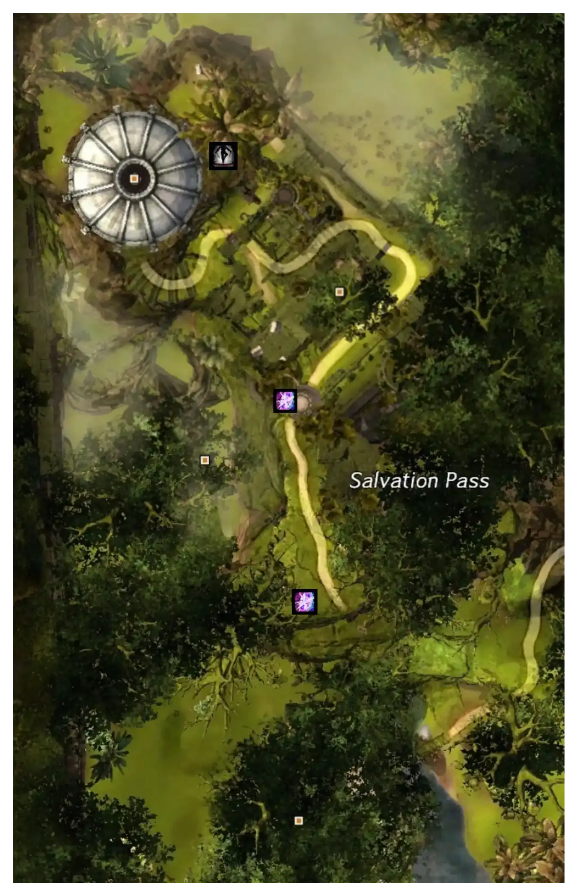
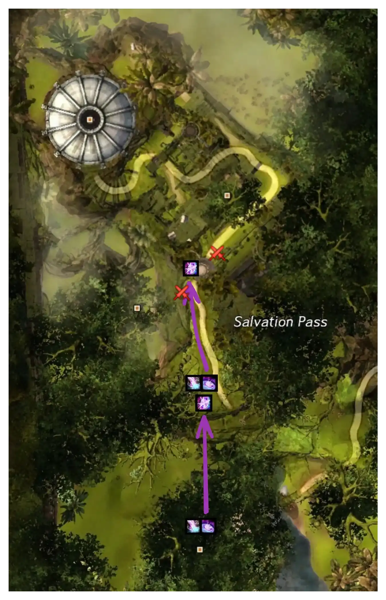
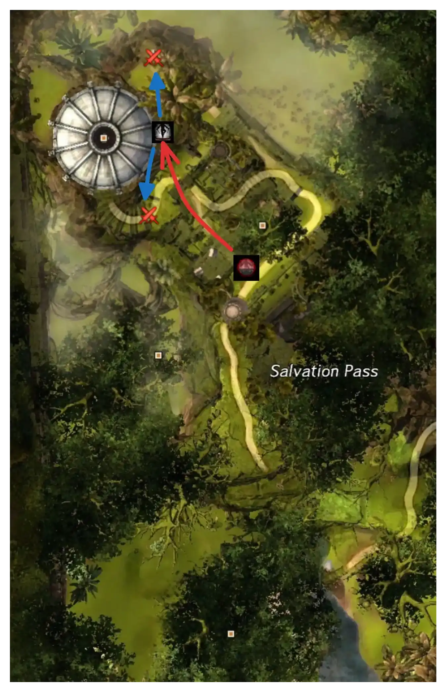
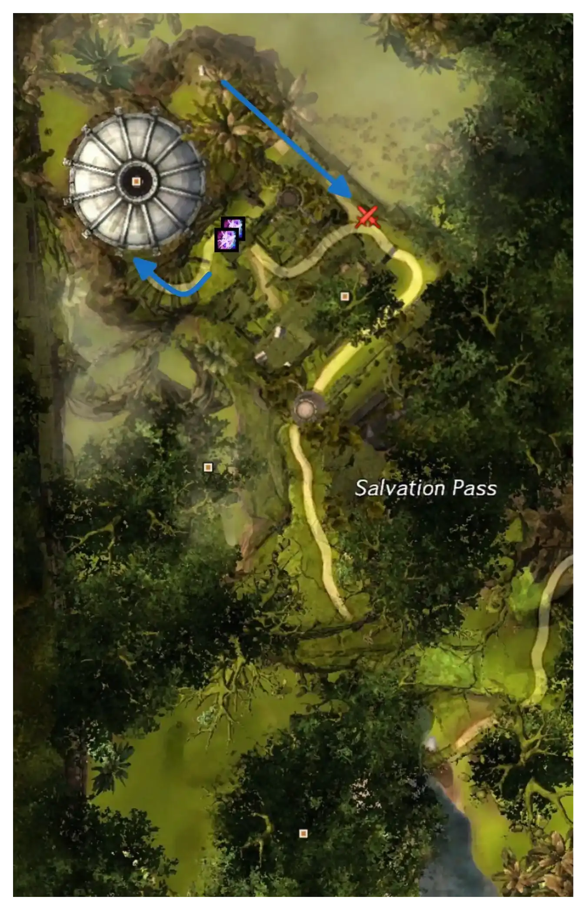
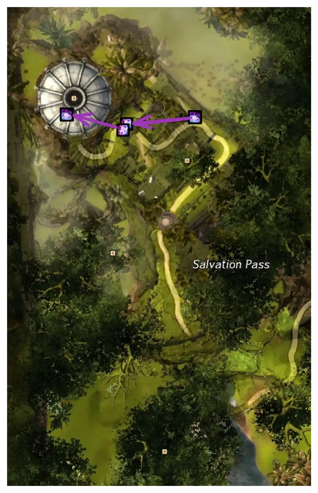

[< Wing 1](../wing-1/){: .btn } [Return to Home](../index.html){: .btn } [Wing 3 >](../wing-3/){: .btn } 
{: .center}

# Salvation Pass
{: .no_toc}

| **Timer** |  11 minutes 45 seconds |
| **Timer Start** |  On eating the first  [Poison Mushroom]. |

<b>Table of Contents</b>

1. TOC
{:toc}

---

Salvation Pass is often chosen by groups as the first wing they attempt on the road to the achievement. While it can become a struggle if groups lack DPS, smooth transitions and thoughtful group composition are enough to clear, making it attractive for groups who are new to speedrunning.

#### Main Points
{: .no_toc}

- [Slothasor] is run with a unique strategy that minimizes the boss' movement.
- Large amounts of time can be saved through optimized transitions into and out of [Bandit Trio].
- [Matthias] is run with a standard strategy, but requires care due to the number of dangerous mechanics it presents.

---

## Composition

Groups running Salvation Pass will usually include at least two  [Mesmers] and a  [Thief]. These can usually cover all encounter-specific utility, including:

-  [Stealth] for starting Slothasor.
-  [Stability] for Slothasor and Matthias.
-  [Pull] for Slothasor and Bandit Camp.
-  [Invulnerability] for Slothasor.
-  [Portals] for the transition between Bandit Camp and Matthias.
-  [Projectile Reflection] for Matthias.

 [Troubadour] is a common pick due to its strong solo-healing capabilities, with the other mesmer often being a support DPS  [Chronomancer] or DPS  [Virtuoso]. For the  [Thief],  [Daredevil] is a common pick, played as  Power on Slothasor and  Condition on Matthias.

DPS classes with copious amounts of crowd control will also be extremely beneficial.

---

## Slothasor

Sloth is run with a strategy that differs significantly from the standard PUG strat, focusing on three important aspects:
1. Keeping the boss stationary as much as possible.
2. minimizing the time spent eating   [Poison Mushrooms] and transformed.
3. Killing slublings quickly so that they do not disrupt the group.

The encounter can be [solo-healed](../general.html#solo-healing) if the off-sub has enough support through classes that provide good passive healing and barrier.  [Luminary] and  [Ritualist] are good picks also due to their strong CC and utility.

Fast Slothasor clears are extremely dependant on the group's defiance damage: DPS classes with heavy breakbar skills will be extremely beneficial, such as  [Engineers] with  [Bomb Kit].

### Movement and Shrooms

Select a player to eat the first shroom. This is best done by the DPS class with the lowest damage, often the  [Thief]. Everyone else should  [Stealth] (normally done with  [Mass Invisibility]) and run to the boss. The shroom player does a brief countdown and then eats the shroom to start the fight.

{: .note}
Since the timer starts when the shroom is eaten, this saves a couple of seconds by not having the players run to the boss or vice-versa.

{: .note}
Players that are affected by  [Stealth] will not take damage from the mushrooms' poison fields.

    
    

The shroom player should eat the  [Poison Mushroom] next to Slothasor, taking care to stay at maximum range so that they are not bursted down by their allies in the stack. After eating, they should move to the safe spot shown in the image above, and the rest of the group should then move into the cleared area once the boss casts [Tantrum](https://wiki.guildwars2.com/wiki/Tantrum).

Soon after, [Slublings] will start spawning. Players should use two  [Pull] skills in sequence to group them together and then bring them to the boss where they are cleaved down. The first pull is almost always done with  [Temporal Curtain] due to its large area of effect, but the second can be done by any class with applicable utility (such as  [Binding Blade]).

    
    

Once the slublings have been pulled, it's safe for the shroom player to eat the second shroom and return to the stack. The rest of the fight can be played normally using the available space.

If both shrooms respawn, with sufficient condition cleanse it is possible to out-heal the incoming damage for a period. If the group is low on DPS, the shroom player can reduce pressure by tracking the time remaining on their  [Magic Transformation](https://wiki.guildwars2.com/wiki/Magic_Transformation) and eating the second shroom at the last possible second.

### Managing the Shake

Slothasor's [Spore Release](https://wiki.guildwars2.com/wiki/Spore_Release) (a.k.a. shake) is one of the more dangerous skills in the encounter. Usually it is double dodged, but any player with access to some form of  [Invulnerability] can block most of the shots by standing in the center of the boss's hitbox while invulnerable and jumping repeatedly. This is commonly done by a  [Mesmer] with  [Distortion].

### Skipping the final breakbar

Sloth's final breakbar occurs at 10%. With good timing, players can wait for the boss to begin an animation then burst down the final 10% in one go, skipping the breakbar entirely. This can save as much as 10 seconds.

---

## Bandit Trio

This encounter is relatively simple and low-risk. Its most critical part is optimizing the transitions into it and out of it.

### Transition from Slothasor

Trio starts as soon as any player enters the fort, thus it is best to send a player with high mobility ahead of the main group to start the encounter. This is commonly done by a  [Thief] running  [Shadowstep] and shortbow.

{: .warning}
Conditions are not cleansed at the end of Slothasor! Make sure everyone is healthy before continuing onwards.

A  [Mesmer] will start preparing the transition into Matthias by gliding to the right at the cliff before Trio and doing a small jumping puzzle. Another player may accompany them to clear out the snipers at the top of the cliff.

  Portal PoV

<iframe class="youtube-video center" width="100%" src="https://www.youtube.com/embed/m803DrvyQuA?si=AFFd0TzH2vKWES1q&end=36&mute=1 " frameborder="0" allow="accelerometer; clipboard-write; encrypted-media; gyroscope; picture-in-picture; web-share" referrerpolicy="strict-origin-when-cross-origin" allowfullscreen></iframe>

### Splitting

To prevent easily avoidable downs due to sniper damage, most groups will choose to keep the squad in the safe spot until all snipers have been pulled: only then will one subgroup move to clear the top bridges.

### Transition Preparation

{: .note}
All portal positions described in this section can be viewed in-game using [marker packs].

The  Portal player who is waiting on top of the cliff should prepare their portal and glide down at 7:10 on the timer. They can then aid with killing [Berg](https://wiki.guildwars2.com/wiki/Salvation_Pass#Berg) and open their portal close to the cliff on the north side of camp to get back to their previous position.

{: .note}
The portal player will not be able to see the timer at the beginning: someone should call out when it's time for them to glide down!

A similar sequence should happen at 5:10 for [Zane](ttps://wiki.guildwars2.com/wiki/Salvation_Pass#Zane). However, this time another player (typically the  [Thief]) should provide a  portal to the North side. Both  [Mesmers] and the  [Thief] should take this portal, then take the Mesmer portal to ascend the cliff.

    
    

At 3:15 missing on the timer, these three players must then each prepare their portal at specific positions and glide back down to help with [Narella].

{: .note}
This guide shows just one way of doing these portals. You do not have to copy them exactly, in fact we encourage you to find whatever strategy that suits your group best.

### Speeding up Narella

[Narella] is the only miniboss in the encounter where DPS is important. Groups will often attempt to kill her faster by releasing the wargs at the top of the stairway on the North side at around 3:10. These wargs will often attack the miniboss, reducing the kill time by 2-3 seconds.

### BUG: Killing Narella Early

It is possible to vastly speed up the final part of the encounter by killing [Narella] early. This strategy requires releasing all wargs just before [Zane](ttps://wiki.guildwars2.com/wiki/Salvation_Pass#Zane) spawns (at at 5:10 on the timer), while keeping the arena clear from adds. When done correctly, this results in Narella being their only viable target within range. They will consequently teleport up to her balcony and to maul her (which is very funny to see). The encounter will then end as soon as Zane dies.

[ Example Log](https://gw2wingman.nevermindcreations.de/log/31be3-Andi9247_20260213-230031_trio_kill){: .btn }

{: .warning}
This bug is not accepted in most speedrun formats.

{: .warning}
While this bug trivializes the timer for this wing, using it is not recommended. If you are considering it due to time constraints, then your group very likely has bigger issues, and addressing them now will be more useful in the long term.

---

## Transition into Matthias

Portals are used to deal with all the bandit groups and quickly get the squad to Matthias. This transition is one of the easiest ways to save time in the wing, and groups should practice until they can perform it smoothly and reliably.

{: .note}
All portal positions described in this section can be viewed in-game using [marker packs].

### Ascending the Cliff

As soon as [Narella] dies, both  [Mesmers] should  [Mimic] their portal to get the squad up the cliff and to the first sets of adds.

{: .warning}
If someone is on top of the cliff when Narella dies (roughly from the edge of the cliff to the end of the pathway where you come out of the second portal), they'll trigger the "ascend the cliff" checkpoint in the same millisecond as the "complete Trio by killing Narella" checkpoint. This breaks the instance. Make sure that everyone who's placing portals jumps down to help with [Narella] even if she's about to die.

    
    

There are two groups of bandits that must be killed. The first one is before the arch and consists of only two adds, so normally only a couple of players are sent to clear it. The second one is in the room after the arch and should be bursted down by the rest of the group.

After the second group is dead, the  [Thief] will open their portal for the squad next to the wall on the North side of the room. After taking the it, both  [Mesmers] should prepare their own portals on top of the hill. The squad should then divide in two, with one group gliding down to the North and the other to the South, and a mesmer following each group.

    
    

Once all bandits have been cleared, both portals are opened and the squad takes them directly into [Matthias]'s arena.

---

## Matthias Gabrel

This boss is played pretty much identically to PUG strat. While there is not much to learn strategy-wise, be aware that Matthias has lots of dangerous mechanics: players should be especially careful of his Hadouken, [Spread](https://wiki.guildwars2.com/wiki/Zealous_Benediction_(effect)) attack and [Shards of Rage](https://wiki.guildwars2.com/wiki/Salvation_Pass#Matthias_Gabrel), as they can easily end your run.

Experienced groups should try to solo-heal Matthias.

### Zealous Benediction

Most commonly known as "spread", this is the most common reason for downs on Matthias. Being in two circles is an instant reset.

Everyone should play this as safe as possible. In the beginning phases, where not everyone gets their own circle, the players targeted should move away from the boss to give space to any DPS that are not targeted. Players should avoid casting any skills with forced movement while targeted by this skill.

### Corruption

Groups should minimize the DPS downtime and inherent risk in having a player run off-stack to cleanse this mechanic. Low-cooldown portals are the obvious solution with  [Sand Swell] being best-in-slot and  [Dimensional Aperture] a distant second.

### Shards of Rage

This attack can easily one-shot an unprepared player. However, getting hit by it brings a considerable increase in DPS due to  [Blood Fueled](https://wiki.guildwars2.com/wiki/Blood_Fueled). Groups that want to play safer can bring projectile block to nullify this attack entirely (not reflect!!), while those that want more DPS can aim to absorb the shards.

A common practice is having a  [Mechanist] use their  [Shift Signet] to position their Mech in the center of Matthias' hitbox: the mech will absorb the attack entirely while gaining many stacks of  [Blood Fueled](https://wiki.guildwars2.com/wiki/Blood_Fueled), thus significantly increasing its damage.

---

## Additional Resources

#### PoVs

{: .note}
This is a non-comprehensive list meant to display a diverse selection of perspectives and roles. You do not have to copy them exactly, in fact we encourage you to find whatever strategy that suits your group best.

| Classes | Link | Date | Notes |
|  DPS, shroom, skips |  [PoV](https://youtu.be/STFDxsU6wa8) | March 2026 | Standard strategy described in this guide. |
|    DPS |  [PoV](https://www.youtube.com/watch?v=o9hckVBT4ZA) | March 2026 | Slightly different portals than described here. |
|   Heal, skips |  [PoV](https://www.youtube.com/watch?v=ITxA8Yc93qU) | March 2026 | Slightly different portals than described here. |
|   BoonDPS |  [PoV](https://www.youtube.com/watch?v=3gv4PEHAR4Q) | March 2026 | Slight mishap during the transition but excellent DPS to make up for it. |

[< Wing 1](../wing-1/){: .btn } [Return to Home](../index.html){: .btn } [Wing 3 >](../wing-3/){: .btn } [Return to Top](#salvation-pass){: .btn .fixed}
{: .center}

[Slothasor]: #slothasor
[Bandit Trio]: #bandit-trio
[Matthias]: #matthias-gabrel
[marker packs]: ../general.html#marker-packs

[Poison Mushroom]: https://wiki.guildwars2.com/wiki/Poison_Mushroom
[Poison Mushrooms]: https://wiki.guildwars2.com/wiki/Poison_Mushroom
[Slublings]: https://wiki.guildwars2.com/wiki/Slubling
[Narella]: https://wiki.guildwars2.com/wiki/Salvation_Pass#Narella

[Mesmers]: https://wiki.guildwars2.com/wiki/Mesmer
[Mesmer]: https://wiki.guildwars2.com/wiki/Mesmer
[Troubadour]: https://wiki.guildwars2.com/wiki/Troubadour
[Chronomancer]: https://wiki.guildwars2.com/wiki/Chronomancer
[Virtuoso]: https://wiki.guildwars2.com/wiki/Virtuoso
[Thief]: https://wiki.guildwars2.com/wiki/Thief
[Daredevil]: https://wiki.guildwars2.com/wiki/Daredevil
[Luminary]: https://wiki.guildwars2.com/wiki/Luminary
[Ritualist]: https://wiki.guildwars2.com/wiki/Ritualist
[Engineers]: https://wiki.guildwars2.com/wiki/Engineer
[Mechanist]: https://wiki.guildwars2.com/wiki/Mechanist

[Stability]: https://wiki.guildwars2.com/wiki/Stability
[Stealth]: https://wiki.guildwars2.com/wiki/Stealth
[Pull]: https://wiki.guildwars2.com/wiki/Pull
[Distortion]: https://wiki.guildwars2.com/wiki/Distortion
[Invulnerability]: https://wiki.guildwars2.com/wiki/Invulnerability
[Portals]: https://wiki.guildwars2.com/wiki/Portal 
[Projectile Reflection]: https://wiki.guildwars2.com/wiki/Reflect
[Bomb Kit]: https://wiki.guildwars2.com/wiki/Bomb_Kit
[Mass Invisibility]: https://wiki.guildwars2.com/wiki/Mass_Invisibility
[Temporal Curtain]: https://wiki.guildwars2.com/wiki/Temporal_Curtain
[Binding Blade]: https://wiki.guildwars2.com/wiki/Binding_Blade
[Shadowstep]: https://wiki.guildwars2.com/wiki/Shadowstep
[Mimic]: https://wiki.guildwars2.com/wiki/Mimic
[Sand Swell]: https://wiki.guildwars2.com/wiki/Sand_Swell
[Dimensional Aperture]: https://wiki.guildwars2.com/wiki/Dimensional_Aperture
[Shift Signet]: https://wiki.guildwars2.com/wiki/Shift_Signet