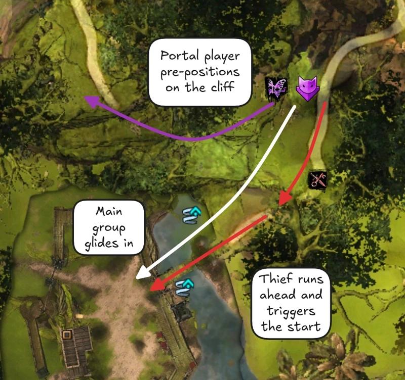
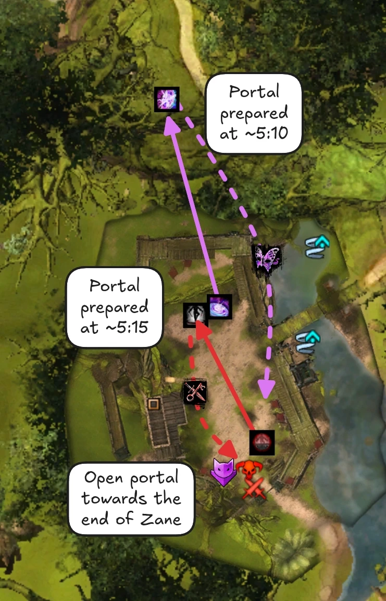
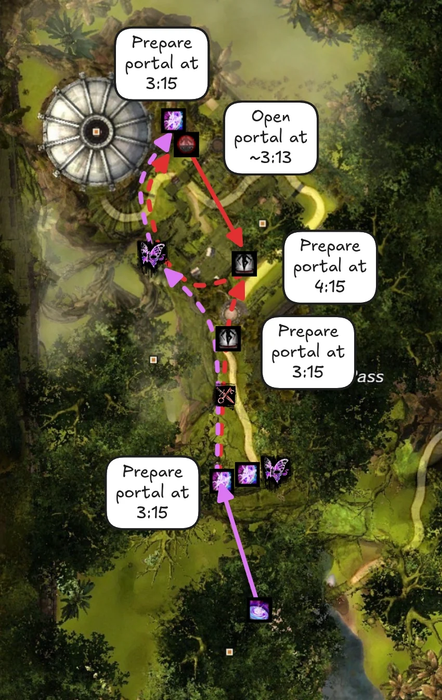
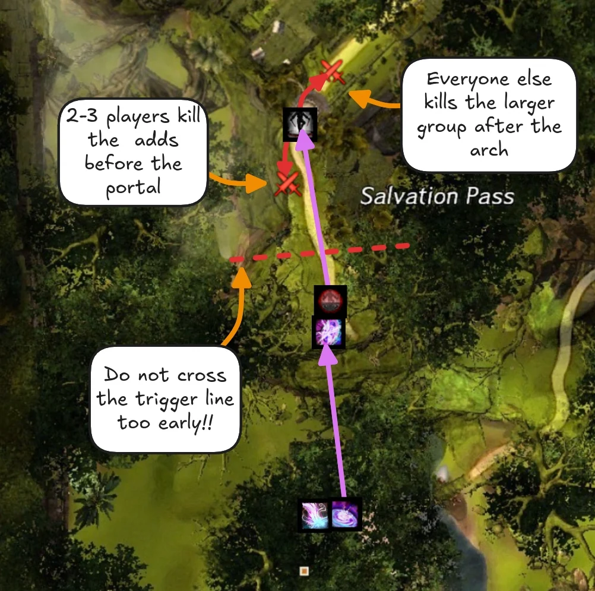
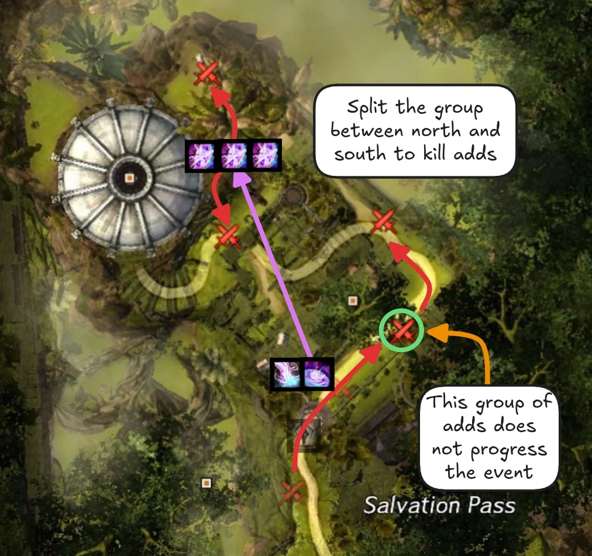
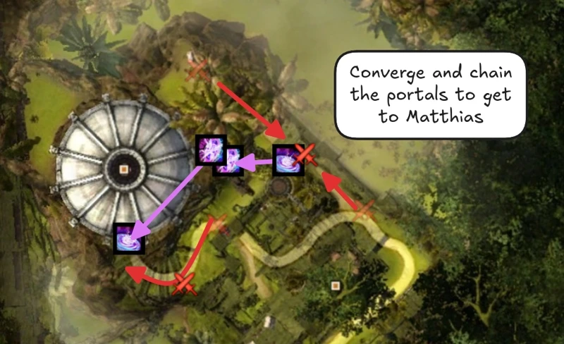

[< Wing 1](../wing-1/){: .btn } [Return to Home](../index.html){: .btn } [Wing 3 >](../wing-3/){: .btn } 
{: .center}

# Salvation Pass
{: .no_toc}

| **Timer** |  11 minutes 45 seconds |
| **Timer Start** |  On eating the first  [Poison Mushroom]. |

<b>Table of Contents</b>

1. TOC
{:toc}

---

Salvation Pass is often chosen by groups as the first wing they attempt on the road to Infallible. While it can become a struggle if groups lack DPS, smooth transitions and thoughtful composition are often enough to clear, making it attractive for players who are new to speedrunning.

#### Main Points
{: .no_toc}

- [Slothasor] is run with a unique strategy that minimizes the boss' movement.
- Large amounts of time can be saved through optimized transitions into and out of [Bandit Trio].
- [Matthias] is run with a standard strategy, but requires care due to the number of dangerous mechanics it presents.

---

## Composition

Groups running Salvation Pass will usually include at least two  [Mesmers] and a  [Thief]. These can usually cover all encounter-specific utility, including:

-  [Stealth] for starting Slothasor.
-  [Stability] for Slothasor and Matthias.
-  [Pull] for Slothasor and Bandit Camp.
-  [Invulnerability] for Slothasor.
-  [Portals] for the transition between Bandit Camp and Matthias.
-  [Projectile Reflection] for Matthias.

The portals are the most important part of this utility and the reason why it these classes are difficult to replace with alternatives.

Stacking sigils such as  [Sigil of Bloodlust](https://wiki.guildwars2.com/wiki/Sigil_of_Bloodlust) and  [Sigil of Cruelty](https://wiki.guildwars2.com/wiki/Sigil_of_Cruelty) are viable on this wing. You can get up to 16 stacks on a fresh instance by killing the [slublings] before [Slothasor]. Some adds in [Bandit Trio] also grant stacks, such as the [Pocket Raptors](https://wiki.guildwars2.com/wiki/Pocket_Raptor) and [Fungi](https://wiki.guildwars2.com/wiki/Fungus).

---

#### [Slothasor]
{: .no_toc}
- Can be [solo-healed](../general.html#solo-healing) if the off-sub has enough support through classes that provide good passive healing and barrier.  [Luminary] and  [Ritualist] are good picks also due to their strong CC and utility.
- Bring  pulls such as  [Temporal Curtain] and  [Binding Blade] to manage slublings.
- CC is extremely important: DPS classes with heavy breakbar skills will be extremely beneficial, such as  [Engineers] with  [Bomb Kit].

#### [Bandit Trio]
{: .no_toc}
- Since this encounter does not benefit much from additional DPS, it is possible to run an additional healer, especially if one of the regular heals is doing portals.
- Assign one or two DPS with good survivability to do mortars.

#### [Matthias]
{: .no_toc}
- Ensure you have a good amount of  pull skills to speed up the transition from Trio.
- [Solo-healing](../general.html#solo-healing) is viable, and slightly less demanding than on [Slothasor].
- Remember to bring  [Projectile Reflection]. If possible, bring multiple sources to ensure you always have a backup.
-  [Sand Swell] and  [Dimensional Aperture] can be used to quickly transport players to/from mechanics.

---

## Slothasor

Sloth is run with a strategy that differs significantly from the standard, focusing on three important aspects:
1. Keeping the boss stationary as much as possible.
2. Minimizing the time spent eating   [Poison Mushrooms] and transformed.
3. Killing slublings quickly so that they do not disrupt the group.

---

### Strategy

Select a player to eat the first shroom. Everyone else should  [Stealth] (normally done with  [Mass Invisibility]) and run to the boss. The shroom player does a brief countdown and then eats the shroom to start the fight.

{: .note}
Since the timer starts when the shroom is eaten, this saves a couple of seconds by not having the players run to the boss or vice-versa.

{: .note}
Players that are affected by  [Stealth] will not take damage from the mushrooms' poison fields.

The shroom player should eat the  [Poison Mushroom] next to Slothasor, taking care to stay at maximum range so that they are not bursted down by their allies in the stack.

{: .warning}
Poison fields originate from  [Poison Mushroom], and standing in the overlap between multiple fields will double incoming damage, potentially leading to  [Downstates]. Take care to position correctly until the first safe spot has been cleared.

After eating, they should move to the safe spot shown in the image, and the rest of the group can then move into the cleared area once the boss casts [Tantrum](https://wiki.guildwars2.com/wiki/Tantrum).

When [Slublings] start spawning, use two  [Pull] skills in sequence to group them together and then bring them to the boss where they are cleaved down. The first pull is almost always done with  [Temporal Curtain] due to its large area of effect, but the second can be done with any applicable utility.

Once the slublings have been pulled, it's safe for the shroom player to eat the second shroom and return to the stack. The rest of the fight can be played normally using the available space.

If both shrooms respawn, with sufficient condition cleanse it is possible to out-heal the incoming damage for a period. If the group is low on DPS, the shroom player can reduce pressure by tracking the time remaining on their  [Magic Transformation](https://wiki.guildwars2.com/wiki/Magic_Transformation) and eating the second shroom at the last possible second.

---

### Managing the Shake

Slothasor's [Spore Release](https://wiki.guildwars2.com/wiki/Spore_Release) (a.k.a. shake) is one of the more dangerous skills in the encounter. Usually it is double dodged, but any player with access to some form of  [Invulnerability] can block most of the shots by standing in the center of the boss's hitbox while invulnerable and jumping repeatedly. This is commonly done by a  [Mesmer] with  [Distortion].

---

### Skipping the final breakbar

Sloth's final breakbar occurs at 10%. With good timing, players can wait for the boss to begin a long animation (either shake, tantrum or flamethrower) then burst down the final 10% in one go, skipping the breakbar entirely. This can save as much as 10 seconds, but is difficult to pull off.

---

## Bandit Trio

This encounter is relatively simple and low-risk. Its most critical part is optimizing the transitions into it and out of it.

{: .warning}
If more than four people are in the area outside the fort while the encounter is active, additional waves of bandits will start spawning in, which can be difficult to deal with.

---

### Transition from Slothasor

{: .warning}
Conditions are not cleansed at the end of Slothasor! Make sure everyone is healthy before continuing onwards.

Trio starts as soon as any player enters the fort, thus it is best to send a player with high mobility ahead of the main group to start the encounter. This is commonly done by a  [Thief] running  [Shadowstep] and shortbow.

Another player, usually a  [Mesmer], will start preparing the transition into [Matthias] by gliding to the right before Trio and doing a small jumping puzzle to get to the top of the cliff. Another player may accompany them to clear out the snipers at the top of the cliff.

The rest of the group can glide in normally and start clearing out bandits, then head into the safe spot. To prevent easily avoidable downs due to sniper damage, most groups will choose to keep the squad in the safe spot until all snipers have been pulled: only then will one subgroup move to clear the top bridges.

---

### Speeding up Narella

[Narella] is the only miniboss in the encounter where DPS is important. Groups will often attempt to kill her faster by releasing the wargs at the top of the stairway on the North side at around *3:10*. These wargs will often attack the miniboss, reducing the kill time by 2-3 seconds.

#### Killing Narella Early
{: .no_toc}

{: .warning}
This strategy is very likely unintended behaviour and is not accepted in most speedrun formats.

It is possible to vastly speed up the final part of the encounter by killing [Narella] early. This strategy requires releasing all wargs just before [Zane] spawns while keeping the arena clear from adds. When done correctly, this results in Narella being their only viable target within range. They will consequently teleport up to her balcony and maul her (which is admittedly very funny). The encounter will then end as soon as Zane dies.

[ Example Log](https://gw2wingman.nevermindcreations.de/log/31be3-Andi9247_20260213-230031_trio_kill){: .btn }

{: .warning}
While this bug trivializes the timer for this wing, if you are considering it due to time constraints, then your group very likely has bigger issues. Addressing them now will be more useful in the long term.

---

## Transition into Matthias

This transition is one of the easiest ways to save time in the wing.   [Portals] are used to get to all the bandit groups quickly and then regroup the squad at [Matthias] once the event is complete.

{: .note}
This guide shows just one way of doing this transition. You do not have to copy it exactly, in fact we encourage you to find whatever strategy suits your group best.

{: .note}
All portal positions described in this section can be viewed in-game using [marker packs].

---

### Preparation During Trio

Preparation for this transition begins at the start of [Bandit Trio]. During the [transition into Trio](#transition-from-slothasor), one player with a   portal will pre-position on the cliff overlooking the fort.

{: .note}
While not strictly necessary, this player will often glide down at *7:10* on the timer to help with killing [Berg](https://wiki.guildwars2.com/wiki/Salvation_Pass#Berg). They can use their portal to get back to their previous position once the miniboss is dead.

{: .note}
The portal player will not be able to see the timer until they enter the encounter area: someone from the main group should call out when it's time for them to glide down.

At *5:10* on the timer, before [Zane] spawns in, the player on the cliff should prepare their   portal and glide down to join the group. Similarly, another portal player should prepare their own   portal (usually around *5:15* but this is not as strict) at the base of the small cliff on the north side of the fort.

Both of these players can help with killing [Zane]. When the boss is close to dying or the portals are close to running out, open them in sequence to bring all three portal players from [Zane] to the top of the cliff.

These players can then proceed to their assigned positions to place portals in preparation for the transition:
- One will remain at the top of the cliff and prepare a   portal at ~*3:15* or earlier.
- One will run to the arch just before the first room and prepare a   portal at ~*3:15* or earlier.
- One will skip ahead and do a short jumping puzzle to get to the cliff next to Matthias' arena (check the [PoV](#povs) section to see this in execution). They can prepare their   portal at ~*3:10* or earlier.

{: .note}
With the strategy described in this guide, it's convenient to use  [Portal Entre] for at least two of the portals above. This allows their cooldown to be reset with  [Mimic] so that they can be used multiple times over the course of the transition.

Once they have placed their portal, all three players should retrace their steps, glide down to the fort and help with the final stages of [Narella]. 

---

### Ascending the Cliff

As soon as [Narella] dies, open the first   portal to get the squad up the cliff, using  [Mimic] if it's a  [Mesmer] portal. The second player will then open their own    portal and bring the rest of the group to the arch.

From here, split off a couple of players to deal with the two bandits before the portal while the rest of the group cleaves down the larger group in the first room.

{: .warning}
Between the ley rift and the arch there is an invisible trigger line that progresses the pre-event. If you are too fast, you can cross this line before the pre-event is active, forcing the instance into a bugged state that requires a reset. To avoid this issue, make sure nobody crosses the trigger line (which is also highlighted in [marker packs]) before the *"Find a way to ascend the cliff"* text appears. This includes taking the second portal described above.

After the second group is dead, the third player will open their    portal next to the wall on the North side of the room. After taking it, both  [Mesmers] (if they correctly used  [Mimic]) will prepare a  portal at the top of the cliff, taking care not to overlap the entrances.

The squad will then divide into two groups, with one group gliding down to the North and the other to the South. One portal  [Mesmer] should follow each group.

Meanwhile, the players that killed the two adds before the portal can make their way forward using the standard route. The next group of adds they encounter does not count towards the event's progress and can be ignored, but the one immediately after the turn in the road should be cleared.

The group gliding north from the cliff can clear out the camp area before walking south. The group coming from the south will converge with them on the final bandits.

The other group can clear out the area around the Asura gate before walking towards Matthias's arena and killing the bandits on the way there.

Once all bandits have been cleared, the event will complete. Open both portals to quickly transport the squad into [Matthias]'s arena.

---

## Matthias Gabrel

This boss is played pretty much identically to PUG strat. While there is not much to learn strategy-wise, be aware that Matthias has lots of dangerous mechanics: players should be especially careful of his *Hadouken*, [Spread](https://wiki.guildwars2.com/wiki/Zealous_Benediction_(effect)) attack and [Shards of Rage](https://wiki.guildwars2.com/wiki/Salvation_Pass#Matthias_Gabrel), as they can easily end your run.

{: .note}
The first person to enter Matthias's arena will be the target of both his *Hadouken* and *Blood Shard* projectiles (the ones to be reflected into his  [Blood Shield](https://wiki.guildwars2.com/wiki/Blood_Shield)). For this reason, it's best if this person is a healer.

---

### Zealous Benediction

Most commonly known as "spread", this is one of the most common reasons for resets on Infallible attempts, since being in two circles is an instant  [Downstate].

Try to play this mechanic as safely as possible. In the beginning phases, where not everyone gets their own circle, the players targeted should move away from the boss to give space to any DPS that are not targeted.

When everyone starts getting a circle under 40%, it can be convenient to assign three melee DPS beforehand to stay on the boss while the rest of the squad spreads out further. This can prevent greedy or unaware players from causing preventable  [Downstates].

---

### Shards of Rage

This attack can easily one-shot an unprepared player. However, getting hit by it brings a considerable increase in DPS due to  [Blood Fueled](https://wiki.guildwars2.com/wiki/Blood_Fueled). Groups that want to play safer can bring projectile block to nullify this attack entirely (not reflect!!), while those that want more DPS can aim to absorb the shards.

A common practice is having a  [Mechanist] use their  [Shift Signet] to position their Mech in the center of Matthias' hitbox: the mech will absorb the majority of the attack while gaining many stacks of  [Blood Fueled](https://wiki.guildwars2.com/wiki/Blood_Fueled), thus significantly increasing its damage.

---

### Position Control

Matthias will always target the furthest player from himself with his melee attacks. This, when combined with mechanics such as  [Corruption](https://wiki.guildwars2.com/wiki/Corruption_(Matthias_Gabrel_effect)) and  [Unstable Blood Magic](https://wiki.guildwars2.com/wiki/Unstable_Blood_Magic) (special action key) can cause him to move a lot, potentially reducing DPS uptime. For this reason, fast runs will try to use portals and movement skills to quickly manage these mechanics before they significantly impact the boss's position.

You generally want to keep the boss close to the center, since it's the most convenient location for accessing the [cleansing pools](https://wiki.guildwars2.com/wiki/Forsaken_Thicket_Waters) on the sides of the arena, but not dead center, as that can lead to accidentally killing the sacrifice player with conditions.

{: .note}
The player chosen by the sacrifice mechanic gets massively increased  power damage reduction, meaning it's more likely to be killed by conditions.

To better control the boss's position, you can assigned a ranged player to stand further from the boss than the rest of the group. The boss will then walk to them when it's not occupied by other mechanics.

---

## Additional Resources

#### PoVs

{: .note}
This is a non-comprehensive list meant to display a diverse selection of perspectives and roles. You can find additional PoVs and logs in the [Infallible Archive](https://docs.google.com/spreadsheets/d/1tzWg6KYGTGpCYCy4qBt0X9t7H2RzEM7MRKooh_gXCno).

| Classes | Link | Date | Notes |
|  DPS, shroom, skips |  [PoV](https://youtu.be/STFDxsU6wa8) | March 2026 | Standard strategy described in this guide. |
|    DPS |  [PoV](https://www.youtube.com/watch?v=o9hckVBT4ZA) | March 2026 | Slightly different portals than described here. |
|   Heal, skips |  [PoV](https://www.youtube.com/watch?v=ITxA8Yc93qU) | March 2026 | Slightly different portals than described here. |
|   BoonDPS |  [PoV](https://www.youtube.com/watch?v=3gv4PEHAR4Q) | March 2026 | Slight mishap during the transition but excellent DPS to make up for it. |

[< Wing 1](../wing-1/){: .btn } [Return to Home](../index.html){: .btn } [Wing 3 >](../wing-3/){: .btn } [Return to Top](#salvation-pass){: .btn .fixed}
{: .center}

[Slothasor]: #slothasor-1
[Bandit Trio]: #bandit-trio-1
[Matthias]: #matthias-gabrel
[marker packs]: ../general.html#marker-packs

[Poison Mushroom]: https://wiki.guildwars2.com/wiki/Poison_Mushroom
[Poison Mushrooms]: https://wiki.guildwars2.com/wiki/Poison_Mushroom
[Slublings]: https://wiki.guildwars2.com/wiki/Slubling
[Narella]: https://wiki.guildwars2.com/wiki/Salvation_Pass#Narella

[Mesmers]: https://wiki.guildwars2.com/wiki/Mesmer
[Mesmer]: https://wiki.guildwars2.com/wiki/Mesmer
[Troubadour]: https://wiki.guildwars2.com/wiki/Troubadour
[Chronomancer]: https://wiki.guildwars2.com/wiki/Chronomancer
[Virtuoso]: https://wiki.guildwars2.com/wiki/Virtuoso
[Thief]: https://wiki.guildwars2.com/wiki/Thief
[Daredevil]: https://wiki.guildwars2.com/wiki/Daredevil
[Luminary]: https://wiki.guildwars2.com/wiki/Luminary
[Ritualist]: https://wiki.guildwars2.com/wiki/Ritualist
[Engineers]: https://wiki.guildwars2.com/wiki/Engineer
[Mechanist]: https://wiki.guildwars2.com/wiki/Mechanist
[Downstates]: https://wiki.guildwars2.com/wiki/Downstate
[Downstate]: https://wiki.guildwars2.com/wiki/Downstate

[Stability]: https://wiki.guildwars2.com/wiki/Stability
[Stealth]: https://wiki.guildwars2.com/wiki/Stealth
[Pull]: https://wiki.guildwars2.com/wiki/Pull
[Distortion]: https://wiki.guildwars2.com/wiki/Distortion
[Invulnerability]: https://wiki.guildwars2.com/wiki/Invulnerability
[Portals]: https://wiki.guildwars2.com/wiki/Portal
[Portal Entre]: https://wiki.guildwars2.com/wiki/Portal_Entre
[Projectile Reflection]: https://wiki.guildwars2.com/wiki/Reflect
[Bomb Kit]: https://wiki.guildwars2.com/wiki/Bomb_Kit
[Mass Invisibility]: https://wiki.guildwars2.com/wiki/Mass_Invisibility
[Temporal Curtain]: https://wiki.guildwars2.com/wiki/Temporal_Curtain
[Binding Blade]: https://wiki.guildwars2.com/wiki/Binding_Blade
[Shadowstep]: https://wiki.guildwars2.com/wiki/Shadowstep
[Mimic]: https://wiki.guildwars2.com/wiki/Mimic
[Sand Swell]: https://wiki.guildwars2.com/wiki/Sand_Swell
[Dimensional Aperture]: https://wiki.guildwars2.com/wiki/Dimensional_Aperture
[Shift Signet]: https://wiki.guildwars2.com/wiki/Shift_Signet
[Zane]: https://wiki.guildwars2.com/wiki/Salvation_Pass#Zane