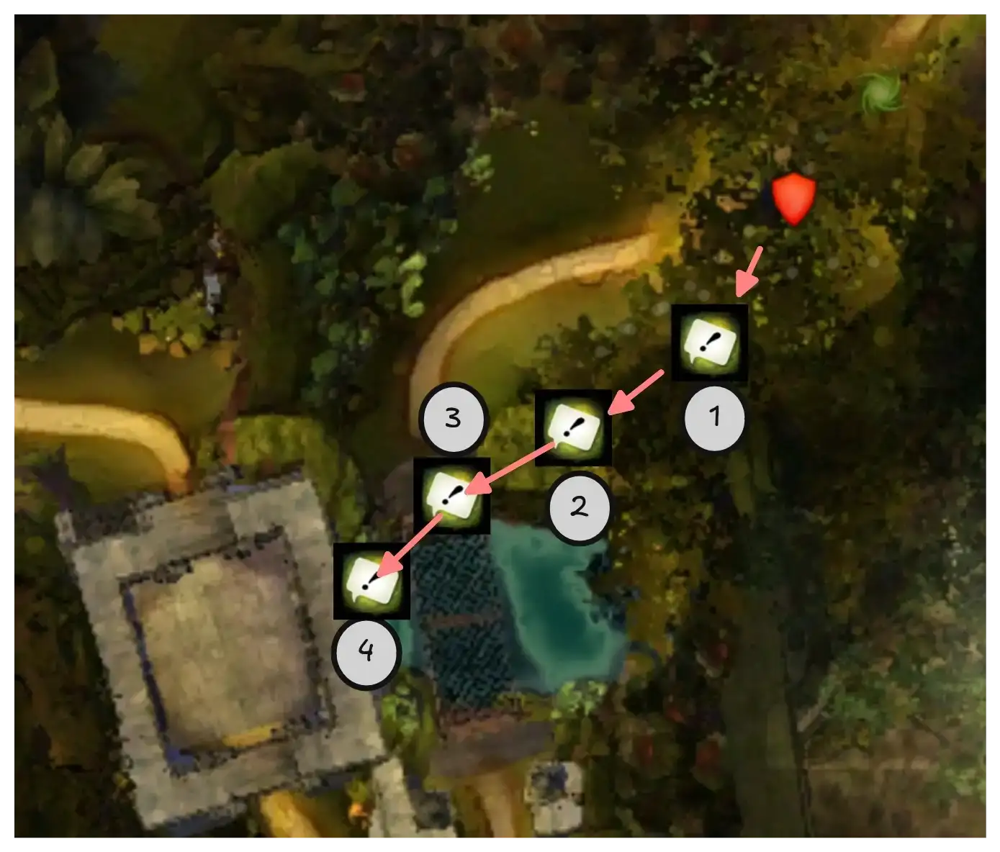
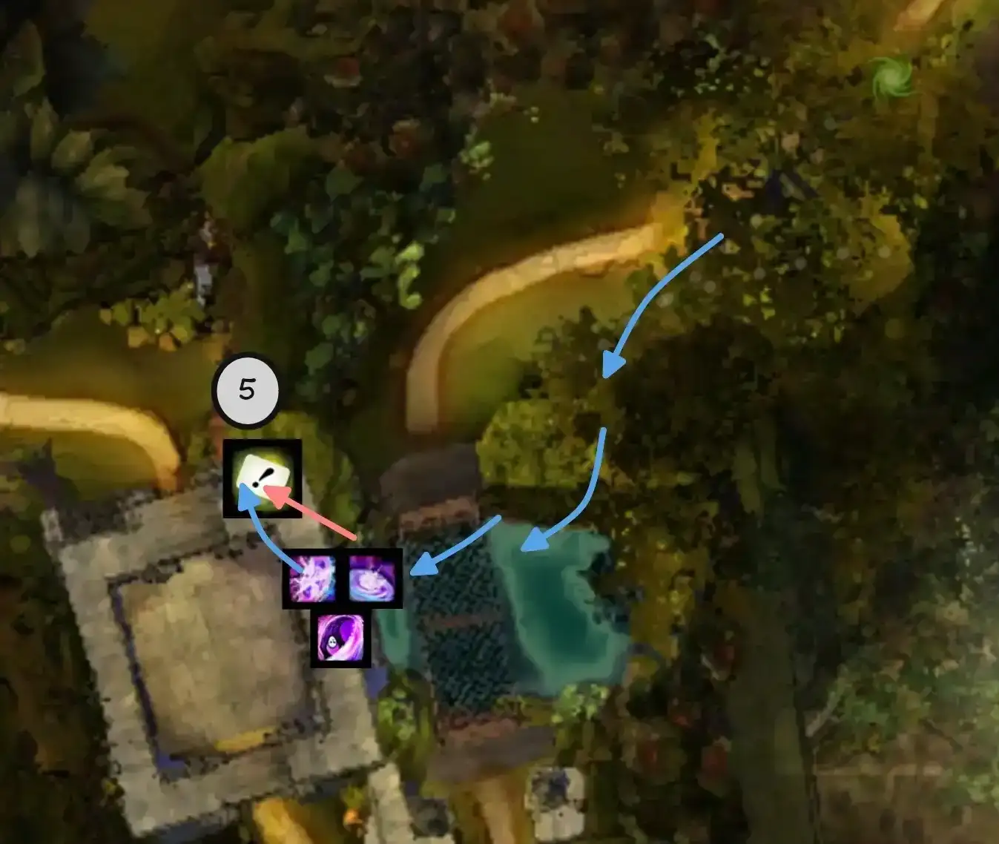
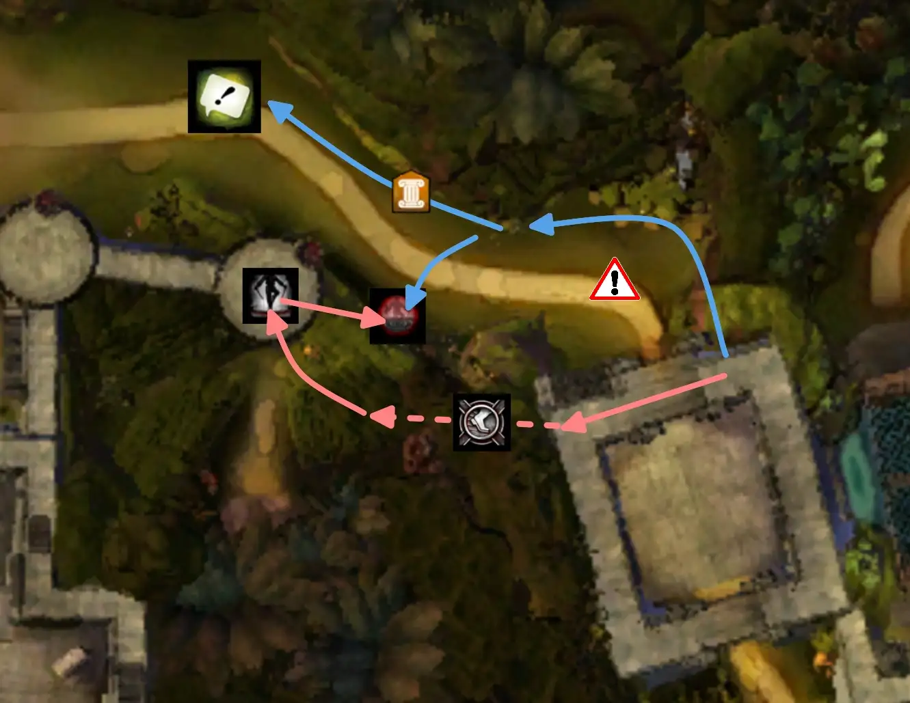
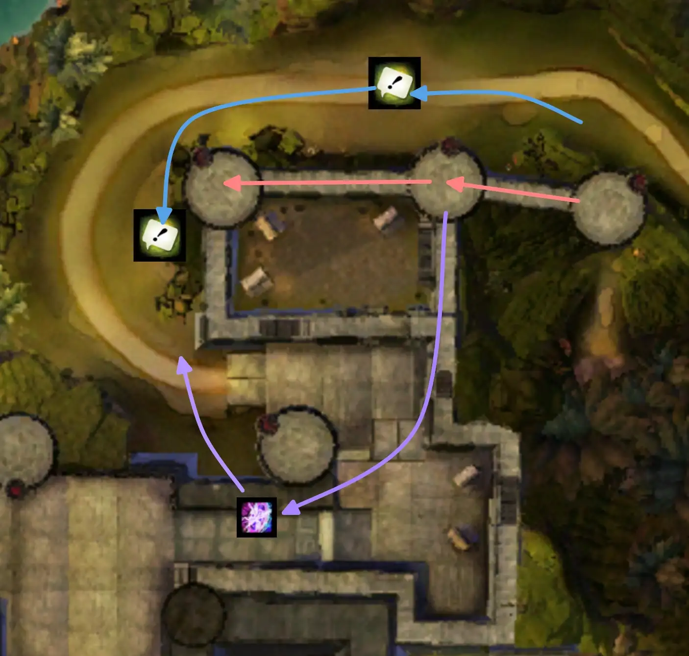
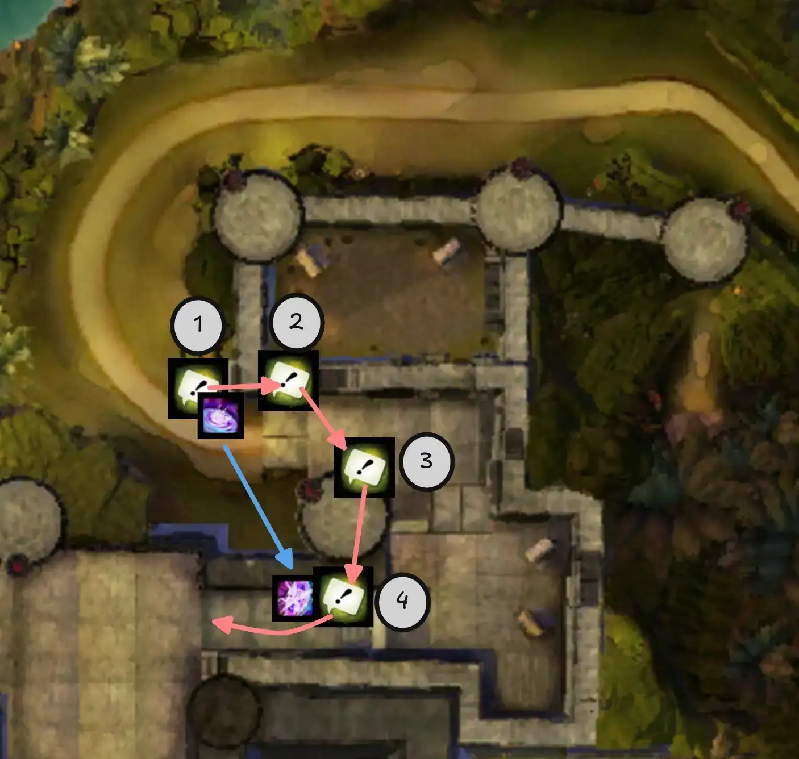
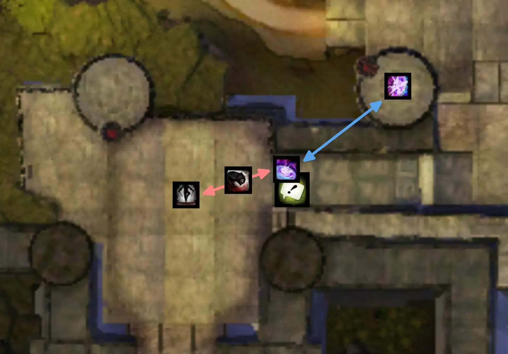
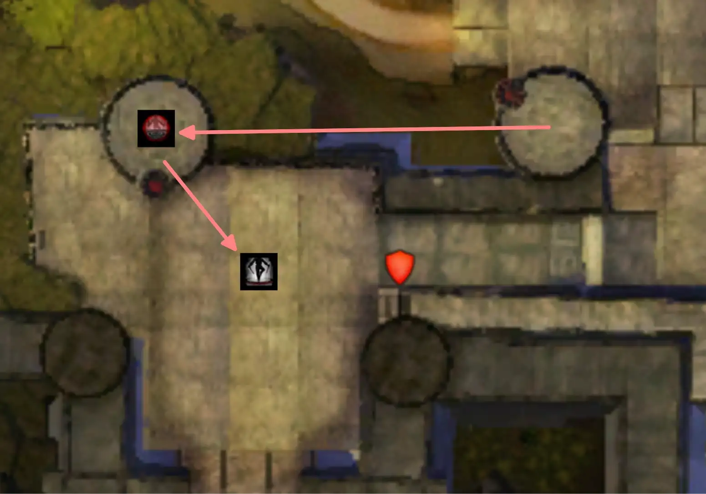

[< Wing 2](../wing-2/){: .btn } [Return to Home](../index.html){: .btn } [Wing 4 >](../wing-4/){: .btn } 
{: .center}

# Stronghold of the Faithful
{: .no_toc}

| **Timer** |  13 minutes 30 seconds  |
| **Timer Start** |  On speaking to  [Glenna] |

<b>Table of Contents</b>

1. TOC
{:toc}

---

Stronghold of the Faithful is one of the easiest wings to clear Infallible on, and is often the first wing groups will attempt on the road to the achievment. The key to clearing this wing is perfecting [Escort] and [Twisted Castle]. These two encounters are run with innovative tactics that greatly reduce their clear time, making the rest of the wing a relative cakewalk.

---

#### Main Points
{: .no_toc}

- [Escort] is run with a  risky strategy that aims to gain as much time as possible.
- [Twisted Castle] can also be run with a similarly risky strategy if necessary.
- The other bosses use standard tactics as additional time is generally not necessary.

---

## Composition

Most compositions will run at least one  [Mesmer] and one  [Thief], which have utility that cannot be easily replaced.

The remaining classes are mainly determined by the group's [Escort] strategy, as it has the most stringent requirements of the wing and is also where you stand to gain the most time. This is explained in detail in the [composition for Escort] section.

Both bosses favour  Power damage, but have relatively long phases.

---

## Siege the Stronghold

As the first encounter of the wing, Escort is usually played using an especially risky strategy. This gains an incredible amount of time compared to normal clears, and is the main hurdle for groups attempting the wing. When performed well, the rest of the raid can then be played with significantly less time pressure.

This section contains an optimized strategy that can be picked up by most groups with a reasonable amount of practice. Feel free to modify and improve it according to your needs.

{: .note}
All positions described in this section can be viewed in-game using [marker packs].

---

### Composition

Most commonly, the squad will divide into two groups:

- A *Tower* group that will clear the towers, clearing space for  [Glenna].
- A *Ground* group that will run  [Glenna] through the bottom part and deal with wargs.

#### Tower Group
{: .no_toc}

This groups focuses on fast movement and clearing towers, and is usually composed of six people:
- One  [Thief] running  [Prepare Shadow Portal] and  [Infiltrator's Signet].
- One  [Mesmer] running  [Portal Entre] and  [Blink]. If you intend to do the [second set of  Glenna ports](#4-fourth-tower-and-glenna-ports), you will need to bring a second one. 
- One healer (if not running a heal  [Mesmer]).  [Druid] is an excellent choice due to  [Glyph of the Tides].
- Three DPS.

{: .note}
> Ensure you are bringing at least three skills that can clear towers, if not more. See [Clearing Towers](#clearing-towers) for more information.

#### Ground Group
{: .no_toc}

This group focuses on quickly and safely ferrying  [Glenna] through the encounter, and comprises the rest of the squad, consisting of:
- A  [Scrapper] to provide  [Glenna] with  [Superspeed] and  [Quickness].
- A healer with high  [Stability] uptime, such as  [Firebrand] or  [Chronomancer].
- Two DPS or BoonDPS that can provide high  [Blinded] uptime (see [Warg Management](#warg-management) for more information)

---

### Important Concepts

These are some general mechanics that are used in Escort speedruns.

---

#### Teleporting Glenna

 [Glenna], being your standard NPC, has a mechanic that prevents her from getting stuck in terrain. Whenever a player uses  [Over Here!] within range, if she cannot pathfind to them (NPCs cannot jump!) she will instead instantly teleport to the player.

<video class="center bordered" width="60%" controls>
  <source src="escort/glenna_port.mp4" type="video/mp4">
</video>

Groups can abuse this to quickly teleport  [Glenna] over walls and difficult terrain. Most [marker packs] highlight positions where this is commonly done.

{: .warning}
This bug is not accepted in most speedrun formats.

---

#### Clearing Towers

To capture a tower, the number of players within the capture point must exceed the number of enemies. The greater the difference, the faster the tower is captured. Thus ideally we maximise the speed of capture by:
1. Sending as many people into each capture point as possible.
2. Quickly clearing enemies from capture points using skills that inflict  [Knockback] or  [Fear] in an area.

Skills that can clear towers include:
-  [Psychic Force] on  [Virtuoso].
-  [Shadow Gust](https://wiki.guildwars2.com/wiki/Shadow_Gust) on  [Deadeye].
-  [Glyph of the Tides] on  [Druid].
-  ["Fear Me!] on  [Warrior].
-  [Shield of Absorbtion](https://wiki.guildwars2.com/images/thumb/6/65/Shield_of_Absorption.png/50px-Shield_of_Absorption.png) on  [Guardian](https://wiki.guildwars2.com/wiki/Guardian).

Groups should bring at least three of these skills, so that one will be ready for each tower.

---

#### Speeding Glenna

The ground group should be arranged in the following manner:
- The  [Scrapper] should run slightly in front of  [Glenna] while giving  [Superspeed] to both her and the rest of the group.
- The two DPS should go ahead to clear out adds while spamming  [Over Here!], but not far enough to be out of range of the  [Scrapper].
- The healer should stay close  [Glenna] and heal her as much as possible.

---

#### Warg Management

Killing wargs is not viable, since the bottom group does not have enough damage and it loses a lot of time. Instead, groups should ferry  [Glenna] around them as much as possible while applying  [Crippled],  [Immobile] and  [Blinded] to prevent them from hitting her.

Blind in particular is extremely important, as in certain parts you can have as many as 4 wargs trying to hit  [Glenna] simultaneously. For this reason, it's important to have at least two players with skills that pulse  [Blinded]. Standard picks include  [Necromancer] with  [Well of Darkness],  [Elementalist] with  [Sandstorm] and  [Dust Storm](https://wiki.guildwars2.com/wiki/Dust_Storm), and  [Thief] with  [Black Powder](https://wiki.guildwars2.com/wiki/Black_Powder) or  [Infiltrator's Arrow](https://wiki.guildwars2.com/wiki/Infiltrator%27s_Arrow).

---

### Strategy

This section contains a play-by-play description of an optimal escort run. You may choose to include or exclude certain parts according to your group's preferences and substitute them with standard gameplay.

---

#### 0. Instance Preparation & Dialogue Skips

Before you start a run, you want to prepare the instance so that the bridge at the beginning is up and the gates are open. This lets players blink up from the bridge to the adjacent wall, enabling successive skips. There are two ways to do this:
- The normal way involves speaking to  [Glenna], having her begin the encounter, then triggering a wipe by /GG-ing. This is commonly done for Infallible runs, since it's easier and Escort will remain in a prepared state until you clear it.
- The fast way additionally has multiple players /GG-ing at specific instances to skip up to 40 seconds of dialogue. This requires some coordination and is often done in speedruns, but has no advantage in Infallible runs apart from not having to listen to  [Glenna] yap.

{: .warning}
If the triggered wipe happens too early, it can bug the encounter and you will have to reset. Have at least one person stay alive until the "Escort Glenna to the stronghold's courtyard" starts disappearing.

Click to view dialogue skip instructions

1. One player should approach  [Glenna] as soon as the wing is open to give her  [Superspeed]. You should then /GG during your first line of dialoge after she gets into position. This will skip the rest of the pre-Escort dialogue.

2. While at least one other player is alive in the wing, another player should interact with Glenna and select the first option. As soon as their first line of dialogue appears they should /GG to skip the rest of the post-Escort dialogue. This window is very tight so ideally they should have pretyped /GG in their chat.

3. Finally, trigger a wipe as soon as the encounter begins by having everyone /GG.

4. After respawning,  [Glenna] will again appear on the right. You can give her  [Superspeed] again and then interact with her to immediately start the encounter.

{: .warning}
In step 1, do not /GG before  [Glenna] gets to her spot: this will result in her becoming un-interactable, making it necessary to reset the instance. If you are late and she's already speaking, wait for her next line to /GG.

---

#### 1. Initial Glenna Port & First Room Skip

Assign a player to each of the spots shown in the image (these positions are also displayed in the [marker pack]). When the encounter starts, two things happen:

1. The players assigned to the markers use their  [Over Here!] in sequence to port  [Glenna] to position *4* in the map.
2. A  [Mesmer]  [Blinks] up to the wall above the bridge, places their  [Portal Entre], then glides down and opens it below where the rest of the squad can access it.

    
    

Once everyone takes the portal, they can use  [Over Here!] in position 5 to port  [Glenna] over the wall, ignoring the first rooms entirely.

---

#### 2. Cave Skip & Tanking Tower Shots

After taking the portal, the  [Thief] can skip the cave in its entirety by teleporting to one of the enemies at its end using  [Infiltrator's Signet], placing a  portal at the bouncing mushroom or on top of the tower, and porting their squad through.

  Cave Skip PoV

<iframe class="youtube-video center bordered" width="100%" src="https://www.youtube.com/embed/X-DcF0dq8wo?si=9gdMxveUEvibrHT5" frameborder="0" allow="accelerometer; clipboard-write; encrypted-media; gyroscope; picture-in-picture; web-share" referrerpolicy="strict-origin-when-cross-origin" allowfullscreen></iframe>

  Cave Skip Done Fast PoV

<iframe class="youtube-video center bordered" width="100%" src="https://www.youtube.com/embed/6gZU__b0SLY?si=wtZKTjmSoVSgs4OK&start=14&end=34&mute=1" frameborder="0" allow="accelerometer; clipboard-write; encrypted-media; gyroscope; picture-in-picture; web-share" referrerpolicy="strict-origin-when-cross-origin" allowfullscreen></iframe>

The most difficult part of performing this skip is targeting the enemies inside the cave. This is best done by enabling autotargeting or using the "Lock Autotarget" keybind. Both use the maximum range on your weapon skills, so equipping a rifle will let you reach the adds from the top of the wall, speeding up the sequence overall.

The rest of the squad will glide off the building to the North. Avoid the center of the area immediately after the building, instead sticking to the walls. This will prevent a group of adds from spawning. The tower group will then take the  to the first tower.

In the meanwhile, the ground group can start bringing  [Glenna] to the first white circle. Until it is captured, the tower will keep bombarding this position: to avoid a wipe, the healer should spam  [Stability] and healing to  [Glenna] and the rest of their group. This is usually not an issue as the tower group should capture it very quickly.

  Ground Healer PoV

<iframe class="youtube-video center bordered" width="100%" src="https://www.youtube.com/embed/VtPpq-VKPr8?si=u1axwHJ1NXqHb4AO&start=23&end=39&mute=1" frameborder="0" allow="accelerometer; clipboard-write; encrypted-media; gyroscope; picture-in-picture; web-share" referrerpolicy="strict-origin-when-cross-origin" allowfullscreen></iframe>

---

#### 3. Towers and Glenna Ports

These towers are captured similarly to the normal strategy. Since no wargs will have reached  [Glenna] yet, it is possible to speed her under the third tower so as to not require any mines to be cleared.

After the second tower, the  [Mesmer] that still has their  [Portal Entre] available runs to the south and prepares it on the final steps. They then glide down and join up with the ground group.

    
    

After activating the leyline to the fourth tower, it is possible to teleport Glenna almost directly to the fifth and final white circle. The group should first pull Glenna to position 1 as shown in the image below. The  [Mesmer] will then open their  portal,  [Blink] up the building to position 2, use  [Over Here!], then take their own  portal back to the group.

Position 3 can either be reached by another ground group player with a blink ( [Necromancer] has  [Summon Flesh Wurm](https://wiki.guildwars2.com/wiki/Summon_Flesh_Wurm) and  [Elementalist] has  [Lightning Flash](https://wiki.guildwars2.com/wiki/Lightning_Flash)), or by a tower player gliding down from the third tower. As soon as Glenna is in position 2, they can use  [Over Here!] then glide down to reach the group.

<video class="center bordered" width="60%" controls>
  <source src="escort/position_3.mp4" type="video/mp4">
</video>

Position 4 is reached by the rest of the ground group once they take the  portal. They can then pull  [Glenna] to the final circle.

{: .note}
All positions referenced in this section are included in the [marker pack].

---

#### 4. Final Portal and Mcleod

The final sequence involves setting up a  portal down from the fifth tower to the courtyard. This prevents [Mcleod] from teleporting up to the tower at the beginning of the boss phase, since he always targets the furthest player with this skill.

After the fourth tower is captured, the first  [Mesmer] prepares their  [Portal Entre], glides down, and opens it on top of the stairs. The  [Thief] then takes this portal,  [Shadowsteps] to the center of the courtyard, places their  [Shadow Portal], then  [Shadowsteps] back and re-takes the  [Portal Entre] to the tower.

{: .note}
It is highly recommended to provide the  [Thief] with  [Stability] as they risk getting interrupted by tower shots.

    
    

This is a critical moment for the run since  [Glenna] will be surrounded by several wargs attempting to kill her. It is extremely important at this point to spam skills that apply  [Blinded] in an area, such as  [Well of Darkness] and  [Sandstorm], otherwise she will die and the run will fail.

Everyone who is not providing  [Blinded] should take the  portal and help with capturing the final tower. Take the leyline as soon as it appears; the  [Thief] will then open their portal in the center of the tower as soon as they land, and everyone should take it when the tower is captured.

{: .warning}
Once [Mcleod] has spawned, the status reset will destroy any portals present in the instance. It's important therefore to take the  portal as soon as possible after the tower is captured, as you risk remaining stranded and making the boss teleport to the tower.

{: .note}
[Mcleod]'s teleport is a  [Knockdown](https://wiki.guildwars2.com/wiki/Knockdown) so try to dodge or block it.

Capturing the tower will begin the boss phase, despawning all wargs. The rest of the encounter is played as normal. Once the boss is dead, make sure to provide  [Superspeed] to Glenna so she gets to the final gate faster.

{: .note}
When [Mcleod] splits into two clones, if you do not see a coloured icon above your character's head, it means that you are on the white clone. This is a fairly common graphical bug. 

[< Wing 2](../wing-2/){: .btn } [Return to Home](../index.html){: .btn } [Wing 4 >](../wing-4/){: .btn }  [Return to Top](#stronghold-of-the-faithful){: .btn .fixed}
{: .center}

[Escort]: #siege-the-stronghold
[Twisted Castle]: #twisted-castle
[Xera]: #xera
[composition for Escort]: #composition-1
[marker packs]: ../general.html#marker-packs
[marker pack]: ../general.html#marker-packs
[Mcleod]: https://wiki.guildwars2.com/wiki/McLeod_the_Silent
[Glenna]: https://wiki.guildwars2.com/wiki/Scholar_Glenna

[Mesmer]: https://wiki.guildwars2.com/wiki/Mesmer
[Thief]: https://wiki.guildwars2.com/wiki/Thief
[Virtuoso]: https://wiki.guildwars2.com/wiki/Virtuoso
[Warrior]: https://wiki.guildwars2.com/wiki/Warrior
[Ranger]: https://wiki.guildwars2.com/wiki/Ranger
[Druid]: https://wiki.guildwars2.com/wiki/Druid
[Deadeye]: https://wiki.guildwars2.com/wiki/Deadeye
[Scrapper]: https://wiki.guildwars2.com/wiki/Scrapper
[Chronomancer]: https://wiki.guildwars2.com/wiki/Chronomancer
[Firebrand]: https://wiki.guildwars2.com/wiki/Firebrand
[Necromancer]: https://wiki.guildwars2.com/wiki/Necromancer
[Elementalist]: https://wiki.guildwars2.com/wiki/Elementalist

[Psychic Force]: https://wiki.guildwars2.com/wiki/Psychic_Force
["Fear Me!]: https://wiki.guildwars2.com/wiki/%22Fear_Me!%22
[Glyph of the Tides]: https://wiki.guildwars2.com/wiki/Glyph_of_the_Tides
[Prepare Shadow Portal]: https://wiki.guildwars2.com/wiki/Prepare_Shadow_Portal
[Infiltrator's Signet]: https://wiki.guildwars2.com/wiki/Infiltrator%27s_Signet
[Shadowstep]: https://wiki.guildwars2.com/wiki/Shadowstep
[Shadowsteps]: https://wiki.guildwars2.com/wiki/Shadowstep
[Portal Entre]: https://wiki.guildwars2.com/wiki/Portal_Entre
[Shadow Portal]: https://wiki.guildwars2.com/wiki/Shadow_Portal
[Blink]: https://wiki.guildwars2.com/wiki/Blink
[Blinks]: https://wiki.guildwars2.com/wiki/Blink
[Superspeed]: https://wiki.guildwars2.com/wiki/Superspeed
[Stability]: https://wiki.guildwars2.com/wiki/Stability
[Quickness]: https://wiki.guildwars2.com/wiki/Quickness
[Blinded]: https://wiki.guildwars2.com/wiki/Blinded
[Immobile]: https://wiki.guildwars2.com/wiki/Immobile
[Crippled]: https://wiki.guildwars2.com/wiki/Crippled
[Knockback]: https://wiki.guildwars2.com/wiki/Knockback
[Fear]: https://wiki.guildwars2.com/wiki/Fear
[Well of Darkness]: https://wiki.guildwars2.com/wiki/Well_of_Darkness
[Sandstorm]: https://wiki.guildwars2.com/wiki/Sandstorm
[Over Here!]: https://wiki.guildwars2.com/wiki/Over_Here!