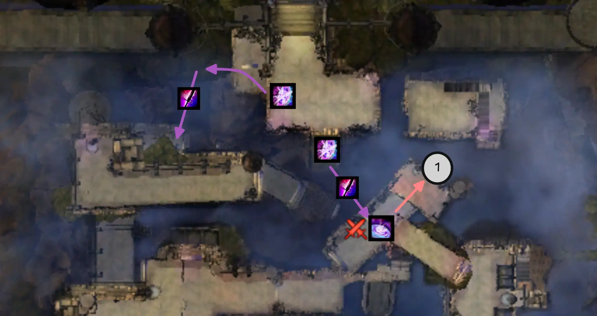
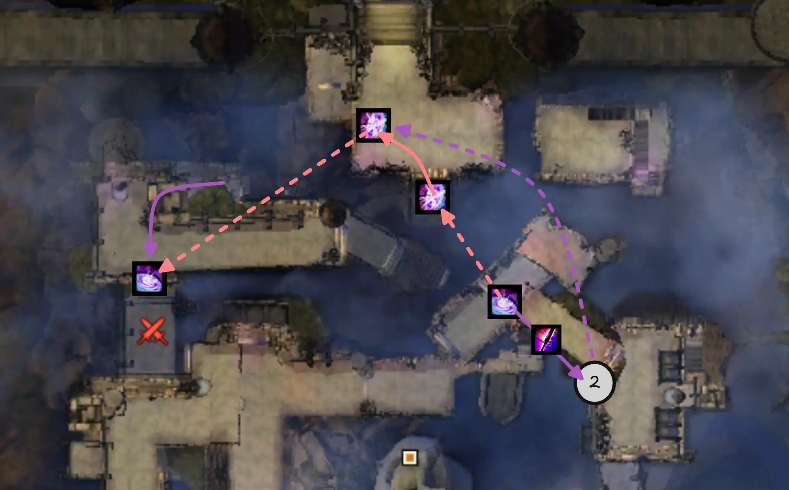
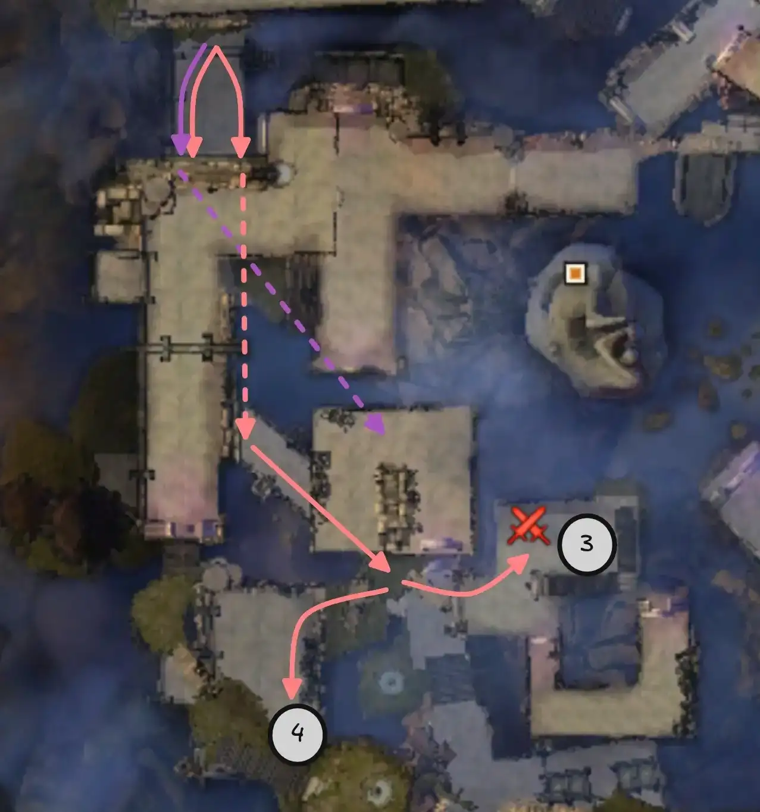
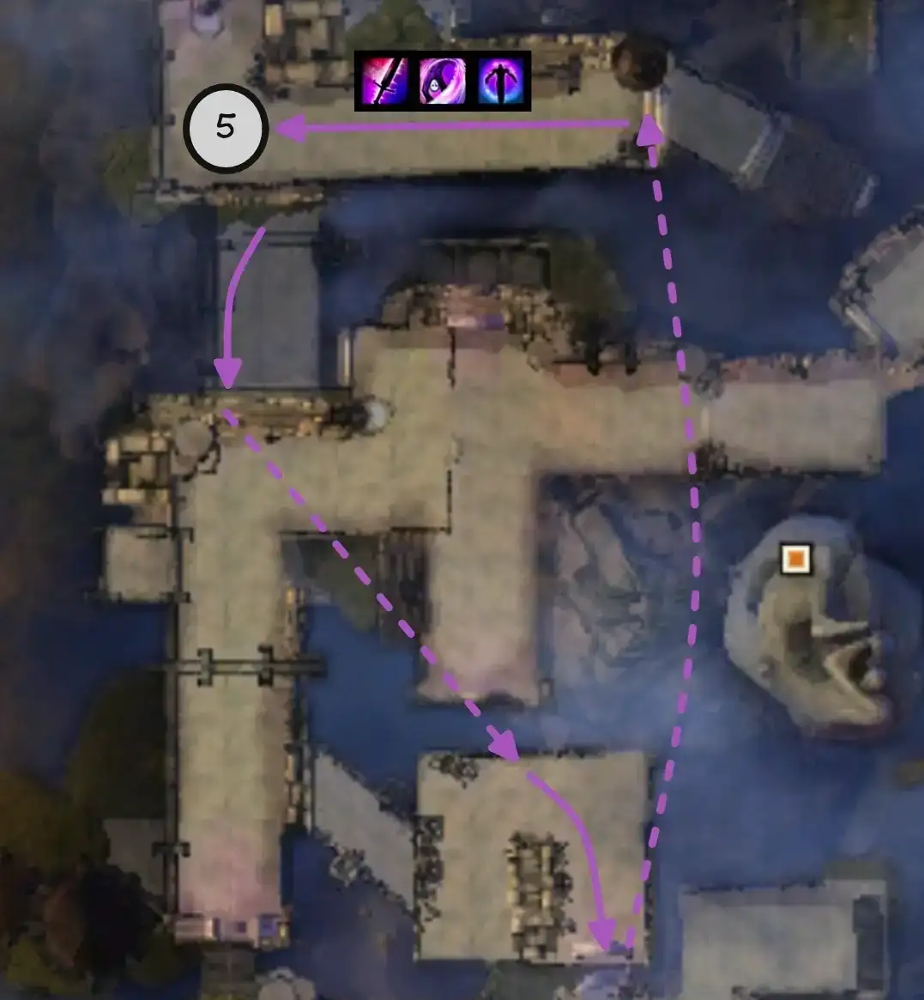
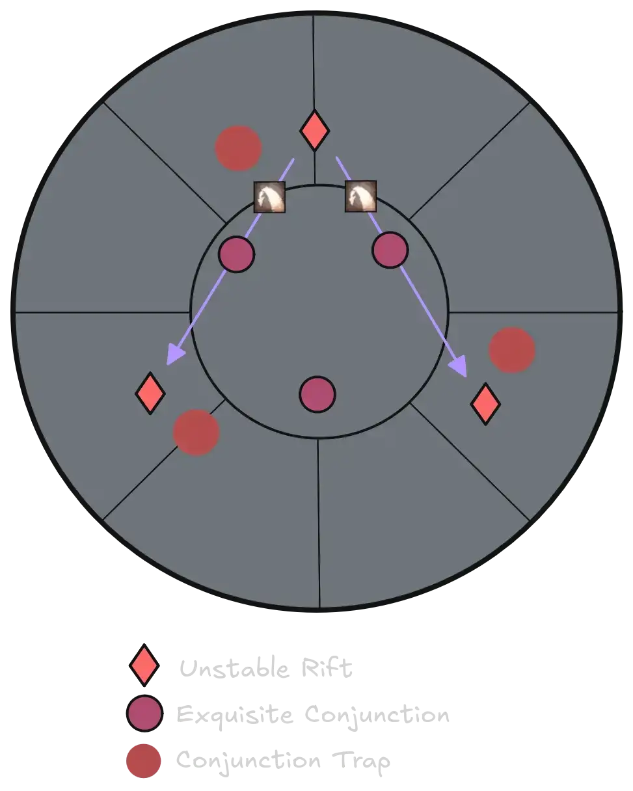
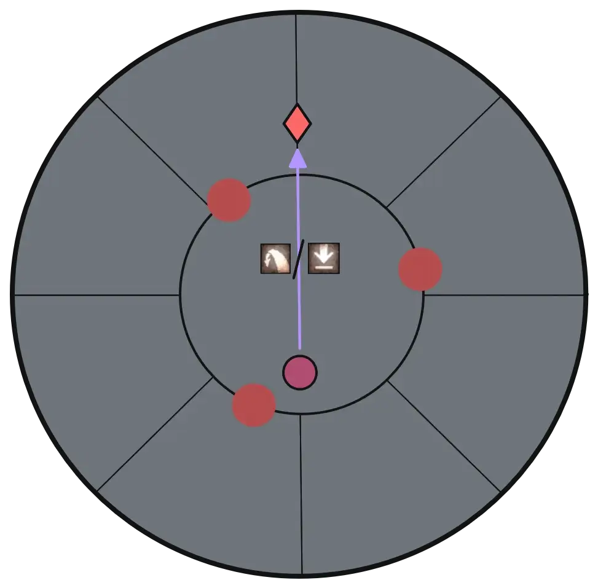
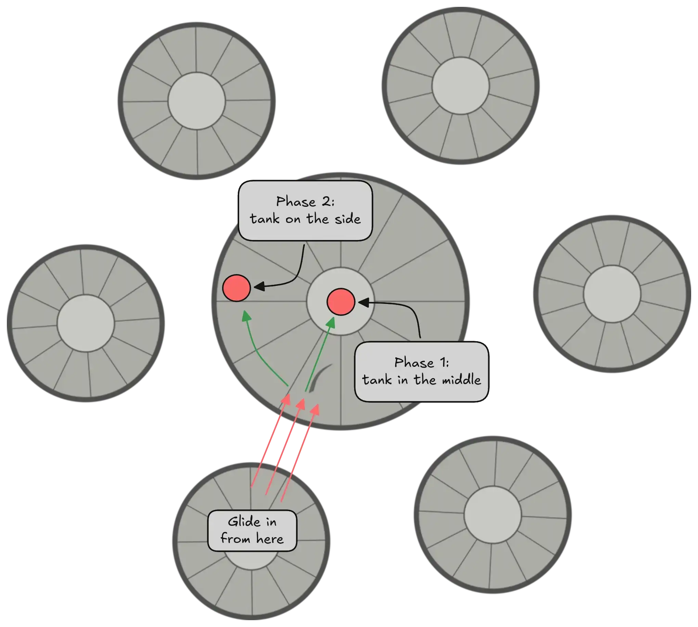

[< Wing 2](../wing-2/){: .btn } [Return to Home](../index.html){: .btn } [Wing 4 >](../wing-4/){: .btn } 
{: .center}

# Stronghold of the Faithful
{: .no_toc}

| **Timer** |  13 minutes 30 seconds |
| **Timer Start** |  On speaking to  [Glenna] |

<b>Table of Contents</b>

1. TOC
{:toc}

---

Fast clears of the Stronghold of the Faithful are heavily dependant on [Escort] and [Twisted Castle]. These two encounters are run with innovative tactics that greatly reduce their clear time, eclipsing the rest of the wing in relevance.

---

#### Main Points
{: .no_toc}

- [Escort] is run with a risky strategy that aims to gain as much time as possible.
- [Keep Construct] is played without moving the boss from the center, aiming to skip the exposed phase.
- [Twisted Castle] can be run extremely quickly with a risky strategy, but this is often not necessary timer-wise.
- [Xera] is played similarly to standard runs. High DPS means that boss movement can be minimized.

---

## Composition

Most compositions will run at least one  [Mesmer] and one  [Thief], which have utility that cannot be easily replaced. The remaining classes are mainly determined by the group's [Escort] strategy, as it has the most stringent requirements of the wing and is also where you stand to gain the most time.

Both bosses favour  Power damage but have relatively long phases, meaning that burst damage isn't as important.

---

#### Escort / Siege the Stronghold
{: .no_toc}

- The squad will divide into two groups: a *Tower* group and a *Ground* group.
- The *Tower* group contains six people:
  - One  [Thief] running  [Prepare Shadow Portal] and  [Infiltrator's Signet].
  - One  [Mesmer] running  [Portal Entre] and  [Blink].
  - A second  [Mesmer] with  [Portal Entre] and  [Blink] if you intend to do the [second set of  Glenna ports](#4-fourth-tower-and-glenna-ports).
  - One healer (if not running a heal  [Mesmer]).  [Druid] is an excellent choice due to  [Glyph of the Tides].
  - Enough DPS to get to six people.
- The *Tower* group bust bring at least three skills that can clear towers. See [Clearing Towers](#clearing-towers) for more information.
- The *Ground* group contains four people:
  - A  [Scrapper] to provide  [Glenna] with  [Superspeed] and  [Quickness].
  - A healer with high  [Stability] uptime, such as  [Guardian] or  [Mesmer].
  - Two DPS or BoonDPS that can provide high  [Blinded] uptime, usually either  [Elementalist] or  [Necromancer] (see [Warg Management](#warg-management) for more information).

#### Keep Construct
{: .no_toc}
- Strongly favours  power damage due to the boss having less armor than normal.
- Fairly easy to solo-heal using a single celestial healer such as  [Specter],  [Scourge] or  [Troubadour].
- Try not to bring too much CC as you don't want to break his  [Defiance Bar].

#### Twisted Castle
{: .no_toc}
- Optimized strategies rely on running a pair of  [Mirages].
- Non-optimized strategies will still benefit greatly from running at least one  [Mirage].
- Strong cleave and  pulls will speed up killing groups of adds.

#### Xera
{: .no_toc}
- The initial platforms can be sped up greatly with a person running  [Illusionary Wave] and a  pull in each subgroup.
- Having a player with enough range to kill the shard can "skip" the gliding phase, making the run much safer overall.

---

## Siege the Stronghold

As the first encounter of the wing, Escort is usually played using an especially risky strategy. This gains an incredible amount of time compared to normal clears, and is the main hurdle for groups attempting the wing. When performed well, the rest of the raid has significantly less time pressure.

This section contains an optimized strategy that can be picked up by most groups with a reasonable amount of practice. Feel free to modify and improve it according to your needs.

{: .note}
All positions described in this section can be viewed in-game using [marker packs].

---

### Important Concepts

#### Groups

Escort speedrun strategies revolve around dividing the squad into two groups:

- A *Tower* group that will [clear the towers](#clearing-towers), clearing space for  [Glenna], usually consisting of six people.
- A *Ground* group that will run  [Glenna] through the bottom part and deal with wargs, usually consisting of four people.

---

#### Teleporting Glenna

 [Glenna] has a mechanic that prevents her from getting stuck in terrain. Whenever a player uses  [Over Here!] within range, if she cannot pathfind to them (NPCs cannot jump!) she will instead instantly teleport to the player.

<video class="center bordered" width="60%" controls>
  <source src="escort/glenna_port.mp4" type="video/mp4">
</video>

Groups can abuse this to quickly teleport  [Glenna] over walls and difficult terrain. Most [marker packs] highlight positions where this is commonly done.

{: .warning}
Teleporting Glenna in this manner is not accepted in most speedrun formats.

---

#### Clearing Towers

To capture a tower, the number of players within the capture point must exceed the number of enemies. The greater the difference, the faster the tower is captured. Thus ideally we maximize the speed of capture by:
1. Sending as many people into each capture point as possible (this is why six people are in the tower group).
2. Quickly clearing enemies from capture points using skills that inflict  [Knockback] or  [Fear] in an area.

Skills that can clear towers include:
-  [Shadow Gust](https://wiki.guildwars2.com/wiki/Shadow_Gust) on  [Deadeye].
-  [Glyph of the Tides] on  [Druid].
-  ["Fear Me!] on  [Warrior].
-  [Shield of Absorption](https://wiki.guildwars2.com/images/thumb/6/65/Shield_of_Absorption.png/50px-Shield_of_Absorption.png) on  [Guardian](https://wiki.guildwars2.com/wiki/Guardian).

Groups should bring at least three of these skills so that one will be ready for each tower.

---

#### Speeding Glenna

The ground group should be arranged in the following manner:
- The  [Scrapper] should run slightly in front of  [Glenna] while giving  [Superspeed] to both her and the rest of the group.
- The two DPS should go ahead to clear out adds while spamming  [Over Here!], but not far enough to be out of range of the  [Scrapper].
- The healer should stay close  [Glenna] and heal her as much as possible.

---

#### Warg Management

Killing wargs is not viable, since the bottom group does not have enough damage and it loses a lot of time. Instead, groups should ferry  [Glenna] around them as much as possible while applying  [Crippled],  [Immobile] and  [Blinded] to prevent them from hitting her.

Blind in particular is extremely important, as in certain parts you can have as many as 4 wargs trying to hit  [Glenna] simultaneously. For this reason, it's important to have at least two players with skills that pulse  [Blinded]. Standard picks include  [Necromancer] with  [Well of Darkness],  [Elementalist] with  [Sandstorm] and  [Dust Storm](https://wiki.guildwars2.com/wiki/Dust_Storm), and  [Thief] with  [Black Powder](https://wiki.guildwars2.com/wiki/Black_Powder) or  [Infiltrator's Arrow](https://wiki.guildwars2.com/wiki/Infiltrator%27s_Arrow).

---

### Strategy

This section contains a play-by-play description of an optimal escort run. You may choose to include or exclude certain parts according to your group's preferences and substitute them with standard gameplay.

---

#### 0. Instance Preparation & Dialogue Skips

Before you start a run, you want to prepare the instance so that the bridge at the beginning is up and the gates are open. This lets players blink up from the bridge to the adjacent wall, enabling successive skips. There are two ways to do this:
- The normal way involves speaking to  [Glenna], having her begin the encounter, then triggering a wipe by /GG-ing. This is commonly done for Infallible runs, since it's easier and Escort will remain in a prepared state until you clear it.
- The fast way additionally has multiple players /GG-ing at specific instances to skip up to 40 seconds of dialogue. This requires some coordination and is often done in speedruns, but has no advantage in Infallible runs apart from not having to listen to  [Glenna] yap.

{: .warning}
If the triggered wipe happens too early, it can bug the encounter and you will have to reset. Have at least one person stay alive until the "Escort Glenna to the stronghold's courtyard" starts disappearing.

Click to view dialogue skip instructions

1. One player should approach  [Glenna] as soon as the wing is open to give her  [Superspeed]. They should then /GG during their first line of dialogue after she gets into position. This will skip the rest of the pre-Escort dialogue.

2. While at least one other player is alive in the wing, another player should interact with Glenna and select the first option. As soon as their first line of dialogue appears they should /GG to skip the rest of the post-Escort dialogue. This window is very tight so ideally they should have pre-typed /GG in their chat.

3. Finally, trigger a wipe as soon as the encounter begins by having everyone /GG.

4. After respawning,  [Glenna] will again appear on the right. You can give her  [Superspeed] again and then interact with her to immediately start the encounter.

{: .warning}
In step 1, do not /GG before  [Glenna] gets to her spot: this will result in her becoming un-interactable, making it necessary to reset the instance. If you are late and she's already speaking, wait for her next line to /GG.

---

#### 1. Initial Glenna Port & First Room Skip

Assign a player to each of the spots shown in the image (these positions are also displayed in the [marker pack]). When the encounter starts, two things happen simultaneously:

1. The players assigned to the markers use their  [Over Here!] in sequence to port  [Glenna] to position *4* in the map.
2. A  [Mesmer]  [Blinks] up to the wall above the bridge, places their  [Portal Entre], then glides down and opens it below where the rest of the squad can access it.

    
    

Once everyone takes the portal, they can use  [Over Here!] in position 5 to port  [Glenna] over the wall, ignoring the first rooms entirely.

---

#### 2. Cave Skip & Tanking Tower Shots

After taking the portal, the  [Thief] can skip the cave in its entirety by teleporting to an add using  [Infiltrator's Signet], placing a  portal at the bouncing mushroom or on top of the tower, and porting their squad through.

  Cave Skip PoV

<iframe class="youtube-video center bordered" width="100%" src="https://www.youtube.com/embed/X-DcF0dq8wo" frameborder="0" allow="accelerometer; clipboard-write; encrypted-media; gyroscope; picture-in-picture; web-share" referrerpolicy="strict-origin-when-cross-origin" allowfullscreen></iframe>

  Cave Skip Done Fast PoV

<iframe class="youtube-video center bordered" width="100%" src="https://www.youtube.com/embed/7hjWcmZJouk" frameborder="0" allow="accelerometer; clipboard-write; encrypted-media; gyroscope; picture-in-picture; web-share" referrerpolicy="strict-origin-when-cross-origin" allowfullscreen></iframe>

The most difficult part of performing this skip is targeting the enemies inside the cave. This is best done by enabling autotargeting or using the "Lock Autotarget" keybind. Both use the maximum range on your weapon skills, so equipping a rifle will let you reach the adds from the top of the wall, speeding up the sequence overall.

{: .note}
This skip can be practiced in a solo instance: read [here](#practicing-skips-on-this-wing) for more information.

The rest of the squad will glide off the building to the North. Avoid the center of the area immediately after the building, instead sticking to the walls. This will prevent a group of adds from spawning. The tower group will then take the  to the first tower.

In the meanwhile, the ground group can start bringing  [Glenna] to the first white circle. Until it is captured, the tower will keep bombarding this position: to avoid a wipe, the healer should spam  [Stability] and healing to  [Glenna] and the rest of their group. This is usually not an issue as the tower group should capture it very quickly.

  Ground Healer PoV

<iframe class="youtube-video center bordered" width="100%" src="https://www.youtube.com/embed/VtPpq-VKPr8&start=23&end=39&mute=1" frameborder="0" allow="accelerometer; clipboard-write; encrypted-media; gyroscope; picture-in-picture; web-share" referrerpolicy="strict-origin-when-cross-origin" allowfullscreen></iframe>

---

#### 3. Towers and Glenna Ports

These towers are captured similarly to the normal strategy. Since no wargs will have reached  [Glenna] yet, it is possible to speed her under the third tower so as to not require any mines to be cleared.

After the second tower, the  [Mesmer] that still has their  [Portal Entre] available runs to the south and prepares it on the final steps. They then glide down and join up with the ground group.

    
    

After activating the leyline to the fourth tower, it is possible to teleport Glenna almost directly to the fifth and final white circle. The group should first pull Glenna to position 1 as shown in the image below. The  [Mesmer] will then open their  portal,  [Blink] up the building to position 2, use  [Over Here!], then take their own  portal back to the group.

Position 3 can either be reached by another ground group player with a blink ( [Necromancer] has  [Summon Flesh Wurm](https://wiki.guildwars2.com/wiki/Summon_Flesh_Wurm) and  [Elementalist] has  [Lightning Flash](https://wiki.guildwars2.com/wiki/Lightning_Flash)), or by a tower player gliding down from the third tower. As soon as Glenna is in position 2, they can use  [Over Here!] then glide down to reach the group.

<video class="center bordered" width="60%" controls>
  <source src="escort/position_3.mp4" type="video/mp4">
</video>

Position 4 is reached by the rest of the ground group once they take the  portal. They can then pull  [Glenna] to the final circle.

{: .note}
All positions referenced in this section are included in the [marker pack].

---

#### 4. Final Portal and Mcleod

The final sequence involves setting up a  portal down from the fifth tower to the courtyard. This prevents [Mcleod] from teleporting up to the tower at the beginning of the boss phase, since he always targets the furthest player with this skill.

After the fourth tower is captured, the first  [Mesmer] prepares their  [Portal Entre], glides down, and opens it on top of the stairs. The  [Thief] then takes this portal,  [Shadowsteps] to the center of the courtyard, places their  [Shadow Portal], then  [Shadowsteps] back and re-takes the  [Portal Entre] to the tower.

{: .note}
It is highly recommended to provide the  [Thief] with  [Stability] as they risk getting interrupted by tower shots.

    
    

This is a critical moment for the run since  [Glenna] will be surrounded by several wargs attempting to kill her. It is extremely important at this point to spam skills that apply  [Blinded] in an area, such as  [Well of Darkness] and  [Sandstorm], otherwise she will die and the run will fail.

Everyone who is not providing  [Blinded] should take the  portal and help with capturing the final tower. Take the leyline as soon as it appears; the  [Thief] will then open their portal in the center of the tower as soon as they land, and everyone should take it when the tower is captured.

{: .warning}
Once [Mcleod] has spawned, the status reset will destroy any portals present in the instance. It's important therefore to take the  portal as soon as possible after the tower is captured, as you risk remaining stranded and making the boss teleport to the tower.

{: .note}
[Mcleod]'s teleport is a  [Knockdown](https://wiki.guildwars2.com/wiki/Knockdown) so try to dodge or block it.

Capturing the tower will begin the boss phase, despawning all wargs. The rest of the encounter is played as normal. Once the boss is dead, make sure to provide  [Superspeed] to  [Glenna] so she gets to the final gate faster.

{: .note}
When [Mcleod] splits into two clones, if you do not see a coloured icon above your character's head, it means that you are on the white clone. This is a fairly common graphical bug.

---

## Keep Construct

A fairly straightforward boss, which is played with only two major deviations compared to the PUG strat. Keep Construct is fairly sensitive to your group's overall DPS: with enough damage, it's possible to completely skip over some of the phases, significantly speeding up the fight overall.

---

### Transition from Escort

Once  [Glenna] blasts the gates open, there are 45 seconds before Keep Construct spawns in the middle of the arena. These cannot be shortened or skipped in any way. You should use this time to:
- Enable the Challenge Mote.
- Swap builds and/or subgroups.
- Change food and utility.
- Preposition in the center of the boss arena in preparation for when it spawns. 

---

### Center Strategy

Groups should aim to keep the boss in the center of the arena for the full duration of the fight. This makes it easier to deal damage, as overall movement is minimized and players can simply stand still and do their golem rotation.

---

### Skipping the Exposed Phase

In the standard Keep Construct strategy, after breaking his  [Defiance Bar] you unlock the ley-rift and exposed phase. In speedruns, however, these phases lose an incredible amount of time, as you will already be very close to 66% or 33% when entering them. It is thus desirable to skip them, forfeiting the damage bonus from  [Compromised](https://wiki.guildwars2.com/wiki/Compromised) but resulting in a much faster clear overall.

The easiest way of doing this is to avoid stripping both stacks of  [Xera's Embrace](https://wiki.guildwars2.com/wiki/Xera%27s_Embrace) from the boss, therefore never unlocking the breakbar at all. To do this either:
1. Ignore the tethers, thus letting the statues combine and killing the powered-up statue in the collection phase.
2. Have one of the players move slightly out of the center so that their statue does not die, while cleaving the second down. The statue will then despawn upon reaching the collection phase.

The second option is generally preferable for most purposes, as it's less inherently risky. However, groups often opt for the first option in pursuit of extra damage, especially in the final 33% as skipping the jump is a big timesave.

If something goes wrong and the  [Defiance Bar] is unlocked, make sure to call it out so that the group does not use any CC skills.

---

### Skipping Mechanics with DPS

With enough damage, players can skip important mechanics that they otherwise would be required to play. These mechanics are:

- (Easy)  [Radiant](https://wiki.guildwars2.com/wiki/Radiant_Phantasm) and  [Crimson Phantasms](https://wiki.guildwars2.com/wiki/Crimson_Phantasm) - the mechanic takes 15 seconds so aim to phase before.
- (Hard)  [Xera's Fury](https://wiki.guildwars2.com/wiki/Xera's_Fury) a.k.a spreads - the spreads pop 10 seconds after spawning. If your group can consistently phase before, it's worth stacking them since spreading reduces your DPS.
- (Medium) **Jump** - 40 seconds after becoming vulnerable in the final phase, the boss jumps into the air and remains untargetable for 12 seconds. Try to kill him before.

---

## Twisted Castle

This is an encounter that, similarly to [Escort], can be made much faster with a risky strategy. In this case we take advantage of the exceptional mobility provided by  [Mirage Thrust].

{: .note}
All skips in Twisted Castle can be practiced in a solo instance: read [here](#practicing-skips-on-this-wing) for more information.

---

### Fast Strategy

To use this strategy you will need at least two  [Mirage] players running a  [skip build](https://gw2skills.net/editor/?PiwAw2xlRw0YhsLmJesTXPVA-DSJYjRHfZkZFkeCI/VBAqA-e).

Once [Keep Construct] is dead, run down the stairs to the South and  [Pull] the first group of adds together. Once these are dead, the encounter will start. Both  [Mirages] should place  [Portal Entre] and use  [Mirage Thrust] to get to the next platforms.

<video class="bordered center" width="100%" controls>
  <source src="tc/mirage_skip_1.mp4" type="video/mp4">
</video>

The first  [Mirage] runs straight forward and drops down to the platform with the second set of adds. After opening their  portal, they can then use a second  [Mirage Thrust] to reach the druid button.

<video class="bordered center" width="100%" controls>
  <source src="tc/mirage_skip_2.mp4" type="video/mp4">
</video>

The second  [Mirage] runs to the right and leaps down to the platform, using  [Weapon Swap] to gain additional distance. This jump is not the easiest and requires some practice to be doable under pressure.

The rest of the squad takes the  portal opened by the first  [Mirage] and kills the group of adds there. Once they're dead, one player takes the gateway to the North and does the fountain button, while the rest take the  portal back to the beginning. The first  [Mirage] can walk into the statue next to the button to do the same.

Killing the second group of adds will also open the door in front of the second  [Mirage]. They can then open their own  portal for the rest of the squad, who then kills the third group of adds after the door. The gateways at the end of the room will activate once they're dead.

The main group can take the gateway on the left to reach the next two buttons. Once this is done, they can walk into a statue to get ported back to the beginning of the encounter, and wait next to the ley rift.

Meanwhile, the two  [Mirage] players will instead take the right gateway to do the final button and skip. 

One  [Mirage] will walk to the left after the gateway, take a second gateway, and get ported to the five statues area. Here they can use their mobility to get past the statues to the last button.

Once this is done, they can walk into a nearby statue to get ported back to the beginning, and position next to the ley rift with the rest of the squad once they come back.

<video class="bordered center" width='100%' controls>
  <source src="tc/mirage_skip_3.mp4" type="video/mp4">
</video>

The other  [Mirage] will instead go right and do the branch skip. This is a difficult skip that requires two precise  [Mirage Thrusts] in sequence.

Speedrun groups will often send both  [Mirages] to do this skip for more reliability, though this is not an option for Infallible groups as failure usually kills the player.

The player that completes the skip can then run directly to the end of the encounter.

{: .warning}
Make sure that everyone has taken a statue back before interacting with the final door!

{: .note}
The branch skip can also be performed with other classes, most notably  [Thief] with  [Vault](https://wiki.guildwars2.com/wiki/Vault).

Once the door is open, the encounter is complete and everyone can take the ley rift to [Xera]. The player who did the skip can instead take the gateway after the door.

{: .warning}
When interacting with the ley rift, make sure to not select the "Return to Aerodrome" option!

---

### Fast or Slow?

Doing the strategy described above can save over a minute compared to a normal clear. However, the strategy is very risky and relies on the  [Mirages] successfully completing several difficult skips, including the branch skip.

Most of the time, with a well-optimized escort, groups will not need this additional time-save. In this case, they may decide to instead complete the encounter with the normal PUG strat. This also simplifies group requirements, as you only need to bring one  [Mesmer]. This player can already bring more than enough utility to simplify the encounter for the rest of the group.

---

## Xera

Xera is a relatively straightforward fight, with minor differences compared to PUG runs. Improving your kill time comes down to higher damage, slightly different tanking strategies and optimized island clears.

Xera's damage pressure is low on everyone except the tank, so groups should try to [solo-heal] if possible. Celestial healers are viable and recommended, as long as they can confidently survive her  [Blurred Frenzy](https://wiki.guildwars2.com/wiki/Blurred_Frenzy).

---

### Island Optimization

On the side islands where you have to push orbs into rifts, it is possible to speed things up significantly with coordinated crowd control.

Usually this is done via an initial  [Knockback] that launches the two closest Conjunctions into their rifts, followed by a  [Pull] to complete the last one.

The initial push is most reliably done by a  [Mesmer] with a [Greatsword](https://wiki.guildwars2.com/wiki/Greatsword):
- Target the bloodstone shard while gliding to the island.
- Stand on the Unstable Rift.
- Cast  [Illusionary Wave](https://wiki.guildwars2.com/wiki/Illusionary_Wave).

For the final  [Pull], there are several options. Some of the most used include:
-  [Temporal Curtain]
-  [Grasping Darkness](https://wiki.guildwars2.com/wiki/Grasping_Darkness)
-  [Fang Grapple](https://wiki.guildwars2.com/wiki/Fang_Grapple)
-  [Point-Blank Shot](https://wiki.guildwars2.com/wiki/Point-Blank_Shot).

<video class="bordered center" width='100%' controls>
  <source src="xera/xera_push.mp4" type="video/mp4">
</video>

---

### Tanking

With speedrun groups, guaranteeing a certain level of damage allows you to tank in fixed positions for the entirety of the fight. Keeping the boss standing still will then increase damage overall.

---

### Skipping Gliding

One of the most common reasons for deaths in Xera is failures in the gliding section. It's possible to skip this section entirely by spawning in the leyline from the final island to the starting island, then using it to glide until the split phase ends.

To do this, you must kill the Charged Bloodstone on the final platform from the starting platform. This can be done in several ways:
- Longbow on  [Ranger], rifle on  [Deadeye] and  [Elite Mortar Kit](https://wiki.guildwars2.com/wiki/Elite_Mortar_Kit) can reach it due to having 1500 range.  [Deadeye] and  [Elite Mortar Kit](https://wiki.guildwars2.com/wiki/Elite_Mortar_Kit) may run into issues with obstructions.
- Traps such as  [Prepare Thousand Needles](https://wiki.guildwars2.com/wiki/Prepare_Thousand_Needles) can cover areas that potentially could be obstructed.

Doing this will not save any time overall as the phase has a fixed duration, however it will give you peace of mind and a moment to recuperate before the final damage phase of the wing.

---

## Additional Resources

#### PoVs

{: .note}
This is a non-comprehensive list meant to display a diverse selection of perspectives and roles. You do not have to copy them exactly, in fact we encourage you to find whatever strategy that suits your group best.

| Classes | Link | Date | Notes |
|   DPS, Portals |  [PoV](https://www.youtube.com/watch?v=owYyLiLvZYg) | March 2026 | First Mesmer on Escort, Normal TC, Gliding Skip on Xera |
|   BoonDPS, Portals |  [PoV](https://www.youtube.com/watch?v=XQjtQTjhJKI) | March 2026 | Second Mesmer on Escort, Fast TC |
|   Heal, DPS |  [PoV](https://www.youtube.com/watch?v=VtPpq-VKPr8) | March 2026 | Glenna Heal, Fast TC |
|   Heal, DPS |  [PoV](https://www.youtube.com/watch?v=ZOd5D_YZTks) | March 2026 | Tower Heal on Escort, Fast TC |

---

#### Practicing Skips on This Wing

Many of the skips described in this guide can be practiced solo:

- ** Cave Skip** - can be done by parking  [Glenna] at the beginning of the encounter: use  [Over Here!] to get her to the first teleport spot then move to the second. Monitor her  [Surveilled](https://wiki.guildwars2.com/wiki/Surveilled) stacks: when they reach zero, seekers will spawn on her. The moment they do, use  [Over Here!] to teleport her to the second spot. The seekers will now be stuck on the rock and Glenna will be safe, as new ones cannot spawn unless the previous ones die.
- ** Twisted Castle Initial Skips** - can be accessed at the start of Twisted Castle by opening an instance cleared up to Xera.
- **/ Branch Skip** - can be accessed by opening an instance cleared up to Xera, taking the portal at the beginning of Twisted Castle, and then gliding down from the staircase. 

---

#### Other Useful Links

-  [Comprehensive Escort Speedrun Guide by Areki](https://www.youtube.com/watch?v=qfR-D7Ps5Fo) - very useful video guide for advanced the Escort strategies.
-  [Twisted Castle Speedrun Explanation by Areki](https://www.youtube.com/watch?v=jvyYtfpv7Gc) - long explanation of the standard TC speedrun strategy.
-  [1:54 Escort by [MCA]](https://www.youtube.com/watch?v=HatDI1eO2wU) - while more than most groups will need, this the peak of Escort gameplay. The video description contains more PoVs of the run. 
-  [0:37 Twisted Castle by [Vs]](https://www.youtube.com/watch?v=KCFNzOBdipw) - showcases great execution of a fast clear. The video description contains more PoVs of the run.
-  [Fast Orbs on Xera by HasHka](https://youtu.be/z-OFa6RVtYY) - shows some ways of doing fast island clears on Xera.

[< Wing 2](../wing-2/){: .btn } [Return to Home](../index.html){: .btn } [Wing 4 >](../wing-4/){: .btn }  [Return to Top](#stronghold-of-the-faithful){: .btn .fixed}
{: .center}

[Escort]: #siege-the-stronghold
[Twisted Castle]: #twisted-castle
[Keep Construct]: #keep-construct
[Xera]: #xera
[composition for Escort]: #composition-1
[marker packs]: ../general.html#marker-packs
[marker pack]: ../general.html#marker-packs
[solo-heal]: ../general.html#solo-healing
[Mcleod]: https://wiki.guildwars2.com/wiki/McLeod_the_Silent
[Glenna]: https://wiki.guildwars2.com/wiki/Scholar_Glenna

[Mesmer]: https://wiki.guildwars2.com/wiki/Mesmer
[Thief]: https://wiki.guildwars2.com/wiki/Thief
[Virtuoso]: https://wiki.guildwars2.com/wiki/Virtuoso
[Warrior]: https://wiki.guildwars2.com/wiki/Warrior
[Ranger]: https://wiki.guildwars2.com/wiki/Ranger
[Druid]: https://wiki.guildwars2.com/wiki/Druid
[Deadeye]: https://wiki.guildwars2.com/wiki/Deadeye
[Scrapper]: https://wiki.guildwars2.com/wiki/Scrapper
[Chronomancer]: https://wiki.guildwars2.com/wiki/Chronomancer
[Guardian]: https://wiki.guildwars2.com/wiki/Guardian
[Necromancer]: https://wiki.guildwars2.com/wiki/Necromancer
[Elementalist]: https://wiki.guildwars2.com/wiki/Elementalist
[Specter]: https://wiki.guildwars2.com/wiki/Specter
[Scourge]: https://wiki.guildwars2.com/wiki/Scourge
[Troubadour]: https://wiki.guildwars2.com/wiki/Troubadour
[Mirage]: https://wiki.guildwars2.com/wiki/Mirage
[Mirages]: https://wiki.guildwars2.com/wiki/Mirage

[Psychic Force]: https://wiki.guildwars2.com/wiki/Psychic_Force
["Fear Me!]: https://wiki.guildwars2.com/wiki/%22Fear_Me!%22
[Glyph of the Tides]: https://wiki.guildwars2.com/wiki/Glyph_of_the_Tides
[Prepare Shadow Portal]: https://wiki.guildwars2.com/wiki/Prepare_Shadow_Portal
[Infiltrator's Signet]: https://wiki.guildwars2.com/wiki/Infiltrator%27s_Signet
[Shadowstep]: https://wiki.guildwars2.com/wiki/Shadowstep
[Shadowsteps]: https://wiki.guildwars2.com/wiki/Shadowstep
[Portal Entre]: https://wiki.guildwars2.com/wiki/Portal_Entre
[Shadow Portal]: https://wiki.guildwars2.com/wiki/Shadow_Portal
[Blink]: https://wiki.guildwars2.com/wiki/Blink
[Blinks]: https://wiki.guildwars2.com/wiki/Blink
[Superspeed]: https://wiki.guildwars2.com/wiki/Superspeed
[Stability]: https://wiki.guildwars2.com/wiki/Stability
[Quickness]: https://wiki.guildwars2.com/wiki/Quickness
[Blinded]: https://wiki.guildwars2.com/wiki/Blinded
[Immobile]: https://wiki.guildwars2.com/wiki/Immobile
[Crippled]: https://wiki.guildwars2.com/wiki/Crippled
[Knockback]: https://wiki.guildwars2.com/wiki/Knockback
[Knockbacks]: https://wiki.guildwars2.com/wiki/Knockback
[Fear]: https://wiki.guildwars2.com/wiki/Fear
[Well of Darkness]: https://wiki.guildwars2.com/wiki/Well_of_Darkness
[Sandstorm]: https://wiki.guildwars2.com/wiki/Sandstorm
[Over Here!]: https://wiki.guildwars2.com/wiki/Over_Here!
[Defiance Bar]: https://wiki.guildwars2.com/wiki/Defiance_bar
[Pull]: https://wiki.guildwars2.com/wiki/Pull
[Pulls]: https://wiki.guildwars2.com/wiki/Pull
[Mirage Thrust]: https://wiki.guildwars2.com/wiki/Mirage_Thrust
[Mirage Thrusts]: https://wiki.guildwars2.com/wiki/Mirage_Thrust
[Weapon Swap]: https://wiki.guildwars2.com/wiki/Weapon_swap
[Temporal Curtain]: https://wiki.guildwars2.com/wiki/Temportal_Curtain
[Illusionary Wave]: https://wiki.guildwars2.com/wiki/Illusionary_Wave