[< Wing 3](../wing-3/){: .btn } [Return to Home](../index.html){: .btn } [Wing 5 >](../wing-5/){: .btn } 
{: .center}

# Bastion of the Penitent
{: .no_toc}

| **Timer** |  14 minutes 30 seconds |
| **Timer Start** |  On speaking to  [Glenna] after first entering the wing. |

<b>Table of Contents</b>

1. TOC
{:toc}

---

The Bastion of the Penitent mostly consists of boss fights, meaning that high DPS is essential to getting a good time. Samarog and Deimos can be especially punishing, as they contain a lot of dangerous mechanics that can be run-ending if misplayed. A good composition, smooth transitions and a lot of practice are the keys to getting the achievement for this wing.

---

#### Main Points
{: .no_toc}

- High damage is especially important since most of the wings is spent in combat. Solo-healing is recommended.
- [Cairn] and [Mursaat Overseer] are golems and played similarly to normal runs.
- [Samarog] is one of the fights where groups lose the most time. Optimized positioning and split phases are extremely important.
- [Deimos] is the run-ender with his plethora of dangerous attacks. Your clear is conditional on correct management of these mechanics.

---

## Composition

Wing 4 leaves you with relative liberty to make your own composition. The only essential components are:
- A  [Thief] to open the door after [Samarog].
- A  [Mesmer] to optimize the transition from [Cairn] to [Mursaat Overseer].

Apart from this, you are basically free to run whatever composition deals most damage and satisfies the most mechanics overall for your group. Some general tips:
- A strong celestial healer will make life much better for your group. Common choices are  [Specter] and  [Troubadour].
- (Boon)DPS classes with some passive healing such as  [Specter],  [Luminary],  [Scourge] and  [Ritualist] are extremely useful for supporting the off-heal subgroup.
- Make sure you bring enough  [Knockback] and  [Pull] utilities for [Samarog].

---

## Cairn

This boss is one of the more annoying CMs to play, but not especially dangerous. Fast clears require doing your best DPS rotation while dodging [Displacement](https://wiki.guildwars2.com/wiki/Displacement) and using  [Celestial Dash] off-cooldown.

Groups wanting to optimize this encounter mainly do so by playing around [Spatial Manipulation](#skipping-greens). It is also highly recommended to run a [single celestial healer](../general.html#solo-healing) as damage pressure is quite low.

---
### Initial Dialogue

The timer for  <a class='yellow-text' href='./404.html'>Down and Out</a> begins upon talking after Glenna on first entering the wing. Glenna will then start walking towards the platform, spawning the boss in when she gets into position. This cannot be sped up in any way, shape or form: it will always take 47 seconds from when the timer starts to when the boss becomes vulnerable. Players should take advantage of this to preposition on the platform beforehand.

{: .warning}
<a class='yellow-text' href='./404.html'>Down and Out</a> is not re-applied if you talk to her a second time after resetting the boss: if you wipe, you will have to swap to a fresh instance.

---

### Skipping Greens

One of the main mechanics that groups can optimize on Cairn is [Spatial Manipulation], a.k.a. greens. A player that fails this mechanic by not being in the green when it pops will  [Float] and gain 25 stacks of  [Unseen Burden](https://wiki.guildwars2.com/wiki/Unseen_Burden). 

This debuff is not an issue until it reaches 99 stacks: groups will therefore provide  [Stability] during the greens, thus preventing the  [Float] effect while maintaining high DPS uptime on the boss. Players can generally tank only one green per pull, as the second one will petrify them.

Ideally, groups should only see two greens: the initial one as the fight starts, and a second one after 50%. In this case, it's best to play the first green correctly (or ignore it with  [Invulnerability] as explained in [the following section](#skipping-special-action-key)), as its pattern includes a safe zone next to the boss.  [Stability] can then be used to skip the second green.

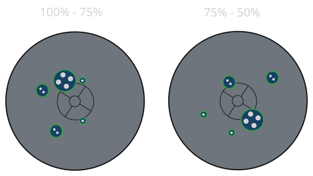
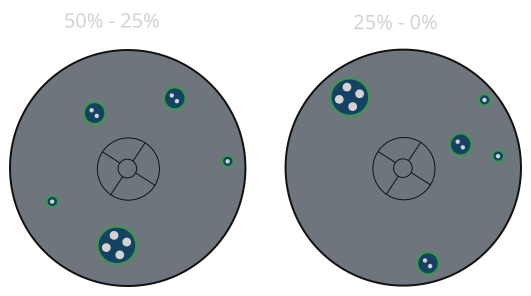

If you consistently get the third green, the fight is still clearable and you still have enough DPS to clear the wing. However, you should instead play the second green and skip the third. This is due to the second green likely spawning before 50%, thus its patterns having safe zones closer to the middle than the third. Players with access to personal  [Invulnerability] skills can use them to skip the second green as well.

---

### Skipping Special Action Key

One of the more annoying mechanics of Cairn CM is  [Countdown](https://wiki.guildwars2.com/wiki/Countdown). This effect is applied in two ways:
- When a player interacts with the Challenge Mote, to any players close to the mote.
- To all players hit by [Spatial Manipulation] (greens).

Players who are  [Invulnerable] during the first green will not be hit by it,  and will therefore not gain  [Countdown](https://wiki.guildwars2.com/wiki/Countdown) until the second green. This lets them completely ignore both the  [Celestial Dash] mechanic and the green itself, as it also prevents any application of  [Unseen Burden](https://wiki.guildwars2.com/wiki/Unseen_Burden).

For this reason, groups on Cairn will often run one or more  [Troubadours], as  [Tale of the August Queen], being the only skill that can currently provide group  [Invulnerability], will vastly increase DPS uptime overall.

---

## Transition to Mursaat Overseer

This transition involves a lot of movement, and can be made a lot faster using portals and movement skills. Your strategy for this transition will vary based on whether you are running with one or two  [Mesmers]. These should run a specialized  [skip build](https://gw2skills.net/editor/?PiwAw2xlRw0YhsLmJesTXPVA-DSJYjRHfZkZFkeCI/VBAqA-e).

{: .note}
It's recommended to use [marker packs] to see portal positions, as they can be quite precise.

---

### Single Mesmer Variation

Towards the end of [Cairn], your  [Thief] and  [Mesmer] should head towards the western part of the arena in preparation. They can even jump down and glide before the boss is dead.

The  [Thief] can head to the base of the cliff to prepare a portal up. This can be done by using  [Shadowstep] to blink up, using  [Prepare Shadow Portal], then  [Shadowstepping] back and opening it.

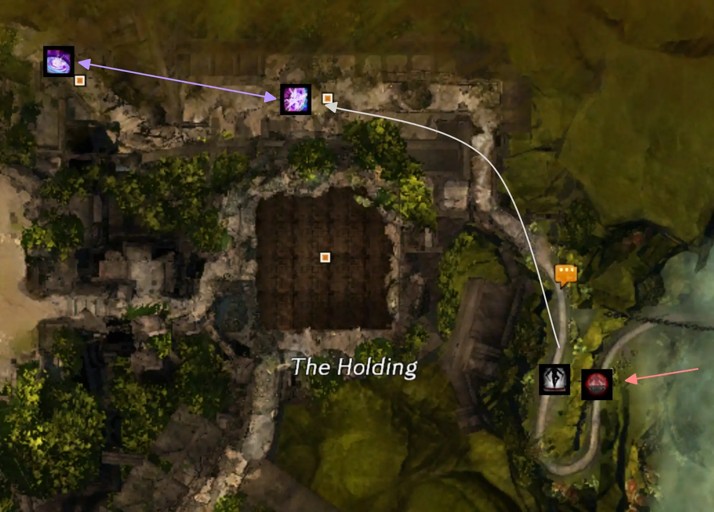

The  [Mesmer] should be ready for when the portal opens. They should then use all their mobility to get to the rubble pile, prepare their  [Portal Entre], then open it next to the shovel.

In the meanwhile, the rest of the squad should be running through the ruins to the door. One person should speak to  [Glenna] on the way. Designate four more people apart from the  [Mesmer] to take the portal, pick up a shovel, take the portal back and use it on the rubble pile.

---

### Double Mesmer Variation

This is played identically to the [single Mesmer version](#single-mesmer-variation) but incorporating an extra portal from  [Glenna] to the rubble pile. This allows the  [Mesmer] going to the shovel to take this portal and save their mobility for the second part of the transition, thus speeding up the sequence by up to 15-20 seconds compared to the single version.

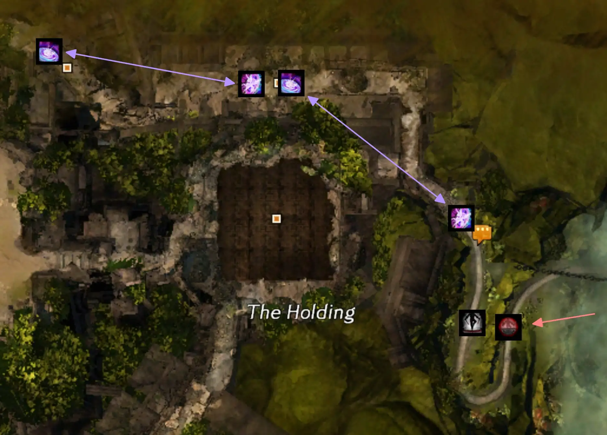

The  [Mesmer] doing the first portal should not wait for the  [Thief]: it's instead faster to  [Mimic]  [Blink] up the cliff before the rest of the squad to get a head start and minimize the group spends waiting for your portal to open.

---

### Concluding the Transition

Start [Mursaat Overseer] as quickly as possible after opening the way to his room. Players should have swapped templates and food before the rubble pile is excavated. The designated holders for  [Claim],  [Dispel] and  [Protect] should run in immediately and pick up their special action keys without delay.

---

## Mursaat Overseer

This boss is very passive. Your players should keep up their best DPS rotation while avoiding deaths due to spikes and blues.

Mursaat has very low damage pressure, and can be run with no healers at all provided your squad has some form of passive health regeneration or barrier from classes such as  [Specter],  [Luminary],  [Scourge] and  [Ritualist].

---

### Protect Timing

To maintain high DPS, most groups playing Mursaat will ignore the outermost two [Jade Scouts]. This results in them eventually promoting to [Jade Soldiers] and exploding on the group after being cleaved down. Proper timing of  [Protect] here can trivialize this issue, negating most of their attacks and their final explosion.

Depending on your overall cleave and survivability, you can choose to use  [Protect] as early as when the soldiers get to the group to as late as when they get to 50% HP.

---

### Managing Overlaps

The second highest risk groups may encounter on Mursaat Overseer is the overlap between Blues and Spikes. This happens because Blues are timing-based, happening every 30 seconds, while spikes are influenced by the boss's HP, resetting at 75%, 50% and 25%.

Keeping in mind that Blues take 4 seconds to detonate and spikes take 5, the only situation that cannot be played around is when the blues appear a second after the spikes. In this case you would need to use  [Protect] to survive, potentially not having it available for the [Jade Soldiers].

If your group consistently ends up with this overlap, consider changing your overall DPS profile. If you are running a celestial healer, you could avoid the overlap by running no-heal instead, and vice-versa.

---

## Samarog

Samarog is a long fight with plenty of occasions to make mistakes. Fast clears are highly dependant on good positioning, high  [Stability] uptime, vast amounts of CC and well-executed split phases. It is very easy to lose time whenever one of these is lacking.

Samarog has low incoming damage pressure and can easily be [solo-healed](../general.html#solo-healing). Groups attempting to speed up this encounter will benefit from:
- Good boon access:  [Protection] to prevent players from being downed by spears, and  [Stability] to prevent  [Knockback] into the arena's edges.
-  [Pull] and  [Knockback] utilities for the split phases.
- High amounts of CC.  [Thief] is unparalleled here due to  [Distracting Throw].

---

### Transition from Mursaat

This transition is fairly short and simple. The easiest way to speed it up is to have a  [Thief] ready to open the door for everyone. This can be optimized by having them position closer to the exit towards the end of [Mursaat Overseer]. Players should try to swap templates while heading up the steps and food should be placed just before the boss, so that players can run in directly without losing time.

---

### Speedrun Strategy

Speedrun strategies for Samarog focus on positioning, ensuring that the boss is moved as little as possible while placing spears in convenient locations around it.

{: .note}
This strategy is described here using positions from the [PEAK Infallible Markers](../general.html#marker-packs) pack.

Start by running in to position *1*, baiting the first spear there. The tank should then move in between *1* and *8*, while the rest of the squad can move to position *2* or *3*.

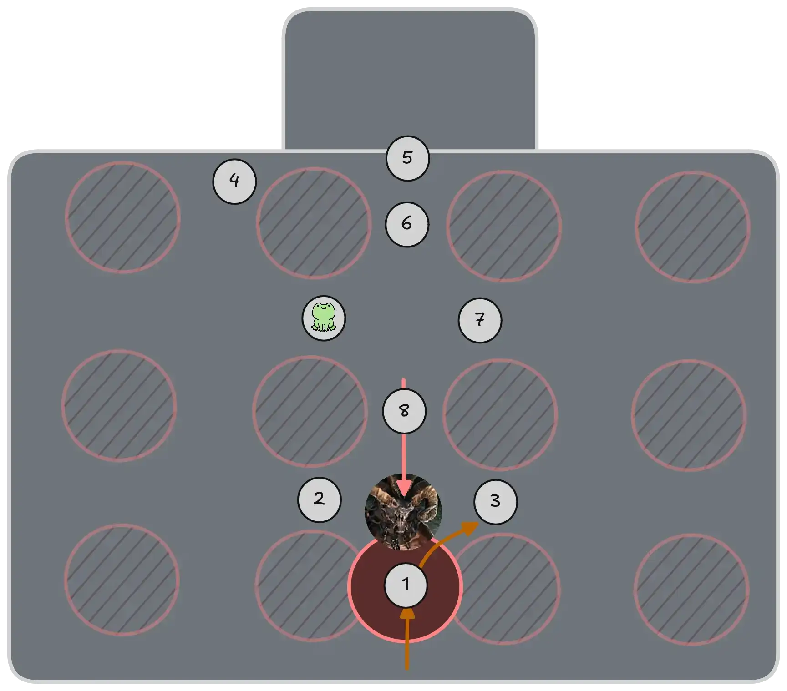
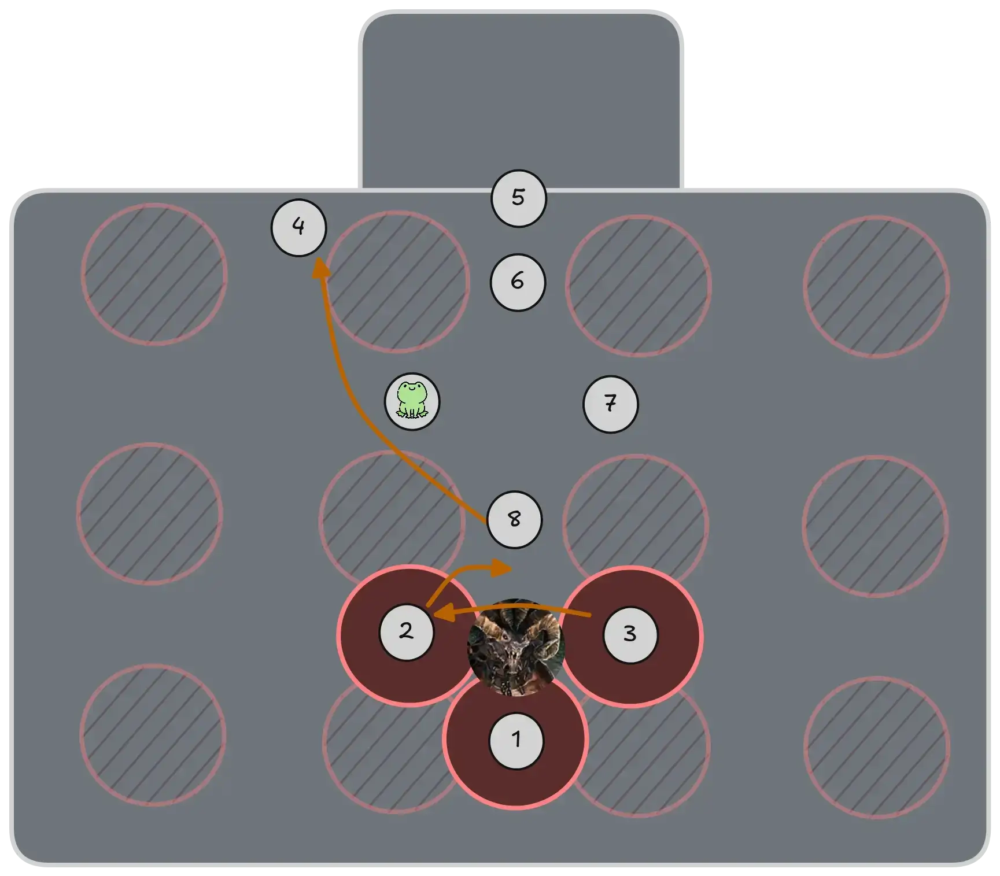

Remain at maximum melee range while doing damage, thus baiting the spear as far from the boss as possible. This gives you more space to work with overall, and reduces the risk of the tank being caught inside a spear during CC.

When the friends mechanic occurs, move to the other side. Then, on the next one, move towards position *8*, and finally to *4* once you reach 33% and the split phase begins. Try to get to *4* quickly: if [Rigom] aggros onto a player who is stuck doing friends far from the alcove, your split phase will become noticeably slower.

While on 4, you should be  pulling [Rigom] into Samarog's hitbox. This is best done using a combination of two or more skills to push him deep into the alcove, otherwise you risk him running out and exploding while on stack. Commonly this is done by combining  [Temporal Curtain] with  [Illusionary Wave] or another  [Knockback].

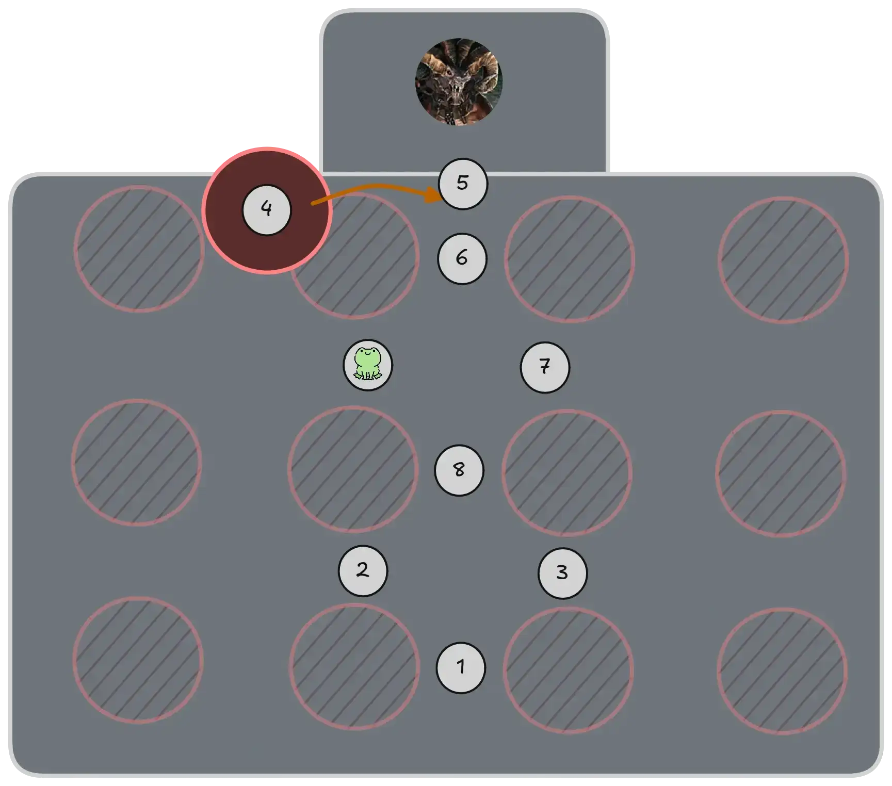
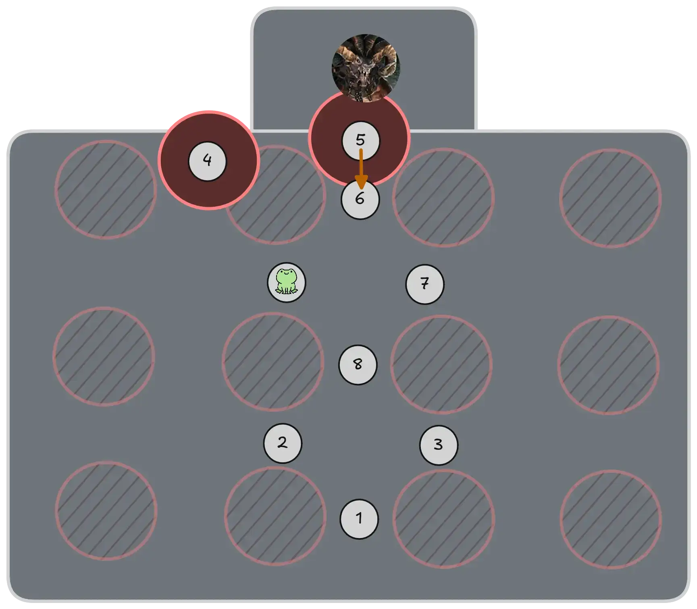

Once you get the friends mechanic on *4*, you can move to *5*, and then to *6* if you get it a second time. Ideally you should not get it a third time.

{: .note}
If you can spare the utility slots and need to do an additional friends mechanic, remember that people targeted by the friends mechanic can still take  [Shadow Portal] and  [Portal Entre], allowing the spear to be placed anywhere.

Once [Guldhelm] dies, you should then  pull [Rigom] out and kill him quickly, beginning the next main phase. Your tank should preposition between *4* and *8* to make Samarog walk all the way out of the spears, while the rest of the squad can remain on *6* (or *7* if the spear on *5* was slightly misplaced).

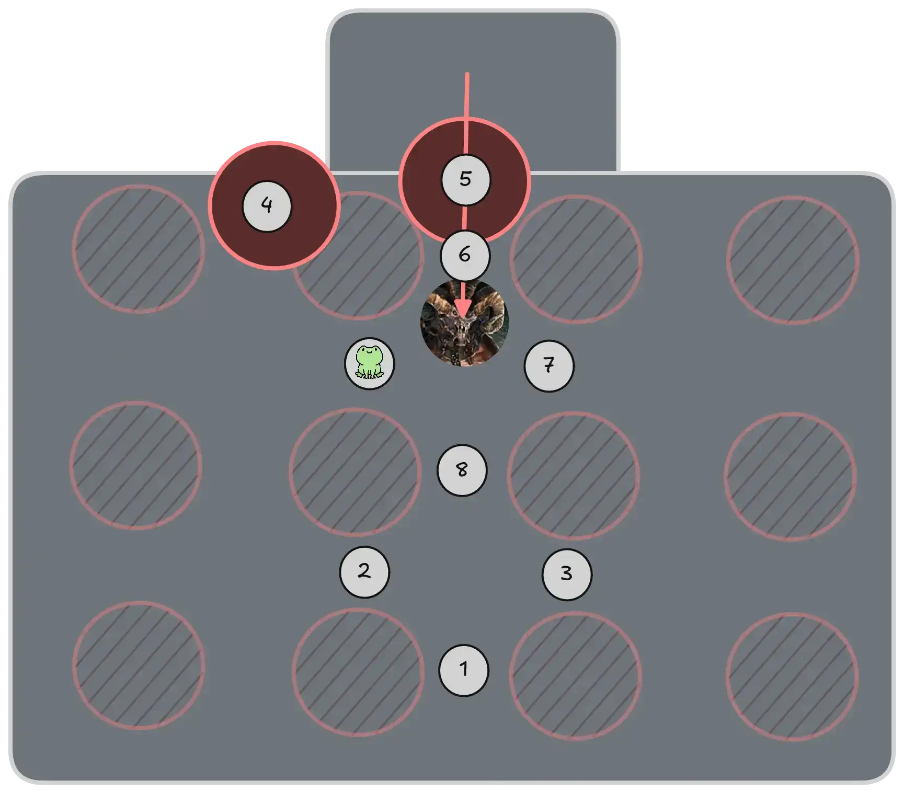
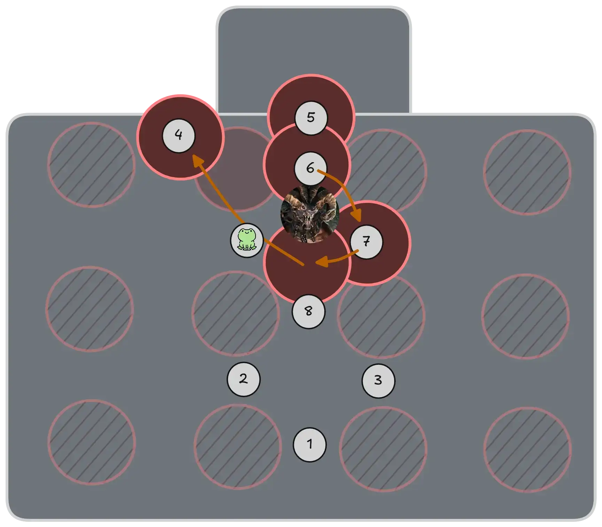

As in the previous phase, remain at maximum melee range to bait out the friend mechanic far from the boss, rotating to a new position when it's convenient. Don't feel like you're forced to follow them sequentially: go to wherever you have space.

Repeat this for the following split phase and main phase.

---

## Deimos

Deimos is a difficult boss with lots of dangerous mechanics. While strategy-wise it's played similarly to normal runs, the potential for easy downstates is always present, with increased pressure due to it being the last boss of the wing.

---

### Composition

Most groups will try to run a handkite that can also give ranged boons to the rest of the squad. Common choices include  [Catalyst] and  [Mechanist]. This is usually combined with a celestial healer.  [Troubadour] is a common pick due to its easy access to  [Aegis] with  [Tale of the Honorable Rogue](https://wiki.guildwars2.com/wiki/Tale_of_the_Honorable_Rogue).

 [Ritualist] also deserves a mention due to its excellent utility:  [Innervate Preservation](https://wiki.guildwars2.com/wiki/Innervate_Preservation) and  [Weapon of Warding](https://wiki.guildwars2.com/wiki/Weapon_of_Warding) are instant-cast sources of group  [Aegis]. Furthermore,  [Xinrae's Weapon](https://wiki.guildwars2.com/wiki/Xinrae%27s_Weapon) makes for extremely safe Mind Crushes as it cannot be stripped by enemy attacks.

---

### Transition from Samarog

To start Deimos, you will have to wait for  [Glenna] to get into position so that you can disable the mid-encounter cinematic. This cannot be sped up in any way, just like at the beginning of the wing. The common approach here is to send a person to enable the CM mote, and then talk to Glenna. A  [Mesmer] can prepare a  [Portal Entre] next to her dialogue position for this player. It can then be opened on the boss platform, with the group starting the fight afterwards.

{: .warning}
Make sure not to open this portal on top of any food items, as anyone trying to eat the food will get an unpleasant surprise instead.

---

### Chain Phase

At the beginning of the fight, when you go down to free Saul, you want to kill all four chains at the same time. This is a big time gain, enabling you to start the fight right away without having to repeat the green sequence multiple times.

The best way to do this is to pre-assign people to each chain. The chains are aligned with the cardinal directions, and you can assign two DPS or BoonDPS players to each chain.

To synchronize the death of the chains, the best approach is to agree on a time on the encounter timer to kill them at, usually *11:42*.

---

### Green Strategy

The group has to manage three greens overall. Each one is solved in a different manner to save the greatest amount of time.

#### 75% Green
{: .no_toc}

For the first green, the best thing is to kill Saul as fast as possible. Therefore, everyone except for the tank and hand-kite should take the green to increase DPS on Saul.

The phase ending usually lines up with Mind Crush: when coming up the group should be careful to step away from Saul and any hands coming in.

#### 50% Green
{: .no_toc}

Most groups will try to not phase Saul before he splits into his four clones. These can easily cause downstates due to their attacks stripping  [Aegis], so you want to have him split in the Demon Realm, where Mind Crush is not an issue.

For this reason, groups will often designate one subgroup to go down in the green while the other keeps dealing damage to the boss.

#### 25% Green
{: .no_toc}

Usually only the person targeted by the green will go down at 25% (known as "sac green"). The rest of the group should phase the boss fast enough that they do not go downstate before they also come down.

To survive, the best thing the sac player can do is kite Saul around in a circle, avoiding his auto-attacks as much as possible.

---

### Oil Placement

Oils are the prime reason for wipes on Deimos. Correct placement of them can make his encounter not only safer, but much faster overall.

#### Parallel Tanking
{: .no_toc}

This strategy minimizes overall movement and maximizes DPS uptime on the boss. However, it's also risky as it places people on the outside of Deimos, where the pizza attack can easily knock them off the platform.

Once the boss is approaching 60%, everyone except for the tank should stand at maximum melee range from its hitbox. Ideally you want to spawn the oil as far as possible from the center. When it does spawn, there should be enough space on the other side to keep hitting the boss without having to pull it away.

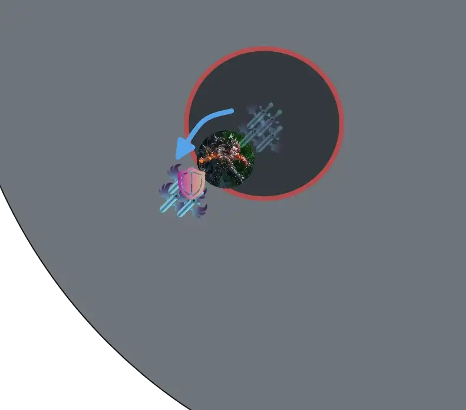

You can keep up DPS on the new side until a second oil spawns. Only at this point will you have to move the boss to the side, then resuming your position at maximum melee range until the next oil spawns.

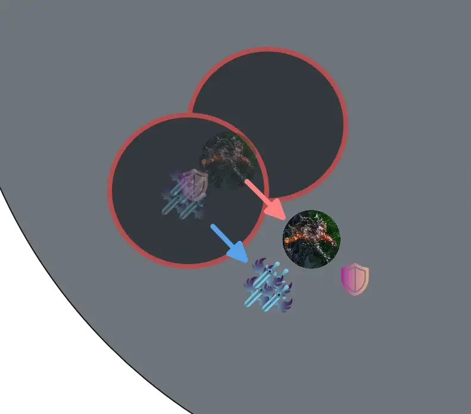

#### Triangle Tanking
{: .no_toc}

This strategy does not guarantee as much DPS uptime and requires a bit more movement, but it's much easier and safer to execute. It also has the advantage of keeping all oils contained to a specific area of the platform, giving your handkite free reign over the rest of the arena.

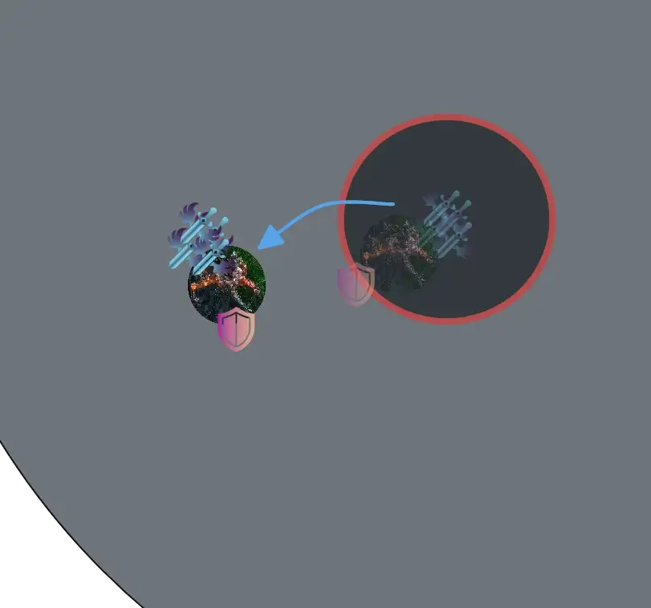

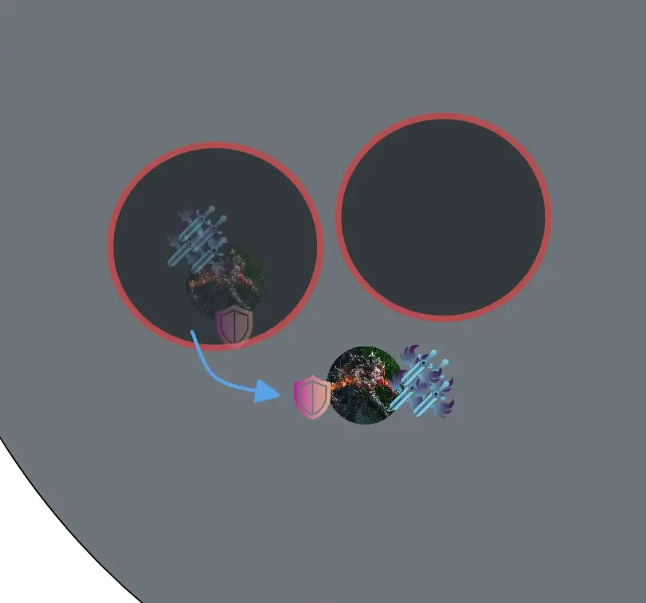

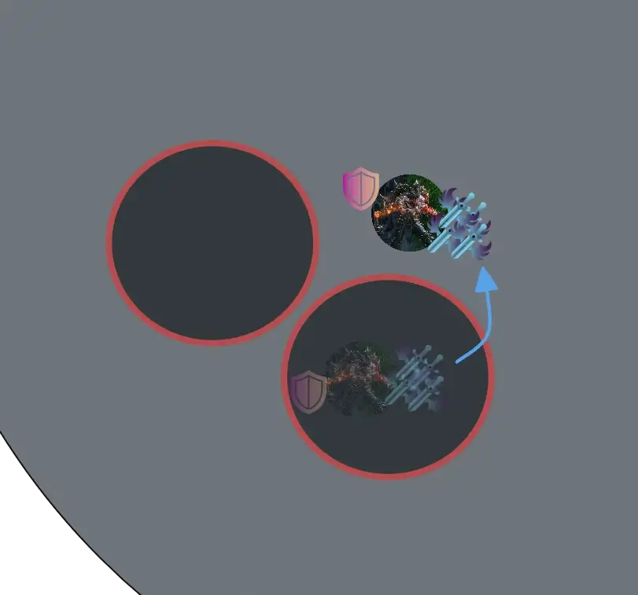

After the group goes down in the first green, the tank can move a bit off-center. From then on, imagining a triangle with a vertex in your current position, every time an oil spawns you can move to the next vertex. This works because once a third oil spawns, the first one de-spawns, always leaving you a free space to move into.

With this strategy, the group can position so that they are always on the inside of the arena from Deimos: this way they cannot be knocked off the platform by his pizza attack.

---

### Demonic Realm Phase

On coming down from the main platform, make sure the entire squad stacks together on one side of his hitbox: this lets you bait the black reliably, which you can then avoid by moving to the other side of the boss.

It's very important at this stage to provide  [Aegis] for his slam attacks, as they risk knocking people off the platform. Call out if you cannot provide it in time.

---

## Additional Resources

#### PoVs

{: .note}
This is a non-comprehensive list meant to display a diverse selection of perspectives and roles. You do not have to copy them exactly, in fact we encourage you to find whatever strategy that suits your group best.

| Classes | Link | Date | Notes |
|  QuickDPS, Handkite |  [PoV](https://www.youtube.com/watch?v=mdUJ_tvCUKo) | March 2026 | Single Mesmer transition, slightly different Samarog tanking. |
|   AlacDPS, DPS |  [PoV](https://www.youtube.com/watch?v=6kfmoEatKjM) | March 2026 | Double Mesmer transition,  handkite. |
|  DPS |  [PoV](https://www.youtube.com/watch?v=6H0ZAjrjbK4) | April 2026 | Double Mesmer transition. |
|   QuickDPS, Skips |  [PoV](https://www.youtube.com/watch?v=vKIKYyUJhro) | April 2026 | Single Mesmer transition. |
|    Heal, Skips |  [PoV](https://www.youtube.com/watch?v=gPUbkNCs-2A) | May 2026 | Single Mesmer transition. |

[< Wing 3](../wing-3/){: .btn } [Return to Home](../index.html){: .btn } [Wing 5 >](../wing-5/){: .btn } [Return to Top](#bastion-of-the-penitent){: .btn .fixed}
{: .center}

[Cairn]: #cairn-the-indomitable
[Mursaat Overseer]: #mursaat-overseer
[Samarog]: #samarog
[Deimos]: #deimos
[marker packs]: ../general.html#marker-packs

[Glenna]: https://wiki.guildwars2.com/wiki/Scholar_Glenna
[Spatial Manipulation]: https://wiki.guildwars2.com/wiki/Spatial_Manipulation
[Jade Soldiers]: https://wiki.guildwars2.com/wiki/Jade_Soldier
[Jade Scouts]: https://wiki.guildwars2.com/wiki/Jade_Scout
[Rigom]: https://wiki.guildwars2.com/wiki/Rigom
[Guldhelm]: https://wiki.guildwars2.com/wiki/Guldhelm

[Thief]: https://wiki.guildwars2.com/wiki/Thief
[Mesmer]: https://wiki.guildwars2.com/wiki/Mesmer
[Mesmers]: https://wiki.guildwars2.com/wiki/Mesmer
[Specter]: https://wiki.guildwars2.com/wiki/Specter
[Troubadour]: https://wiki.guildwars2.com/wiki/Troubadour
[Troubadours]: https://wiki.guildwars2.com/wiki/Troubadour
[Luminary]: https://wiki.guildwars2.com/wiki/Luminary
[Scourge]: https://wiki.guildwars2.com/wiki/Scourge
[Ritualist]: https://wiki.guildwars2.com/wiki/Ritualist
[Mechanist]: https://wiki.guildwars2.com/wiki/Mechanist
[Catalyst]: https://wiki.guildwars2.com/wiki/Catalyst

[Knockback]: https://wiki.guildwars2.com/wiki/Knockback
[Pull]: https://wiki.guildwars2.com/wiki/Pull

[Celestial Dash]: https://wiki.guildwars2.com/wiki/Celestial_Dash
[Float]: https://wiki.guildwars2.com/wiki/Float
[Floating]: https://wiki.guildwars2.com/wiki/Float
[Stability]: https://wiki.guildwars2.com/wiki/Stability
[Protection]: https://wiki.guildwars2.com/wiki/Protection
[Aegis]: https://wiki.guildwars2.com/wiki/Aegis
[Invulnerability]: https://wiki.guildwars2.com/wiki/Invulnerability
[Invulnerable]: https://wiki.guildwars2.com/wiki/Invulnerability
[Tale of the August Queen]: https://wiki.guildwars2.com/wiki/Tale_of_the_August_Queen
[Shadowstep]: https://wiki.guildwars2.com/wiki/Shadowstep
[Shadowstepping]: https://wiki.guildwars2.com/wiki/Shadowstep
[Prepare Shadow Portal]: https://wiki.guildwars2.com/wiki/Prepare_Shadow_Portal
[Shadow Portal]: https://wiki.guildwars2.com/wiki/Prepare_Shadow_Portal
[Portal Entre]: https://wiki.guildwars2.com/wiki/Portal_Entre
[Mimic]: https://wiki.guildwars2.com/wiki/Mimic
[Blink]: https://wiki.guildwars2.com/wiki/Blink
[Claim]: https://wiki.guildwars2.com/wiki/Claim
[Dispel]: https://wiki.guildwars2.com/wiki/Dispel
[Protect]: https://wiki.guildwars2.com/wiki/Protect
[Distracting Throw]: https://wiki.guildwars2.com/wiki/Distracting_Throw
[Temporal Curtain]: https://wiki.guildwars2.com/wiki/Temporal_Curtain
[Illusionary Wave]: https://wiki.guildwars2.com/wiki/Illusionary_Wave