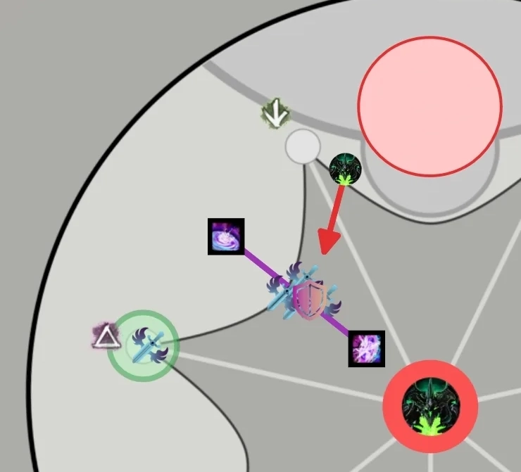

[< Wing 4](../wing-4/){: .btn } [Return to Home](../index.html){: .btn } [Wing 6 >](../wing-6/){: .btn } 
{: .center}

# Hall of Chains
{: .no_toc}

| **Timer** |  16 minutes 30 seconds |
| **Timer Start** |  On entering combat with Soulless Horror. |

<b>Table of Contents</b>

1. TOC
{:toc}

---

Hall of Chains speedruns mostly revolve around optimizing [River of Souls] and [Statues of Grenth]. While the Infallible timer for this wing is rather lenient, the achievement can be very punishing overall due to the length of the wing and how easy it is to go  [Downstate] on both [Statues] and [Dhuum].

---

#### Main Points
{: .no_toc}

- [Soulless Horror] is played with a standard strategy.
- [River of Souls] is played by killing [Hollowed Bombers] before they explode.
- [Eyes] are cleared using a portal to move the squad from one eye to the other.
- [Eater of Souls] and [Broken King] are played simultaneously.
- [Dhuum] is [throne tanked](#throne-tanking) to reduce movement and increase damage uptime.

---

## Composition

Most groups will benefit from a core roster of:

- One  [Ranger]
- One  [Mesmer]
- One  [Necromancer]
- One  [Engineer].

These provide utility that vastly simplifies certain mechanics and is difficult to replace otherwise. Apart from these, run whatever your squad is most comfortable on.

---

#### Soulless Horror
{: .no_toc}
- You will need a pusher to manage [Tormented Dead](https://wiki.guildwars2.com/wiki/Tormented_Dead). This is most commonly a  [Druid].
-  [Epidemic](https://wiki.guildwars2.com/wiki/Epidemic) can help with killing [Tormented Dead](https://wiki.guildwars2.com/wiki/Tormented_Dead) and wurms.
- Projectile negation such as  [Feedback] and  [Corrosive Poison Cloud] can be useful if your tanks are struggling to stay alive.

#### River
{: .no_toc}
- A  [Scrapper] is almost always run to provide  [Superspeed] to  Desmina.
-  [Portal Entre] and  [Sand Swell] can provide useful mobility.
- High burst classes that can quickly apply  [Vulnerability] are extremely important for killing [Hollowed Bombers] in time. Examples include  [Engineer] with  [Steel-Packed Powder](https://wiki.guildwars2.com/wiki/Steel-Packed_Powder) and  [Necromancer] with  [Death Spiral](https://wiki.guildwars2.com/wiki/Death_Spiral).

#### Statues
{: .no_toc}
- The speedrun strategy on [Eyes] requires a  [Chronomancer] running  [Portal Entre] and  [Blink].
- Increasing  [Daze](https://wiki.guildwars2.com/wiki/Daze) length will make [Eyes] much easier. This is best done by  [Druid] running  [Moment of Clarity](https://wiki.guildwars2.com/wiki/Moment_of_Clarity) and  [Superior Sigil of Paralyzation](https://wiki.guildwars2.com/wiki/Superior_Sigil_of_Paralyzation).
- [Eater of Souls] should be run with  Power builds to provide greater burst and damage control.
- [Eater of Souls] greatly benefits from large amounts of CC.
- [Broken King] is commonly run with two to three healers.
-  [Specter] and  [Ritualist] can cheese the [Broken King] with their shroud.

#### Dhuum
{: .no_toc}
-  [Mass Invisibility] or another source of  [Stealth] is required for [throne tanking](#throne-tanking).
-  [Sand Swell] and  [Portal Entre] provide good mobility for managing greens, bombs and  [Greater Death Mark].
-  [Summon Flesh Wurm] and  [Healing Turret](https://wiki.guildwars2.com/wiki/Healing_Turret) trivialize management of the reaper on .
- Your kiter should play a class with good mobility, capable of giving boons in large bursts or at range.  [Chronomancer],  [Troubadour] and  [Scourge] are common picks for this reason.  [Druid] can also be played but is harder to maintain good uptime with.
- Make sure to have enough boonstrip for [Greater Death Mark].
- Bring ranged CC to free any players caught by the [Echo].

---

## Soulless Horror

This boss is played with a relatively normal strategy. The most noticeable difference compared to standard runs is the tendency to compress the tank and pusher role into a single push-tank, commonly played by a  [Druid]. Alternatively, if the pusher is not confident, it's possible to have a DPS or BoonDPS tank instead, alongside the other healer.

Overall, aggressive compositions are not very punishing due to the boss being the first of the wing.

---

### Platform Start
It's possible to start Soulless Horror on the boss platform, which saves a few seconds. To do this:
- Start the fight by dropping down to the arena.
- Everyone `/GG`s once in combat.
- Rush back to the platform before the boss re-spawns.

---

## River of Souls

This encounter is optimized by making  Desmina travel as quickly as possible, which involves:
- Providing her with permanent  [Superspeed].
- Killing all [Hollowed Bombers] so they don't force her to stop.

With an ideal execution,  Desmina should be able to run from the beginning to the end of the encounter without any interruptions.

{: .note}
It is highly recommended to run a [marker pack] that shows the spawn position of [Hollowed Bombers] and [Enervators].

---

### Transition from Soulless Horror

This transition involves a bit of dialogue, followed by Desmina walking from whenever she ended up in the previous encounter to the beginning of the River. Her walk is affected by  [Superspeed], and can be further optimized by killing her close to the East side of the arena, where the river starts.

---

### Strategy

The speedrun strategy for River of Souls involves the  [Scrapper] staying within  Desmina's protective dome, providing her with permanent  [Superspeed] while the rest of the group runs ahead of her and clears out all enemies, including [Hollowed Bombers].

While  Desmina is dialoguing, everyone except for the  [Scrapper] can pre-position on the spawn of the first [Enervator] using mounts. It will spawn as soon as the encounter commences: kill it and then walk back towards  Desmina, killing the [Hollowed Bomber] when it spawns. You can use  [Sand Swell] to get to and back from this bomber, but it is not strictly necessary.

{: .note}
[Enervators] will spawn as soon as the encounter commences, but [Bombers] only spawn when  Desmina get close.

Once the [Bomber] is dead, you can run ahead to the next [Enervator], after which you must split into two subgroups to kill two [Bombers] that spawn simultaneously.

{: .note}
You should kill these adds within 3-4 seconds of them spawning to prevent  Desmina from stopping. For this reason it's important to have classes capable of quickly stacking  [Vulnerability].

Once the two adds are dead, the group must kill an additional [Hollowed Bomber]. While they are doing so, a  [Mesmer] can run ahead to prepare a  [Portal Entre] to the next [Enervator]. The portal can be opened as soon as the bomber is dead.

{: .note}
The  [Mesmer] should take care not to down if off-stack for extended periods.

Move to the next [Enervator]. Kill it, then once again separate into two subgroups to kill the [Hollowed Bombers] spawning simultaneously in front of  Desmina. After this final split, the rest of the encounter consists of two more [Bombers] and one [Enervator] that you can get rid of one after the other in a straightforward manner.

{: .warning}
Three walls will spawn in sequence just before the final [Enervator]. One of these walls can spawn directly on top of the group in certain conditions, leading to avoidable deaths. There is a safe spot where you should wait for all three walls to spawn before continuing with the encounter, which is shown in the [marker pack]. Otherwise, you can provide a portal to the last [Enervator] and skip over the walls entirely.

Once everything is dead, you can run to the end of the River.

---

## Statues of Grenth

Statues is the encounter where it is easiest to gain time. Strategies here differ greatly from the norm:
- [Eyes] are usually done with a strategy involving  [Portals].
- The [Eater of Souls] and [Broken King] are usually done in parallel.

---

### Eyes

This is normally the statue done first, as pre-positioning is easily done while  Desmina is running through the final part of the [River of Souls]. The  [Mesmer] can  [Mimic] a portal down to the center platform for the  [Scrapper] if necessary.

The typical speedrun strategy for Eyes requires four special roles:
- A  [Druid] running  [Moment of Clarity](https://wiki.guildwars2.com/wiki/Moment_of_Clarity) and  [Superior Sigil of Paralyzation](https://wiki.guildwars2.com/wiki/Superior_Sigil_of_Paralyzation) that picks up the [Light Orbs] and uses  [Flare](https://wiki.guildwars2.com/wiki/Flare). This can optionally be replaced with any other class, but the  [Daze](https://wiki.guildwars2.com/wiki/Daze) provided by  [Flare](https://wiki.guildwars2.com/wiki/Flare) will be shorter.
- A  [Chronomancer] running  [Portal Entre] and  [Blink].
- One player to  [Throw Light](https://wiki.guildwars2.com/wiki/Throw_Light) twice. Usually this is done by the  [Scrapper], as their abundant CC can make DPSing the Eyes difficult.
- Two players to  [Throw Light](https://wiki.guildwars2.com/wiki/Throw_Light) once. This can be done by any DPS.

Start on the Eye of Judgement (to the North in-game). The  [Scrapper] and two other players can pick up the [Light Orbs] and throw them to the squad.

As soon as the encounter starts, the  [Chronomancer] will gather clones using the adds on the upper platform. Once they have a few, they can open their  [Continuum Split], drop down towards the Eye of Fate,  [Blink] to the Eye, prepare their  [Portal Entre] and exit their  [Continuum Split] to get back to the upper platform.

Both single throwers should glide to the Eye of Judgement immediately after throwing. The  [Druid] will  pick up a light as soon as possible and  [Flare] the Eye. Burst it down once it's vulnerable, taking care not to use any CC skills. The  [Druid] will have to  [Flare] it a second time in this interval.

Once Judgement is close to dying, the  [Chronomancer] will open their  [Portal Entre] to the other Eye. The  [Druid] should pick up the final light before taking the portal and use it immediately on the other Eye. The  [Scrapper] should remain up top and throw one final [Light Orb] to Fate, after which they can join the rest of the group for the final burst. The  [Druid] should pick up this light to cast one final  [Flare] when necessary.

{: .warning}
Remember not to `/GG` at the end of the encounter: instead use the  [Sand Portal] to get back to Death's Landing.

If you are running a second  [Mesmer], they can be one of the single throwers. This allows them to prepare a  [Portal] in front of the  [Sand Portal] after throwing, opening it as soon as the encounter is over. This saves a few seconds in the transition to the other statues.

Since you will already be on the  [Jackal] when you reach Death's Landing, the fastest way to then get to the remaining Statues is by spamming  [Blink](https://wiki.guildwars2.com/wiki/Blink_(Jackal)) over the chasm in combination with  [Bond of Vigor](https://wiki.guildwars2.com/wiki/Bond_of_Vigor).

---

### Statue of Ice

This encounter is usually done in parallel with the [Eater of Souls] by sending a subgroup to each. The strategy is otherwise identical to the PUG strat.

Manage your DPS to keep less than five stacks of  [Shield of Ice] on the boss. This allows players to stand in one green each without over-collecting. As it is easy to upkeep this amount of stacks even with two or three DPS, you can run multiple healers with no downside.

Normally, players  [Glaciate](https://wiki.guildwars2.com/wiki/Glaciate) and are  [Stunned] upon getting a fourth stack of  [Frozen Wind](https://wiki.guildwars2.com/wiki/Frozen_Wind), but some transformation skills can be abused to go over this limit:
-  [Specter]'s  [Shadow Shroud](https://wiki.guildwars2.com/wiki/Shadow_Shroud): getting a fourth stack does some damage and kicks you out of shroud, but prevents both  [Glaciate] and  [Stun].
-  [Ritualist]'s  [Ritualist Shroud](https://wiki.guildwars2.com/wiki/Ritualist%27s_Shroud): getting a fourth stack does some damage, kicks you out of shroud, prevents  [Glaciate] but does not prevent  [Stun].

Running several of these classes allows you to accumulate more  stacks on the boss with less risk.

{: .warning}
As a  [Ritualist], be careful not to take a fourth stack of  [Frozen Wind](https://wiki.guildwars2.com/wiki/Frozen_Wind) if there are no cracks on the ground. With bad luck, the cracks can spawn directly underneath a  [Stunned] player, making them take a lot of damage and potentially go  [Downstate].

Once the other subgroup has killed the [Eater of Souls], they will join you on the Broken King. At this point you should increase your DPS to maintain around 8 stacks of  [Shield of Ice] on the boss.

{: .warning}
Broken King tends to bug out when at 10  stacks or above: players may not be counted inside greens, which can then fail, likely resulting in downstates. Aiming to keep the boss at 8 stacks gives you a safe margin while still being more than sufficient timer-wise.

{: .warning}
Remember not to `/GG` when the boss dies.

---

### Eater of Souls

This encounter is usually done in parallel with the [Broken King] by sending a subgroup to each. The overall strategy is similar to the standard PUG strat, with the exception that two players go up in the first green and two in the second.

{: .warning}
In Infallible runs, you cannot send additional players up in these greens: if there are insufficient orbs, some players will not be able to collect enough to return to the platform.

{: .note}
When the Eater is killed on a charged platform, there is a small chance that multiple orbs spawn in the same location. This may result in players not collecting enough orbs to complete the mechanic and going  [Downstate]. Splitting the group between two greens results in fewer simultaneous orbs in the air, reducing the likelihood of this bug.

The first green should spawn roughly when the squad is killing the Eater for the first time, after charging the first platform. The second one should spawn a bit after killing him the second time. Be aware of when the green is about to spawn, and move towards it early if necessary.

Be careful with  [Reclaimed Energy]: wasting this skill will force you to kill an additional [Twisted Spirit] in order to charge the platform completely. This commonly occurs when:
- A player who already has  [Reclaimed Energy] walks over an uncollected orb. This will destroy the orb without granting an additional cast.
- A player misses the platform when casting  [Reclaimed Energy]. This can happen if they are out of range, or if they are moving while casting the skill. To charge the platform safely: make sure you are within 900 range and completely still before using this skill.

Whenever any players go up in a green, the rest of the squad should CC the Eater as quickly as possible. Players in spirit form must not fly close to the Eater until its  [Defiance Bar] has been broken, as it is easy to get sucked in and go  [Downstate]. 

The same attack can pull players down into vomit, giving them a lethal dose of conditions. Players in spirit form should be aware of any vomit on the platform and avoid it until the  [Defiance Bar] has been broken. Whoever is tanking the Eater should avoid pulling it through the center of the arena, as vomit spawning there can be very dangerous.

#### Example
{: .no_toc}
> Immediately after the first green, the [Twisted Spirit] spawns on the opposite side of the arena.
>
> <u>Bad:</u> the players not doing the green immediately move to the [Twisted Spirit]. This can result in the Eater using its suction or vomit in the center of the arena, making life very difficult for the players in spirit form.
> 
> <u>Better:</u> the players not doing the green continue DPSing the Eater until he gets his  [Defiance Bar]. Once it is broken, they immediately move to the [Twisted Spirit].

This encounter is usually much quicker than the [Broken King]: once you are done, take the  [Sand Portal] back to Death's Landing and join the rest of the group at the [Statue of Ice]. Use your  [Skyscale]'s  [Dash](https://wiki.guildwars2.com/wiki/Dash_(Skyscale)) in combination with  [Bond of Vigor](https://wiki.guildwars2.com/wiki/Bond_of_Vigor) to do so: anything else can place you too low when you enter combat, resulting in not being able to reach the platform by gliding.

Once you reach the [Broken King], immediately glide into any unoccupied greens before dealing any damage to the boss.

---

## Dhuum

Dhuum is a long, elaborate fight where lots of things can be optimized, resulting in significant differences between a normal pull and a speedrun pull.

---

### Transition from Statues

After [Broken King] dies, the  [Scrapper] should take the  [Sand Portal] to Death's Landing while the rest of the squad waits behind. They can then give  [Superspeed] to  Desmina while she walks up to the reapers.

While the dialogue is occurring, the rest of the group can take the portal through and move ahead, swapping builds and otherwise preparing for the fight. The  [Scrapper] stays behind with  Desmina after the dialogue concludes, continuing to provide her with  [Superspeed].

You should ideally begin the fight the instant  Desmina is in position and interactable.

---

### Getting the Echo Stuck

It is possible to start the encounter in such a way that the [Echo] gets stuck next to the entrance. It will then remain stuck until its position is reset at the first big dip, letting you do optimal DPS for the first phases.

<iframe class="youtube-video center bordered" width="100%" src="https://www.youtube.com/embed/bBYPfelUe2Y" frameborder="0" allow="accelerometer; clipboard-write; encrypted-media; gyroscope; picture-in-picture; web-share" referrerpolicy="strict-origin-when-cross-origin" allowfullscreen></iframe>

This is very easy to do with a [marker pack]:
1. Have one player with a portal position on the marker and look at the second marker on the wall.
2. This player then opens their portal next to  Desmina.
3. Everyone should take the portal and *stand still* on the exit.
4. The kiter talks to Desmina to begin the encounter, then immediately also takes the portal.

You can move off the portal exit when the [Echo] starts moving towards the group. Mark it with an  to make its position visible on the minimap.

{: .warning}
Remember to pay attention once the [Echo] gets un-stuck after the big dip.

---

### Throne Tanking

This strategy involves tanking Dhuum close to the throne for most of the fight. This reduces movement, resulting in higher damage uptime overall.

You will have to designate a green 3 player that is not the tank. Tanking itself does not require much healing, and can be done by any player with additional toughness. Green 2 is done by the kite as normal and green 1 by a DPS.

Begin the pre-event as normal. At *7:55* remaining on the timer, just before the boss spawns, a  [Mesmer] should use  [Mass Invisibility] on . This  [Stealths] the reapers on  and , forcing the [Enforcer] to target the reaper on . While walking towards it, it will get cleaved by the group on the boss.

{: .note}
Make sure you are far enough from the group that your players do not get  [Stealth] instead of the reapers.

{: .note}
This can also be done with other classes by  [Stealthing] the  reaper first, then the  one after the [Enforcer] gets close.

Once Dhuum is about to spawn, the tank should position in front of the throne so that the boss swivels around to hit them after walking out. You will then get a long DPS phase with the squad behind the boss and the tank absorbing the aggro. In this period, the Green 1 will come back from  and the Green 2 will complete .

Before the [Death Mark] at *7:07*, the squad should walk forward into the tank. This forces the dangerous AoE to spawn close to the throne, where it is out of the way for the rest of the fight. Wait for him to swipe his scythe at *7:10*, then walk in. The tank can then walk the boss out of the AoE while the Green 3 player goes to .

{: .note}
It's convenient to pull Dhuum towards , as this brings the Green 1 closer to  while also positioning the group in a favorable position for [Greater Death Mark], as you will not have any dangerous areas behind you.

{: .note}
The Green 3 should try to collect a *medium orb* while completing , as this will prevent a [Messenger] from spawning during [Greater Death Mark]. If they don't manage to do so, they should alert the kiter.

[Greater Death Mark] is one of the critical moments in the fight, as you will have many overlapping mechanics: stripping Dhuum, cleansing and re-applying conditions, the [Enforcer] re-spawning and running straight for the group,  and the suction potentially pulling players to their death. You can additionally get a [Messenger] if the Green 3 did not collect the medium orb.

One way to manage this sequence is by:
1. Stacking tightly just before the dip in order to reliably bait the [Enforcer] towards the group.
2. Walking backwards out of the Enforcer's path.
3. Providing a portal backwards out of the suction, as both a safety for players that get too close and as a possible escape path from the [Enforcer]. 

{: .warning}
Before taking any portal, make sure that the exit is safe from the [Enforcer]. If it isn't, call it out to the rest of the group.

Once the suction ends, it's convenient to leave Dhuum in the center of the arena. The tank should be in position to avoid any rogue scythe swipes on the group, which can lead to downs if players do not have  [Protection] or  [Aegis]. Shortly before the next [Death Mark] at *5:47* on the timer, the tank should walk into the rest of the group so that the red spawns slightly off-center. They can then pull the boss out of the red, keeping it in the center. From this position you can easily access the greens on ,  and .

You can then walk Dhuum out of the red as before, and continue DPS keeping him close to the center. From this position you can easily access the greens on ,  and .

High-damage groups should be able to phase the boss before the next [Greater Death Mark]. If you have to play this mechanic, treat it identically to the first death mark: stay stacked, walk backwards out ot the [Enforcer]'s path, and provide a portal out. You should not see an additional [Death Mark].

---

### Skipping the Collection Phase

Normally after phasing the boss to 10%, everyone is separated into their spirit form and has to collect five orbs before returning to the platform. It is possible to skip this process by getting picked up by the [Enforcer] just before getting your soul ripped out. This results in the player spawning in the center of the safe area as if they had collected their orbs normally.

---

### Additional Tips
- Use  [Sand Swell] to port players out of the group when they get  [Arcing Affliction](https://wiki.guildwars2.com/wiki/Arcing_Affliction_(effect)) (bomb).
- Use  [Dimensional Aperture](https://wiki.guildwars2.com/wiki/Dimensional_Aperture) and  [Portal Entre] to port returning players from greens.
- Explode  [Arcing Affliction](https://wiki.guildwars2.com/wiki/Arcing_Affliction_(effect)) at *6:35* on the timer to overlap a bomb with the big dip. The dip will remove the bomb effect, making the run much safer.
- Green players are responsible for clearing the  reaper from deathlings, especially when doing greens on   and .
- Apply  [Quickness],  [Swiftness] and  [Protection] to all players before they go out to channel seals.

---

## Additional Resources

#### PoVs

{: .note}
This is a non-comprehensive list meant to display a diverse selection of perspectives and roles. You can find additional PoVs and logs in the [Infallible Archive](https://docs.google.com/spreadsheets/d/1tzWg6KYGTGpCYCy4qBt0X9t7H2RzEM7MRKooh_gXCno).

| Classes | Link | Date | Notes |
|  Heal, Push, Tank |  [PoV](https://www.youtube.com/watch?v=1NJxYpNMVxc) | March 2026 | Broken King on Statues |
|   BoonDPS, Desmina, Thrower |  [PoV](hhttps://www.youtube.com/watch?v=bXH86REC5yI) | March 2026 | Eater of Souls on Statues, standard Dhuum tanking |
|   Heal, Kite |  [PoV](https://www.youtube.com/watch?v=dEZuE2fJKUE) | April 2026 | Broken King on Statues |

---

#### Other Useful Links

-  [River and Eyes Portals by xBourne](https://www.youtube.com/watch?v=di49FJcxntA) - good visualization of  [Mesmer]  [Portals] for these encounters.
-  [Heal Chronomancer Kiting with MI and Portal by HasKha](https://youtu.be/_Yz4PQx_8Bc&t=2880) - while NM, this showcases the process overall.
-  [Throne Tanking Dhuum by Christine](https://www.youtube.com/watch?v=ceu2O8u3xOg) - while relatively old, the positioning in this run is still relevant.
-  [Getting the Echo Stuck](https://www.youtube.com/watch?v=bBYPfelUe2Y) - shows how to bug out the Echo at the beginning of Dhuum.

[< Wing 4](../wing-4/){: .btn } [Return to Home](../index.html){: .btn } [Wing 6 >](../wing-6/){: .btn }  [Return to Top](#hall-of-chains){: .btn .fixed}
{: .center}

<!-- Links to other pages in the guide -->
[Soulless Horror]: #soulless-horror
[River of Souls]: #river-of-souls
[River]: #river-of-souls
[Statues]: #statues-of-grenth
[Statues of Grenth]: #statues-of-grenth
[Statue of Ice]: #broken-king
[Broken King]: #broken-king
[Eater of Souls]: #eater-of-souls
[Eyes]: #eyes
[Statue of Darkness]: #eyes
[Dhuum]: #dhuum
[marker pack]: ../general.html#marker-packs

<!-- Links to classes and specializations -->
[Druid]: https://wiki.guildwars2.com/wiki/Druid
[Mesmer]: https://wiki.guildwars2.com/wiki/Mesmer
[Mesmers]: https://wiki.guildwars2.com/wiki/Mesmer
[Specter]: https://wiki.guildwars2.com/wiki/Specter
[Necromancer]: https://wiki.guildwars2.com/wiki/Necromancer
[Scourge]: https://wiki.guildwars2.com/wiki/Scourge
[Scourges]: https://wiki.guildwars2.com/wiki/Scourge
[Scrapper]: https://wiki.guildwars2.com/wiki/Scrapper
[Chronomancer]: https://wiki.guildwars2.com/wiki/Chronomancer
[Troubadour]: https://wiki.guildwars2.com/wiki/Troubadour
[Ritualist]: https://wiki.guildwars2.com/wiki/Ritualist
[Engineer]: https://wiki.guildwars2.com/wiki/Engineer
[Ranger]: https://wiki.guildwars2.com/wiki/Ranger

<!-- Links to skills -->
[Sand Swell]: https://wiki.guildwars2.com/wiki/Sand_Swell
[Summon Flesh Wurm]: https://wiki.guildwars2.com/wiki/Summon_Flesh_Wurm
[Portal Entre]: https://wiki.guildwars2.com/wiki/Portal_Entre
[Portal]: https://wiki.guildwars2.com/wiki/Portal_Entre
[Portals]: https://wiki.guildwars2.com/wiki/Portal_Entre
[Blink]: https://wiki.guildwars2.com/wiki/Blink
[Continuum Split]: https://wiki.guildwars2.com/wiki/Continuum_Split
[Mass Invisibility]: https://wiki.guildwars2.com/wiki/Mass_Invisibility
[Mimic]: https://wiki.guildwars2.com/wiki/Mimic
[Corrosive Poison Cloud]: https://wiki.guildwars2.com/wiki/Corrosive_Poison_Cloud
[Feedback]: https://wiki.guildwars2.com/wiki/Mimic
[Flare]: https://wiki.guildwars2.com/wiki/Flare
[Reclaimed Energy]: https://wiki.guildwars2.com/wiki/Reclaimed_Energy

<!-- Links to buffs and debuffs -->
[Downstate]: https://wiki.guildwars2.com/wiki/Downstate
[Superspeed]: https://wiki.guildwars2.com/wiki/Superspeed
[Vulnerability]: https://wiki.guildwars2.com/wiki/Vulnerability
[Stealth]: https://wiki.guildwars2.com/wiki/Stealth
[Stealths]: https://wiki.guildwars2.com/wiki/Stealth
[Stealthing]: https://wiki.guildwars2.com/wiki/Stealth
[Glaciate]: https://wiki.guildwars2.com/wiki/Glaciate
[Stun]: https://wiki.guildwars2.com/wiki/Stun
[Stunned]: https://wiki.guildwars2.com/wiki/Stun
[Protection]: https://wiki.guildwars2.com/wiki/Protection
[Aegis]: https://wiki.guildwars2.com/wiki/Aegis
[Quickness]: https://wiki.guildwars2.com/wiki/Quickness
[Swiftness]: https://wiki.guildwars2.com/wiki/Swiftness

<!-- Links to enemies and enemy skills -->
[Hollowed Bomber]: https://wiki.guildwars2.com/wiki/Hollowed_Bomber
[Hollowed Bombers]: https://wiki.guildwars2.com/wiki/Hollowed_Bomber
[Bomber]: https://wiki.guildwars2.com/wiki/Hollowed_Bomber
[Bombers]: https://wiki.guildwars2.com/wiki/Hollowed_Bomber
[Enervator]: https://wiki.guildwars2.com/wiki/Enervator
[Enervators]: https://wiki.guildwars2.com/wiki/Enervator
[Light Orb]: https://wiki.guildwars2.com/wiki/Light_Orb
[Light Orbs]: https://wiki.guildwars2.com/wiki/Light_Orb
[Shield of Ice]: https://wiki.guildwars2.com/wiki/Shield_of_Ice
[Deathlings]: https://wiki.guildwars2.com/wiki/Deathling
[Echo]: https://wiki.guildwars2.com/wiki/Ender's_Echo
[Enforcer]: https://wiki.guildwars2.com/wiki/Dhuum%27s_Enforcer
[Twisted Spirit]: https://wiki.guildwars2.com/wiki/Twisted_Spirit
[Death Mark]: https://wiki.guildwars2.com/wiki/Death_Mark
[Greater Death Mark]: https://wiki.guildwars2.com/wiki/Greater_Death_Mark
[Messenger]: https://wiki.guildwars2.com/wiki/Dhuum's_Messenger

<!-- Other -->
[Sand Portal]: https://wiki.guildwars2.com/wiki/Sand_Portal
[Defiance Bar]: https://wiki.guildwars2.com/wiki/Defiance_bar
[Skyscale]: https://wiki.guildwars2.com/wiki/Skyscale
[Jackal]: https://wiki.guildwars2.com/wiki/Jackal