[< Wing 4](../wing-4/){: .btn } [Return to Home](../index.html){: .btn } [Wing 6 >](../wing-6/){: .btn } 
{: .center}

# Hall of Chains
{: .no_toc}

| **Timer** |  16 minutes 30 seconds |
| **Timer Start** |  On entering combat with Soulless Horror. |

<b>Table of Contents</b>

1. TOC
{:toc}

---

The Hall of Chains is a straightforward wing to clear as the timer is relatively forgiving and composition requirements aren't strict. Most of the learning curve is in optimizing [River of Souls] and [Statues], and clearing [Dhuum] under pressure.

---

#### Main Points
{: .no_toc}

- [Soulless Horror] is played with a standard strategy.
- [River of Souls] and [Statues of Grenth] are run with strategies that differ noticeably from the standard.
- [Dhuum] is tanked in a different manner to optimize damage uptime.

---

## Composition

The requirements here are not overall as strict as in other wings.
- A  [Druid] is almost always run for pushing on [Soulless Horror].
- A  [Scrapper] is almost always run to provide  [Superspeed] for [River of Souls].
- One or more  [Mesmers] are useful for portals on [River], [Statues] and [Dhuum], and other various utilities.
- Classes with shrouds and other transformations, such as  [Specter] and  [Necromancer], can cheese the [Broken King].
- One or more  [Scourges] are useful on [Dhuum] for  [Sand Swell] and  [Summon Flesh Wurm].

---

## Soulless Horror

This boss is played with a relatively normal strategy. The most noticeable difference compared to standard runs is the tendency to compress the tank and pusher role into a single push-tank  [Druid]. Alternatively, if the pusher is not confident, it's possible to have a DPS or BoonDPS tank instead, alongside the other healer.

Overall, aggressive compositions are not very punishing due to the boss being the first of the wing.

---

### Platform Start
It's possible to start Soulless Horror on the boss platform, which saves a few seconds. To do this:
- Start the fight by dropping down to the arena.
- Everyone `/GG`s once in combat.
- Rush back to the platform before the boss re-spawns.

---

## River of Souls

This encounter is optimized by making  Desmina travel as quickly as possible, which involves:
- Providing her with permanent  [Superspeed].
- Killing all [Hollowed Bombers] so they don't force her to stop.

The strategy is well executed when  Desmina runs uninterruptedly from the beginning to the end of the encounter.

{: .note}
It is highly recommended to run a [marker pack] that shows the spawn position of [Hollowed Bombers] and [Enervators].

---

### Composition

High burst is very important to kill [Hollowed Bombers] before  Desmina gets to them. Classes that can quickly apply  [Vulnerability] are also extremely important, such as  [Engineer] with  [Steel-Packed Powder](https://wiki.guildwars2.com/wiki/Steel-Packed_Powder) and  [Necromancer] with  [Death Spiral](https://wiki.guildwars2.com/wiki/Death_Spiral).

---

### Transition from Soulless Horror

This transition involves a bit of dialogue, followed by Desmina walking from whenever she ended up in the previous encounter to the beginning of the River. Her walk is affected by  [Superspeed], and can be further optimized by killing her close to the East side of the arena, where the river starts.

---

### Strategy

The speedrun strategy for River of Souls involves the  [Scrapper] staying within  Desmina's protective dome, providing her with permanent  [Superspeed] while the rest of the group runs ahead of her and clears out all enemies, including [Hollowed Bombers].

While  Desmina is dialoguing, everyone except for the  [Scrapper] speeding her up can pre-position on the spawn of the first [Enervator]. It will spawn as soon as the encounter commences: kill it and then walk back towards  Desmina. Kill the [Hollowed Bomber] when it spawns. You can use  [Sand Swell] to get to and back from this bomber, but it is not strictly necessary.

{: .note}
[Enervators] will spawn as soon as the encounter commences, but [Bombers] only spawn when  Desmina get close.

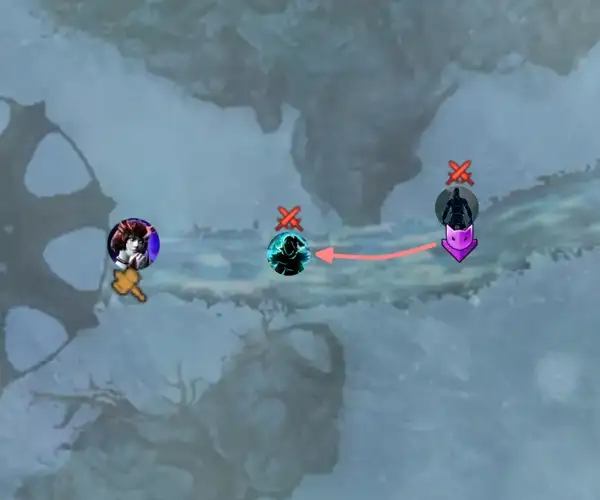

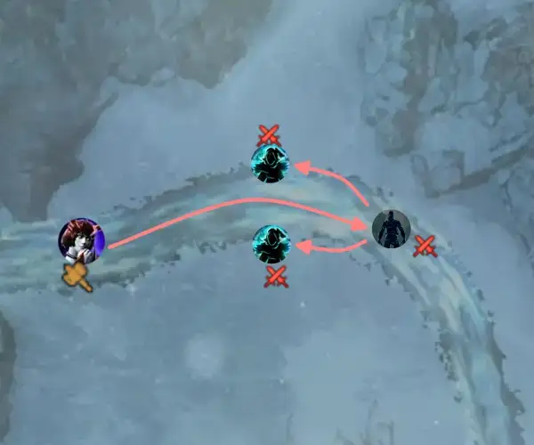

Once the [Bomber] is dead, you can run ahead to the next [Enervator], after which you must split into two subgroups to kill two [Bombers] that spawn simultaneously.

{: .note}
You should kill these adds within 3-4 seconds of them spawning to prevent  Desmina from stopping. For this reason it's important to have classes capable of quickly stacking  [Vulnerability].

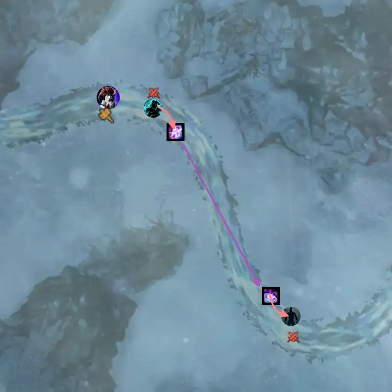

Once the two adds are dead, the group must kill an additional [Hollowed Bomber]. While they are doing so, a  [Mesmer] can run ahead to prepare a  [Portal Entre] to the next [Enervator]. The portal can be opened as soon as the bomber is dead.

{: .note}
The  [Mesmer] should take care not to down if off-stack for extended periods.

Move to the next [Enervator]. Kill it, then once again separate into two subgroups to kill the [Hollowed Bombers] spawning simultaneously in front of  Desmina. After this final split, the rest of the encounter consists of two more [Bombers] and one [Enervator] that you can get rid of one after the other in a straightforward manner.

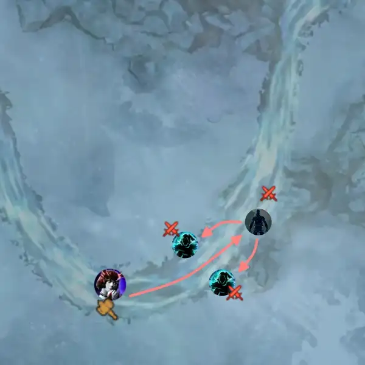

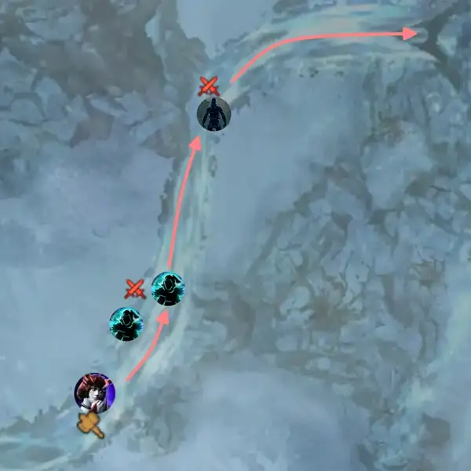

Once everything is dead, you can run to the end of the River.

---

## Statues of Grenth

Statues is the encounter where it is easiest to gain time. Strategies here differ greatly from the norm:
- [Eyes] are usually done with a strategy involving  [Portals].
- The [Eater of Souls] and [Broken King] are usually done in parallel.

---

### Eyes

This is normally the statue done first, as pre-positioning is easily done while  Desmina is running through the final part of the [River of Souls]. The  [Mesmer] can  [Mimic] a portal down to the center platform for the  [Scrapper]

The typical speedrun strategy for Eyes requires three special roles:
- A  [Druid] running  [Moment of Clarity](https://wiki.guildwars2.com/wiki/Moment_of_Clarity) and  [Superior Sigil of Paralyzation](https://wiki.guildwars2.com/wiki/Superior_Sigil_of_Paralyzation) that picks up the [Light Orbs] and uses  [Flare](https://wiki.guildwars2.com/wiki/Flare).
- A  [Chronomancer] running  [Portal Entre] and  [Blink].
- One player to  [Throw Light](https://wiki.guildwars2.com/wiki/Throw_Light). Usually this is done by the  [Scrapper], as their abundant CC can make DPSing the Eyes difficult.

Start on the Eye of Judgement (to the North in-game). The  [Scrapper] and two other players can pick up the [Light Orbs] and throw two to the Eye of Judgement and one to the Eye of Fate.

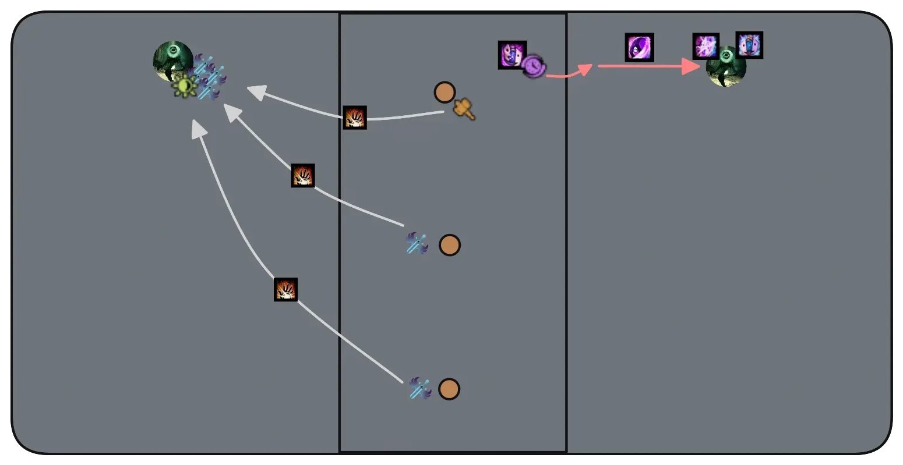

Meanwhile, the  [Chronomancer] gathers clones on the adds on the upper platform. Once they have a few, they open their  [Continuum Split], drop down towards the Eye of Fate,  [Blink] to the Eye, prepare their  [Portal Entre] and exit their  [Continuum Split] to get pack to the upper platform.

Everyone except for the  [Scrapper] should run to the Eye of Judgement. As soon as they can, the  [Druid] should  [Flare](https://wiki.guildwars2.com/wiki/Flare) the Eye and the group quickly DPSs it down, taking care not to use any CC skills.

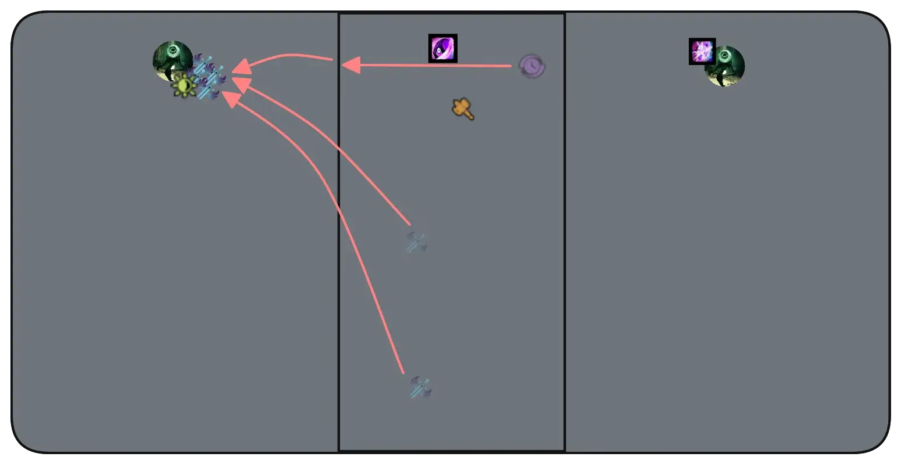

Once Judgement is close to dying, the  [Chronomancer] opens their  [Portal Entre] to the other Eye. The  [Scrapper] should remain up top and throw one final [Light Orb] to Fate, after which they can join the rest of the group for the final burst.

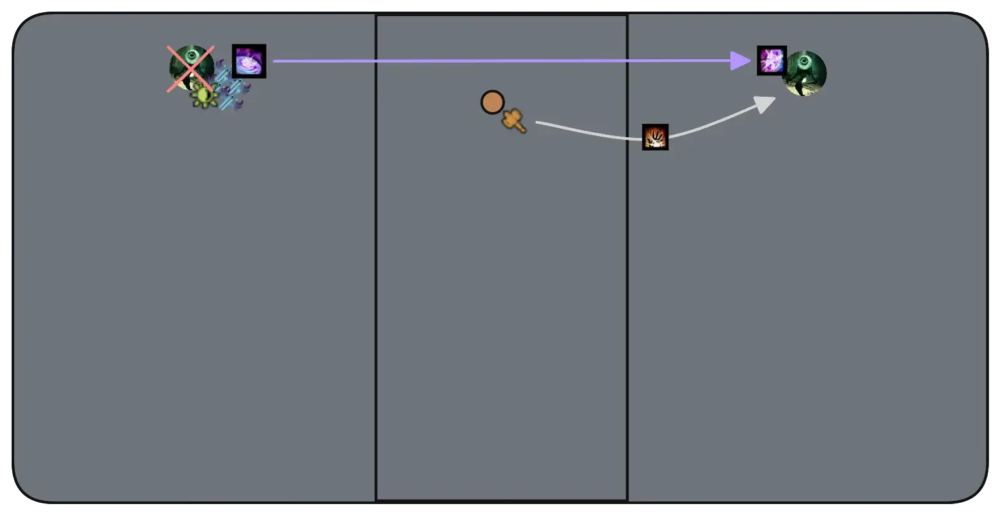

{: .warning}
Remember not to `/GG` at the end of the encounter: instead use the  [Sand Portal] to get back to Death's Landing.

---

### Eater of Souls

This encounter is usually done in parallel with the [Broken King]. The overall strategy is similar to the standard PUG strat, with the exception that you send two players up in the first green and two in the second to make collecting easier.

{: .warning}
In Infallible runs, you cannot send additional players up in these greens: if there are insufficient orbs, some players will not be able to collect enough to return to the platform.

{: .note}
There is a small chance that multiple orbs spawn in the same location, which can result in players not collecting enough orbs to exit the mechanic. Splitting the group between two greens results in less orbs per green, thus reducing the likelihood of encountering this bug.

All three players that do not take the green should aid in CCing the boss.

This encounter is usually much quicker than the [Broken King]: once you are done, take the  [Sand Portal] back to Death's Landing and join the rest of the group at the [Statue of Ice].

---

### Statue of Ice

This encounter is usually done in parallel with the [Eater of Souls]. The strategy is identical to the PUG strat, but performed with less initial players.

Manage your DPS to keep around five stacks of  [Shield of Ice] on the boss. This allows players to stand in one green each without over-collecting. As it is easy to upkeep this amount of stacks even with two or three DPS, you can run multiple healers with no downside.

Normally, players  [Glaciate](https://wiki.guildwars2.com/wiki/Glaciate) and are  [Stunned] upon getting a fourth stack of  [Frozen Wind](https://wiki.guildwars2.com/wiki/Frozen_Wind), but some transformation skills can be abused to go over this limit:
-  [Specter]'s  [Shadow Shroud](https://wiki.guildwars2.com/wiki/Shadow_Shroud): getting a fourth stack does some damage and kicks you out of shroud, but prevents both  [Glaciate] and  [Stun].
-  [Ritualist]'s  [Ritualist Shroud](https://wiki.guildwars2.com/wiki/Ritualist%27s_Shroud): getting a fourth stack does some damage, kicks you out of shroud, prevents  [Glaciate] but does not prevent  [Stun].

Running several of these classes allows you to accumulate more  stacks on the boss with less risk.

Once the other subgroup has killed the [Eater of Souls], they will join you on the Broken King. At this point you should increase your DPS to maintain around 8 stacks of  [Shield of Ice] on the boss.

{: .warning}
Broken King tends to bug out when at 10  stacks or above: players may not be counted inside greens, which can then fail, likely resulting in downstates. Aiming to keep the boss at 8 stacks gives you a safe margin while still being more than sufficient timer-wise.

{: .warning}
Remember not to `/GG` when the boss dies.

---

## Dhuum

Dhuum is a long, elaborate fight where lots of things can be optimized, resulting in significant differences between a normal pull and a speedrun pull.

---

### Composition and Utilities

Several skills are especially suited to Dhuum CM and should be run if possible:

-  [Summon Flesh Wurm] can stop [Deathlings] from reaching the  reaper when positioned accurately. They will stop to attack the wurm, which can be healed or resummoned if necessary. It is also very good mobility for doing the  green.
-  [Healing Turret](https://wiki.guildwars2.com/wiki/Healing_Turret) can greatly improve  [Summon Flesh Wurm]'s survivability.
-  [Sand Swell] and  [Portal Entre] can provide useful mobility in various situations.
-  [Mass Invisibility] is used to  [Stealth] the  and  reapers when [throne tanking](#throne-tanking).

Your kiter should be a class with good mobility and capable of giving boons in large bursts or at range.  [Chronomancer],  [Troubadour] and  [Scourge] are good picks for this reason.  [Druid] can also be played but is harder to maintain good uptime with.

The overall damage pressure in the fight is not large if bombs are managed correctly. For this reason it's viable to run one or more celestial healers.

Make sure to have sufficient boonstrip for the dip mechanics, and enough ranged CC to free any players caught by the [Echo].

---

### Transition from Statues

After [Broken King] dies, the  [Scrapper] should take the  [Sand Portal] to Death's Landing while the rest of the squad waits behind. They can then give  [Superspeed] to  Desmina while she walks up to the reapers.

While the dialogue is occurring, the rest of the group can take the portal through and move ahead, swapping builds and otherwise preparing for the fight. The  [Scrapper] stays behind with  Desmina after the dialogue concludes, continuing to provide her with  [Superspeed].

You should ideally begin the fight the instant  Desmina is in position and interactable.

---

### Getting the Echo Stuck

It is possible to start the encounter in such a way that the [Echo] gets stuck next to the entrance. It will then remain stuck until its position is reset at the first big dip, letting you do optimal DPS for the first phases.

<iframe class="youtube-video center bordered" width="100%" src="https://www.youtube.com/embed/bBYPfelUe2Y" frameborder="0" allow="accelerometer; clipboard-write; encrypted-media; gyroscope; picture-in-picture; web-share" referrerpolicy="strict-origin-when-cross-origin" allowfullscreen></iframe>

This is very easy to do with a [marker pack]:
1. Have one player with a portal position on the marker and look at the second marker on the wall.
2. This player then opens their portal next to  Desmina.
3. Everyone should take the portal and *stand still* on the exit.
4. The kiter talks to Desmina to begin the encounter, then immediately also takes the portal.

You can move off the portal exit when the [Echo] starts moving towards the group. Mark it with an  to make its position visible on the minimap.

{: .warning}
Remember to pay attention once the [Echo] gets un-stuck after the big dip.

---

### Throne Tanking

This strategy involves tanking Dhuum close to the throne for most of the fight. This reduces movement, resulting in higher damage uptime overall.

You will have to designate a green 3 player that is not the tank. Tanking itself does not require much healing, and can be done by any player with additional toughness. Green 2 is done by the kite as normal and green 1 by a DPS.

Begin the pre-event as normal. At *7:55* remaining on the timer, just before the boss spawns, a  [Mesmer] should use  [Mass Invisibility] on . This  [Stealths] the reapers on  and , forcing the [Enforcer] to target the reaper on . While walking towards it, it will get cleaved by the group on the boss.

{: .note}
Make sure you are far enough from the group that your players do not get  [Stealth] instead of the reapers.

{: .note}
This can also be done with other classes (traditionally a  [Druid] with  [Celestial Shadow](https://wiki.guildwars2.com/wiki/Celestial_Shadow)) by  [Stealthing] the  reaper first, then the  one after the [Enforcer] gets close.

Once Dhuum is about to spawn, the tank should position in front of the throne so that the boss swivels around to hit them after walking out. 

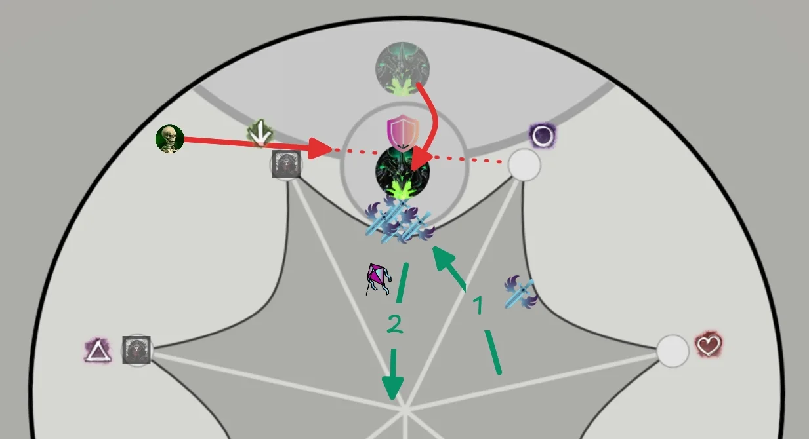

Before the small dip at *7:07*, the squad should walk forward into the tank. This forces the dangerous AoE to spawn close to the throne, where it is out of the way for the rest of the fight. Wait for him to swipe his scythe at *7:10*, then walk in.

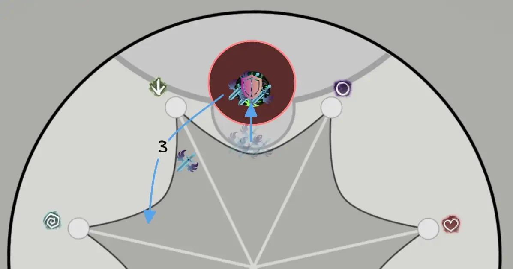

The tank can then bait the boss out of the AoE. DPS players should be able to hit it in the meanwhile. 

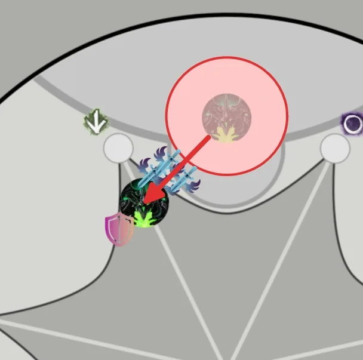

When the big dip happens, all players should take special care not to have their backs to the throne. Once the suction wears off, tank the boss in the middle as shown in the picture.

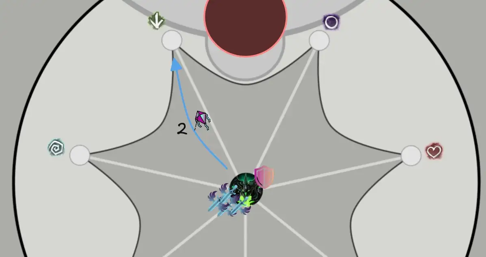

Shortly before the small dip, the tank should walk into the rest of the group, so that the red spawns slightly off-center.

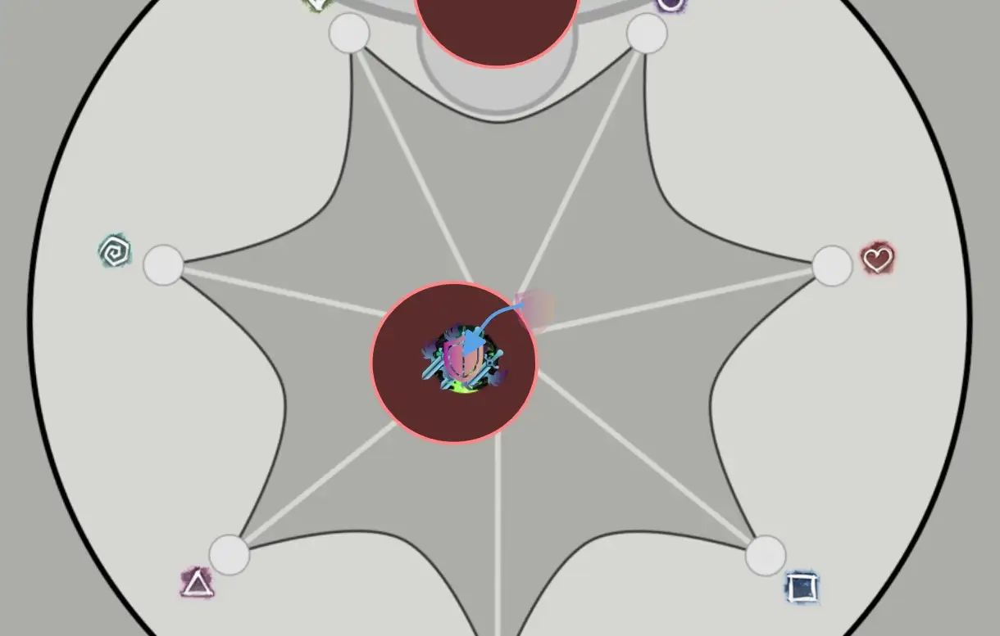

You can then walk Dhuum out of the red as before, and continue DPS keeping him close to the center.
From this position you can easily access the greens on ,  and , and are in prime position for the next big split.

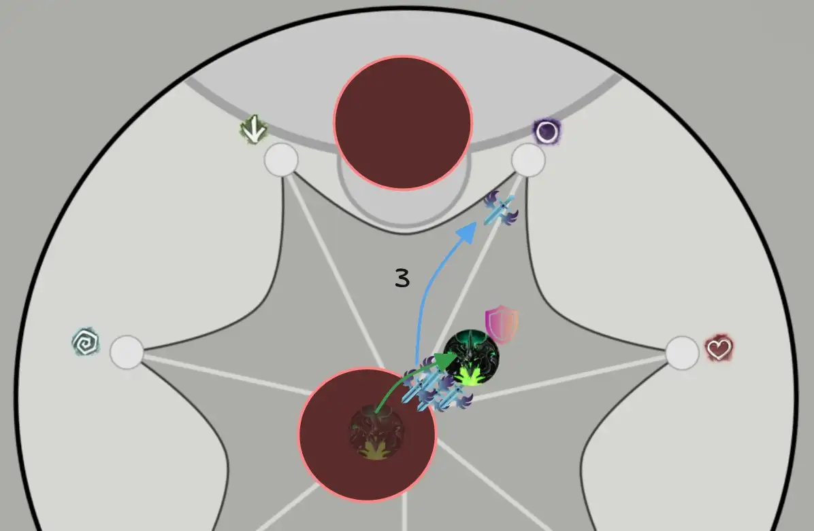

Play the rest of the encounter normally. With good damage, you should phase shortly.

---

### Additional Tips
- Use  [Sand Swell] to port players out of the group when they get  [Arcing Affliction](https://wiki.guildwars2.com/wiki/Arcing_Affliction_(effect)).
- Use  [Dimensional Aperture](https://wiki.guildwars2.com/wiki/Dimensional_Aperture) and  [Portal Entre] to port returning players from greens.
- Explode  [Arcing Affliction](https://wiki.guildwars2.com/wiki/Arcing_Affliction_(effect)) at *6:35* on the timer to overlap a bomb with the big dip. The dip will remove the bomb effect, making the run much safer.
- Green players are responsible for clearing the  reaper from deathlings, especially when doing greens on   and .
- Use  [Sand Swell]  or  [Portal Entre] during the big dip to port out players getting sucked into the boss. When you open a portal, check the location and direction of the [Echo] and communicate whether it is safe to take.  

---

## Additional Resources

#### PoVs

{: .note}
This is a non-comprehensive list meant to display a diverse selection of perspectives and roles. You do not have to copy them exactly, in fact we encourage you to find whatever strategy that suits your group best.

| Classes | Link | Date | Notes |
|  Heal, Push, Tank |  [PoV](https://www.youtube.com/watch?v=1NJxYpNMVxc) | March 2026 | Broken King on Statues |
|   BoonDPS, Desmina, Thrower |  [PoV](hhttps://www.youtube.com/watch?v=bXH86REC5yI) | March 2026 | Eater of Souls on Statues, standard Dhuum tanking |
|   Heal, Kite |  [PoV](https://www.youtube.com/watch?v=dEZuE2fJKUE) | April 2026 | Broken King on Statues |

---

#### Other Useful Links

-  [River and Eyes Portals by xBourne](https://www.youtube.com/watch?v=di49FJcxntA) - good visualization of  [Mesmer]  [Portals] for these encounters.
-  [Heal Chronomancer Kiting with MI and Portal by HasKha](https://youtu.be/_Yz4PQx_8Bc&t=2880) - while NM, this showcases the process overall.
-  [Throne Tanking Dhuum by Christine](https://www.youtube.com/watch?v=ceu2O8u3xOg) - while relatively old, the positioning in this run is still relevant.
-  [Getting the Echo Stuck](https://www.youtube.com/watch?v=bBYPfelUe2Y) - shows how to bug out the Echo at the beginning of Dhuum.

[< Wing 4](../wing-4/){: .btn } [Return to Home](../index.html){: .btn } [Wing 6 >](../wing-6/){: .btn }  [Return to Top](#hall-of-chains){: .btn .fixed}
{: .center}

<!-- Links to other pages in the guide -->
[Soulless Horror]: #soulless-horror
[River of Souls]: #river-of-souls
[River]: #river-of-souls
[Statues]: #statues-of-grenth
[Statues of Grenth]: #statues-of-grenth
[Statue of Ice]: #broken-king
[Broken King]: #broken-king
[Eater of Souls]: #eater-of-souls
[Eyes]: #eyes
[Statue of Darkness]: #eyes
[Dhuum]: #dhuum
[marker pack]: ../general.html#marker-packs

<!-- Links to classes and specializations -->
[Druid]: https://wiki.guildwars2.com/wiki/Druid
[Mesmer]: https://wiki.guildwars2.com/wiki/Mesmer
[Mesmers]: https://wiki.guildwars2.com/wiki/Mesmer
[Specter]: https://wiki.guildwars2.com/wiki/Specter
[Necromancer]: https://wiki.guildwars2.com/wiki/Necromancer
[Scourge]: https://wiki.guildwars2.com/wiki/Scourge
[Scourges]: https://wiki.guildwars2.com/wiki/Scourge
[Scrapper]: https://wiki.guildwars2.com/wiki/Scrapper
[Chronomancer]: https://wiki.guildwars2.com/wiki/Chronomancer
[Troubadour]: https://wiki.guildwars2.com/wiki/Troubadour
[Ritualist]: https://wiki.guildwars2.com/wiki/Ritualist
[Engineer]: https://wiki.guildwars2.com/wiki/Engineer

<!-- Links to skills -->
[Sand Swell]: https://wiki.guildwars2.com/wiki/Sand_Swell
[Summon Flesh Wurm]: https://wiki.guildwars2.com/wiki/Summon_Flesh_Wurm
[Portal Entre]: https://wiki.guildwars2.com/wiki/Portal_Entre
[Portals]: https://wiki.guildwars2.com/wiki/Portal_Entre
[Blink]: https://wiki.guildwars2.com/wiki/Blink
[Continuum Split]: https://wiki.guildwars2.com/wiki/Continuum_Split
[Mass Invisibility]: https://wiki.guildwars2.com/wiki/Mass_Invisibility
[Mimic]: https://wiki.guildwars2.com/wiki/Mimic

<!-- Links to buffs and debuffs -->
[Superspeed]: https://wiki.guildwars2.com/wiki/Superspeed
[Vulnerability]: https://wiki.guildwars2.com/wiki/Vulnerability
[Stealth]: https://wiki.guildwars2.com/wiki/Stealth
[Stealths]: https://wiki.guildwars2.com/wiki/Stealth
[Stealthing]: https://wiki.guildwars2.com/wiki/Stealth
[Glaciate]: https://wiki.guildwars2.com/wiki/Glaciate
[Stun]: https://wiki.guildwars2.com/wiki/Stun
[Stunned]: https://wiki.guildwars2.com/wiki/Stun

<!-- Links to enemies and enemy skills -->
[Hollowed Bomber]: https://wiki.guildwars2.com/wiki/Hollowed_Bomber
[Hollowed Bombers]: https://wiki.guildwars2.com/wiki/Hollowed_Bomber
[Bomber]: https://wiki.guildwars2.com/wiki/Hollowed_Bomber
[Bombers]: https://wiki.guildwars2.com/wiki/Hollowed_Bomber
[Enervator]: https://wiki.guildwars2.com/wiki/Enervator
[Enervators]: https://wiki.guildwars2.com/wiki/Enervator
[Light Orb]: https://wiki.guildwars2.com/wiki/Light_Orb
[Light Orbs]: https://wiki.guildwars2.com/wiki/Light_Orb
[Shield of Ice]: https://wiki.guildwars2.com/wiki/Shield_of_Ice
[Deathlings]: https://wiki.guildwars2.com/wiki/Deathling
[Echo]: https://wiki.guildwars2.com/wiki/Ender's_Echo
[Enforcer]: https://wiki.guildwars2.com/wiki/Dhuum%27s_Enforcer

<!-- Other -->
[Sand Portal]: https://wiki.guildwars2.com/wiki/Sand_Portal