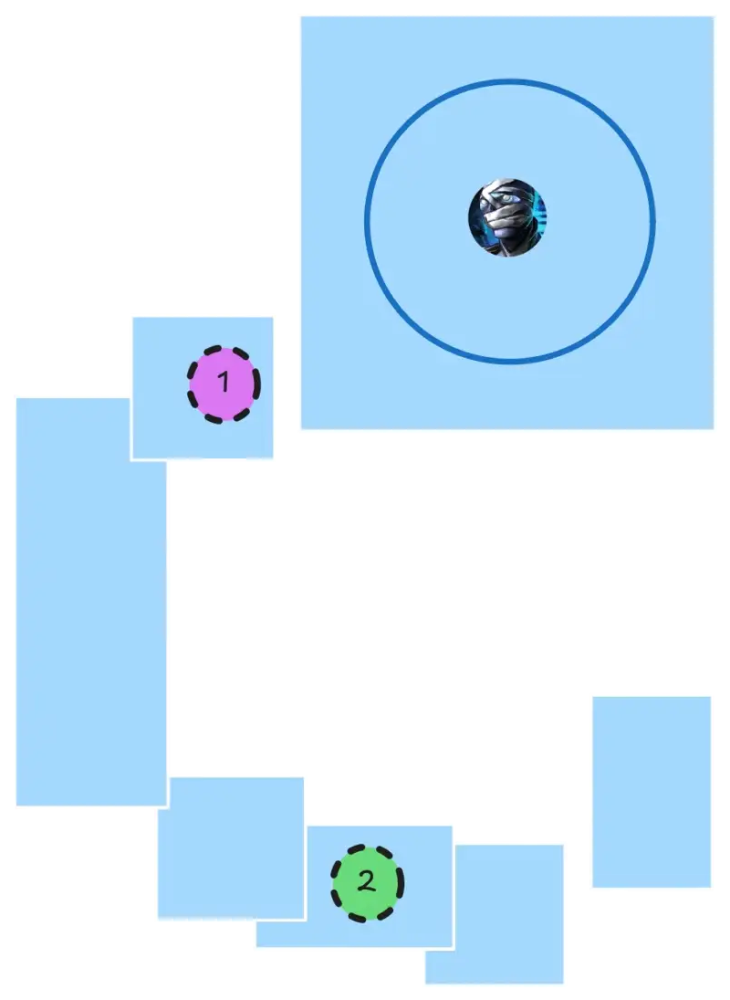
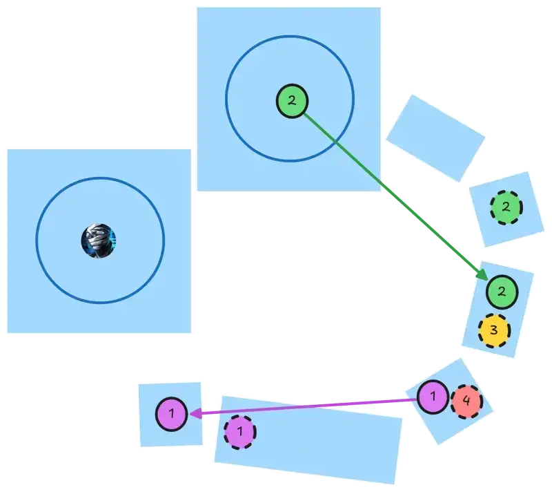
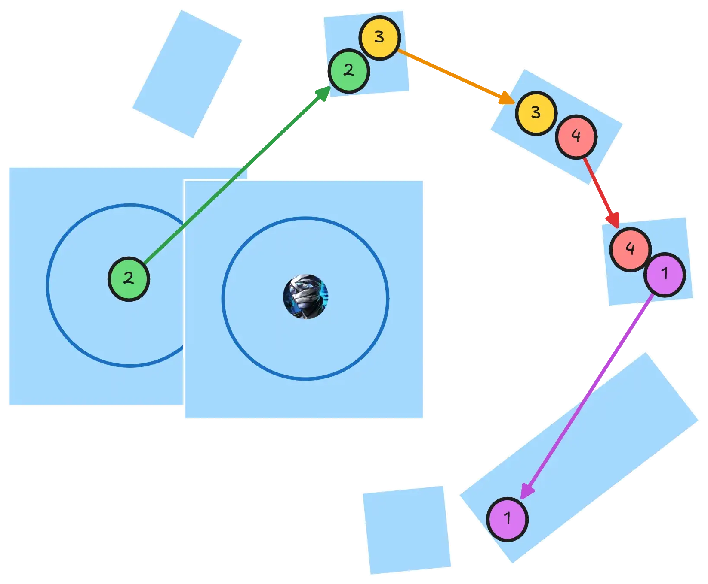
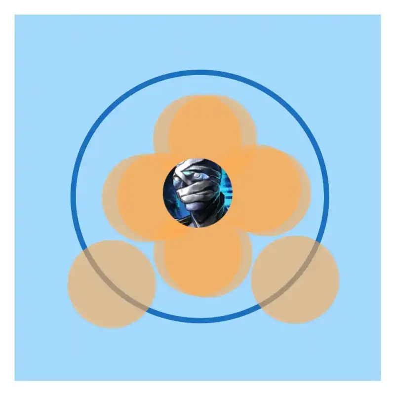
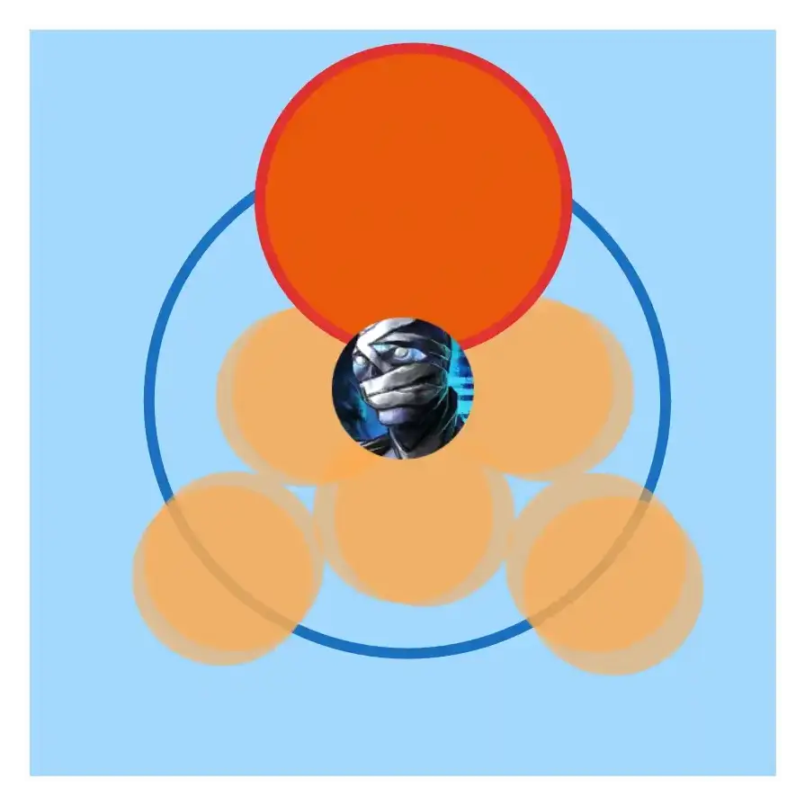
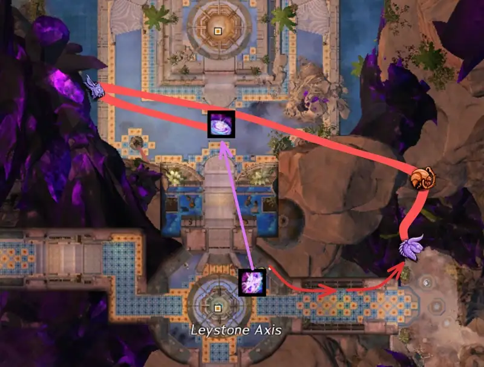
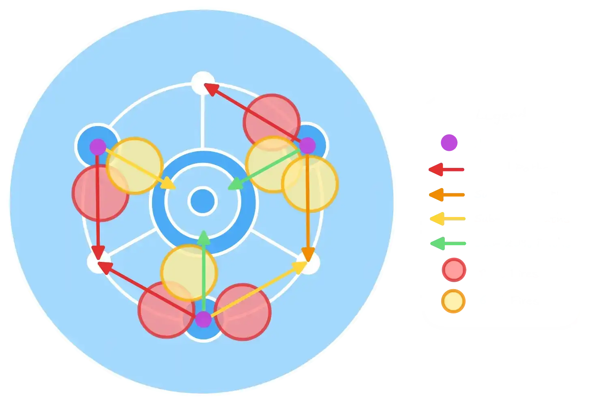
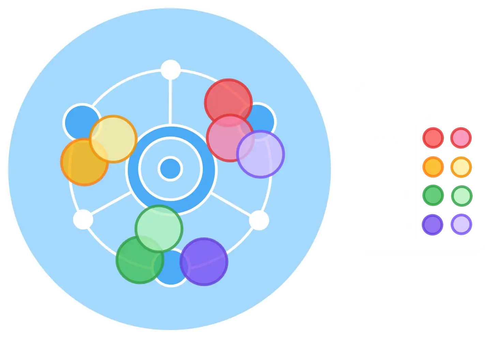
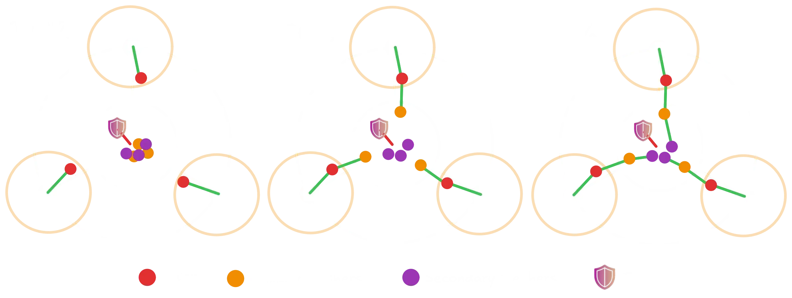
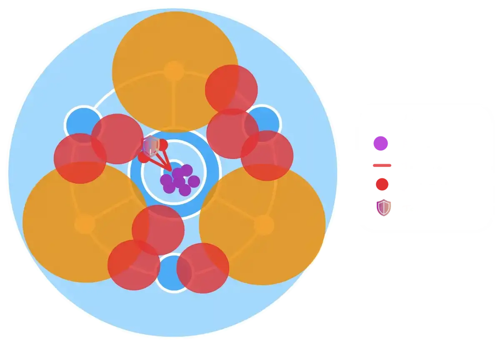

[< Wing 6](../wing-6/){: .btn } [Return to Home](../index.html){: .btn } [Wing 8 >](../wing-8/){: .btn } 
{: .center}

# The Key of Ahdashim
{: .no_toc}

| **Timer** |  18 minutes 30 seconds |
| **Timer Start** |  On approaching  [Glenna]. |

<b>Table of Contents</b>

1. TOC
{:toc}

---

The Key of Ahdashim is a balanced raid with a mix of bosses, events and transitions. As one of the more dialogue-heavy wings in the game, fast clears consistently use out-of-bounds skips to make the timer more manageable.

---

#### Main Points
{: .no_toc}

- [Gate] is usually done twice, resetting the first pull to skip the initial dialogue.
- [Adina] is played assuming that players can skip pillars, and splitting the group to kill all hands simultaneously in the split phases.
- [Sabir] optimization revolves around portals for the platform transitions and group invulnerability to skip certain mechanics.
- [Qadim] can be made much faster through efficient tether management, fire positioning and boonstrips.
- Several out-of-bounds skips are used between encounters to skip dialogue.

---

## Composition

Compositions for the Key of Ahdashim usually run at least one  [Mesmer] for portals. Having two, or a  [Mesmer] and a  [Thief], opens up even more options.

Apart from this requirement, groups are usually free to run whatever they want to maximize their damage output and utility.

---

#### [Gate]
{: .no_toc}
- Bring classes with high  power burst and cleave.
-  Pulls can make killing groups of adds much faster.
-  Knockbacks can remove adds from rifts and make capturing faster.

#### [Adina]
{: .no_toc}
- Damage pressure is low enough to run a single celestial healer.
- Ensure you have as many sources of projectile reflection as possible.
- Classes that can hit multiple hands at once, such as  [Bladesworn], can greatly speed up the split phases.
- Classes with some ranged damage or that do not mind not hitting the boss for a few seconds are commonly used for baiting pillars.

#### [Sabir]
{: .no_toc}
- Bring abundant crowd control for the  [Defiance Bar].  [Thief] is a common pick, as  [Distracting Throw] spam is unmatched in sustained CC.
- Bring multiple portals to [speed up the split phases](#fast-split-phases).
- Projectile reflection or nullification is extremely useful for the final phase.
- Skills that grant group invulnerability or damage prevention let you tank the shockwave, greatly increasing DPS on the boss. These include  ["Rebound!"],  ["We Will Never Yield!"] and  [Tale of the August Queen].

#### [Qadim]
{: .no_toc}
- Most of the boss's damage pressure is applied to the tank, making solo-healing viable.
-  [Deadeye] is by far the best pylon class, bringing high damage, sustain and utility at the cost of being harder to play than its alternatives.
-  [Scourge] is another common pylon pick, as it is tanky, easy to play and can provide  [Alacrity] while kiting.
- DPS or BoonDPS classes with ranged damage can be useful when optimizing good tethers.
- Assign one player with good (and possibly ranged) CC to [Anomaly] duty.
- Bring abundant boonstrips for the final phase.

---

## Gate

Gate is a relatively long encounter that is optimized in three main ways:
- An initial dialogue skip.
- Fast captures by distracting the [Champion Branded Djinns].
- Stacking [Djinns] to kill them faster in the final phase.

---

### Initial Dialogue Skip

This is at the same time one of the easiest and most annoying skips to execute, as it requires the squad to complete the encounter up until the point where [Glenna] and the [Key] are opening the door. At this point, make the encounter fail by letting enemies kill [Glenna].

{: .note}
`/gg`ing at this point does not work, as you will respawn. Glenna has to die to damage for the encounter to fail.

When you respawn, both NPCs will be in position to immediately begin the encounter, skipping the normal dialogue. The timer will still begin once you approach [Glenna], so you should be ready to begin immediately.

---

### Strategy

The standard Gate speedrun strategy aims to aggro the [Champion Djinn] away from the capture zones so that they do not interfere with capturing.

Once the encounter begins, split up the squad by sending:
- One player to aggro onto the closest [Champion Djinn].
- Another player (usually a healer) to aggro the second [Champion Djinn].
- Optionally, a player with a   portal to do the [out-of-bounds skip](#out-of-bounds-skip)
- The rest of the squad to quickly clear out the first rift.

Once the rift is clear, you can leave a couple of players on it to continue the capture while the rest of the group kills the [Djinn].

Meanwhile, the healer who aggro'd the furthest Djinn can pull them over to the corner where it cannot interfere for the rest of the event.

{: .note}
Capture speed is unaffected by the number of players in the rift. Capturing only requires the rift area to be clear of enemies.

With one [Champion Djinn] dead and the other distracted, you should be able to easily capture the next two rifts without interference.

Once they are done, head over to the final rift. After it has been cleared, you can send the main group over to aggro the final [Djinn], once again preventing it from interfering.

Capturing all rifts progresses the event to the next phase and forcibly despawns all surviving Djinn.

You can then position in preparation for the rest of the event by sending the main group to the spawn location on the west side while a healer goes to the east side.

Once the last three champions spawn, the main group will be in position to kill the first.
Meanwhile, the healer aggros the next two and uses line-of-sight to attract them behind the pillar in front of the gate.

You can then portal in the main group and kill both of them quickly while they are still stacked.

At this point the encounter will be over, and you can either head into the [Leystone Axis] to trigger the dialogue or use a   portal provided via an out-of-bounds break to skip it.

---

## Transition to Adina

This transition is often done with an out-of-bounds skip. The  [Skyscale] in combination with  [Bond of Faith] enable a player to get to the [Basalt Arena] while [Gate] is still ongoing, place a   portal down and retrace their steps back to [Gate], portaling everyone over once the event ends.

This saves a lot of time, as otherwise you would have to sit through all the dialogue in the [Leystone Axis] before the doors to [Adina] and [Sabir] are opened. While this is not strictly necessary to meet the timer, it makes it significantly easier overall.

  Skip PoV

<iframe class="youtube-video center bordered" width="100%" src="https://www.youtube.com/embed/ZeF_aE34Ntk?start=11&end=117" frameborder="0" allow="accelerometer; clipboard-write; encrypted-media; gyroscope; picture-in-picture; web-share" referrerpolicy="strict-origin-when-cross-origin" allowfullscreen></iframe>

{: .note}
[Marker packs] can show you the path to take during the skip for an easier overall experience, as shown in the PoV above.

---

## Cardinal Adina

Adina is a bursty boss with four relatively short phases. Speedruns differ from normal runs in that:
- They require enough DPS to skip certain mechanics .
- They optimize split phases by killing all hands simultaneously.

---

### Stacking Pillars

This is when the group aims to phase the boss before [Boulder Barrage], removing the need for moving out and hiding behind pillars. When doing this, the five players baiting the pillars will usually stack in one spot, spawning one single pillar instead of five.

Note that, contrary to common belief, this does not directly increase DPS on the boss, as  [Pillar Pandemonium](https://wiki.guildwars2.com/wiki/Pillar_Pandemonium) is only applied by damaged pillars. Instead, stacking has the benefit that players can more easily share boons and support while far from the boss. For this reason, it's best if these players are all part of the same subgroup.

---

### Split Phases

Optimized split phases aim to kill all hands simultaneously. To do this, squads will usually split into two subgroups.

For the first split phase, you can send one subgroup to the east hand and one to the west. For the second and third, you can send one sub to the north and the other to the south, and then split them again into groups of 2 to 3 players for each hand.

Usually it's best to send the subgroup containing the tank to the south, so that they are in position to re-capture aggro when the split phase ends.

Any specializations who can damage both hands simultaneously, such as  [Bladesworn] and   [Virtuoso], are very high value in the split phases. Healers or boon supports can similarly stand between the two hands to help both groups at the same time.

---

## Transition to Sabir & Preventing Crashes

Groups who do [Adina] first (as recommended by this guide) will want to quickly transition to [Sabir] immediately after. The fastest way to do so is by using the [ley rift] from the [Basalt Arena] to the [Leystone Axis], and then clearing Sabir's pre-event.

This runs into some persistent technical issues as this wing is notorious for its crashes triggered upon taking the ley rifts. These can be mitigated by:
- Lowering shader settings in graphics.
- Only taking ley rifts 2-3 players at a time.

If your team is suffering from frequent crashes, consider not using any ley rifts.

---

## Cardinal Sabir

Fast Sabir clears are dependant on three important factors:
- Fast split phases taking advantage of portals.
- Proper  [Defiance Bar] and spread management.
- Use of group invulnerability or damage prevention skills to ignore the [Unbridled Tempest] shockwave (and potentially [Fury of the Storm]).

---

### Pre-Event

Once you have cleared the wisps inside the [Leystone Axis] and opened your way to the [Fractured Conservatory], to spawn the boss you only need to kill the final wisp just before his arena. Use the  [Skyscale] in combination with  [Bond of Vigor](https://wiki.guildwars2.com/wiki/Bond_of_Vigor) to get to the last platform, kill it and immediately access the boss.

---

### Fast Split Phases

Sabir's split phases involve killing wisps as you slowly scale the platforms between arenas. However, the only strict requirement to progress the fight is to make it to the next arena; portals can thus be used to move between platforms instead of wisps, which is much faster than what was originally intended in the encounter.

Portals usually have a maximum range of 5000 units. However, on Sabir they are limited to 800 units vertically: anything beyond this range will result in a portal that is visually fine, but not interactable by players. This means that portals must be placed in specific points that stay within this limitation.

{: .note}
This vertical limitation can be worked around by triggering a loading screen. This happens only if taking the portal would result in over 5000 units of movement, which can be done with extremely precise portal placement combined with interacting with the portals on their edge: [example](https://www.youtube.com/watch?v=_kp3C5MmFQ0).

We can divide the portals between different roles:
- *Portal 1* is the easiest role to implement, and is sometimes even done in PUGS. This role enables skipping the tornado platforms in the split phases, thus bringing the greatest benefit for the lowest cost. It requires either  [Shadow Portal] (which may be insufficient in case of extremely high DPS) or  [Portal Entre] in combination with  [Mimic].
- *Portal 2* is harder to implement, as it requires some adaptation before the fight begins and during the first split phase. It brings a significant benefit, but not as good as portal 1, and is best done with  [Portal Entre] in combination with  [Mimic], as the interval between opening the first portal and preparing the second is extremely short.
- *Portal 3* and *Portal 4* are relatively easy, as they can be pre-placed during the first split phase and used in the second. They can also be done with  [Sand Swell](https://wiki.guildwars2.com/wiki/Sand_Swell) if necessary. They bring a smaller advantage compared to *1* and *2*, and can be forgone if the composition requires it.

Any additional portals lead to diminishing returns, as you are limited by the time Sabir requires to move between arenas.

{: .note}
As with everything in this guide, these roles are merely suggestions: feel free to mix and match strategies, skills and classes as best fits your group's requirements.

{: .note}
Implementing *any* portals introduces a DPS check, as you will have to phase fast enough that they do not run out. The DPS checks for *portals 2, 3 and 4* (approximately 60 seconds phase-to-phase) are much higher than the one for *portal 1* (approximately 50 seconds from the defiance bar to the end of the phase).

---

#### Phase 1 Pre-Placements
{: .no_toc}

The *Portal 2* player will need to pre-position on the platform shown in the image. As soon as the fight begins, they can prepare their  portal and make their way up the platforms to the main group.

{: .note}
In *normal mode* there are updrafts that make this faster; in *challenge mode* these are not present and the player will have to run the normal way. Alternatively, you can do [fancy things](https://www.youtube.com/watch?v=4UtiLrGkDs0) using  [Dimensional Aperture], blinks or other similar skills.

The *Portal 1* player can prepare their own portal on the platform immediately under the boss arena. This can be done during the  [Defiance Bar], or immediately after if the player is helping with CC.

---

#### First Split Phase
{: .no_toc}

The *Portal 2* will  [Mimic] and open their portal in the center of the arena, bringing the squad directly to the third platform.

{: .warning}
The *Portal 2* player should only open their portal once the platforms have stopped moving, otherwise it will not be able to transfer players.

{: .note}
If you don't have a portal here, you can use the tornados on the arena floor to boost up and reach the first platform faster.

The *Portal 2* player will then need to prepare their portal on the second platform up from the arena. This requires dropping down from the third, preparing the portal, and then getting back up using personal blinks or skills such as  [Dimensional Aperture] or  [Sand Swell](https://wiki.guildwars2.com/wiki/Sand_Swell).

The *Portal 3* player, if there is one, will prepare their portal on the third platform if they need to. Similarly, the *Portal 4* can prepare their own on the fourth platform, just before the one with the tornados. The *Portal 1* player should open their portal (using  [Mimic] as necessary) on this same platform. You can then kill the final wisp and access the second arena.

The *Portal 1* will then have to pre-place their portal once more during the CC or immediately after. This time it should be prepared at the end of the tornado platform, one down from where they prepared it in the previous phase.

---

#### Second Split Phase
{: .no_toc}

In this split phase you should be able to quickly reach the final arena by chaining portals.

{: .warning}
The *Portal 2* player should only open their portal once the platforms have stopped moving, otherwise it will not be able to transfer players.

When chaining portals, especially  [Portal Entre] into itself,  [Shadow Portal], or  [Sand Swell](https://wiki.guildwars2.com/wiki/Sand_Swell), make sure to open the entrance of the new portal far enough from the exit of the previous one, as there can be issues with players being unable to take the new entrance if there is any overlap.

---

### Managing CC Phases

Sabir's  [Defiance Bar] only appears during two mechanics:
- *Free CC*, during which he gains barrier and pushes back players.
- *Coordinated CC*, during which he quickly regenerates defiance and gains stacking damage resistance from  [Ion Shield](https://wiki.guildwars2.com/wiki/Ion_Shield).

For the *Free CC*, it's in everyone's interest to use  [Flash Discharge](https://wiki.guildwars2.com/wiki/Flash_Discharge) and any other CC skills as much as possible. Your objective is to burst down the bar quickly to continue dealing damage.

During the *Coordinated CC*, try to break the  [Defiance Bar] once the boss is at *40%* HP or lower: this makes him skip a cast of [Unbridled Tempest].

Once either CC is finished, Sabir will always do a spread attack. You can stack two spreads, but three will usually down the involved players. For this reason it can be convenient to prepare spread positions in advance, thus enabling melee players to upkeep DPS during this mechanic while avoiding downstates. In the images you can see some example spread patterns for the first and second phase, and for the final phase with the tornado.

---

### Skipping Shockwaves

Sabir's [Unbridled Tempest] usually requires players to fly up in a tornado to survive, thus losing all stacks of  [Violent Currents](https://wiki.guildwars2.com/wiki/Violent_Currents). This is a significant loss in terms of both raw damage and damage uptime.

Optimized groups should bring ways to circumvent this requirement:
1. **Movement Skills** - make it possible to teleport over the shockwave, using either personal blinks or portals. This is risky as it requires proper positioning and timing, and is not commonly used in Infallible runs.
2. **Personal Invulnerability** - any skill that would prevent the user from taking lethal damage, such  [Distortion],  [A.E.D.](https://wiki.guildwars2.com/wiki/A.E.D.),  [Defiant Stance](https://wiki.guildwars2.com/wiki/Defiant_Stance), can let a player tank the shockwave.
3. **Group Invulnerability** - currently only provided by  ["Rebound!"],  ["We Will Never Yield!"] and  [Tale of the August Queen]. This is the safest option, but it requires composition adjustments as you need two sources in each subgroup to fully cover this mechanic.
4. **Very High DPS** - if you manage to reduce Sabir to below 70% HP before he uses [Unbridled Tempest], he will cancel this attack and instead begin his  [Defiance Bar]. This is an extreme DPS check that is only really possible in Normal Mode speedruns (for now).

Aside from this, DPS players should in general try to hold on to their stacks of  [Violent Currents](https://wiki.guildwars2.com/wiki/Violent_Currents), unless they are required for CC.

{: .note}
> [Fury of the Storm] (the shockwave with safe areas) is an attack that is similar to [Unbridled Tempest] and can be resolved in much the same ways:
> -  [Portals] to and from the safe area to reduce time spent in movement.
> - Personal and group damage prevention skills to remain on the boss, maintaining DPS uptime.
>
> {: .warning}
> Invulnerability skills such as  [Distortion] and  [Tale of the August Queen] do not prevent downing to this mechanic!
>
> Since this mechanic does not force you to lose  [Violent Currents](https://wiki.guildwars2.com/wiki/Violent_Currents), give priority to [Unbridled Tempest] when deciding where to use resources.

---

## Transition to Qadim

Between killing [Sabir] (or [Adina] if you did Sabir first) and gaining access to the [Sovereign's Stadium], the squad will have to sit through some extremely long dialogue between [Glenna] and the [Key]. Skipping this dialogue is not strictly necessary to clear the timer, but it will make it a lot easier overall. Players have devised three main ways to do this.

---

### Direct Dialogue Skip

This skip is the simplest to execute, but is not suited for Infallible runs. It involves sending a single player over to the [Leystone Axis] to trigger the dialogue; when the [Key] then uses the line *"(yells)"*, this player will immediately `/gg` to immediately trigger the animation opening the [Sovereign's Stadium]. The rest of the squad can then use the [ley rift] to the [Leystone Axis] and run in.

If you really need more time, Infallible groups can still use this skip by having the triggering player leave the instance instead of `/gg`. This player will lose their achievement eligibility, but the rest of the squad won't.

---

### Jackal Skip

This skip is difficult to execute, but can be attempted by all players simultaneously, increasing the likelihood of success. It involves using  [Bond of Faith] at a precise moment during  [Jackal]  [Blink](https://wiki.guildwars2.com/wiki/Blink_(Jackal)) to launch forward at incredible speed.

Players can position on top of the crystal in the [Leystone Axis] and use this combo towards the gate. When executed correctly, this will glitch them through the barrier and into the [Sovereign's Stadium]. They can then position next to the gate with the  [Siege Turtle](https://wiki.guildwars2.com/wiki/Siege_Turtle), allowing the rest of the squad through by having them mount up and dismount on the other side.

Most Infallible groups will not use this skip unless there are multiple players capable of reliably performing the  [Jackal]  [Blink](https://wiki.guildwars2.com/wiki/Blink_(Jackal)) glitch, as you run the risk of remaining high and dry just before the final boss of the wing.

---

### Out-of-Bounds Skip

This the most reliable skip, as it provides a portal from the [Leystone Axis] to the [Sovereign's Stadium] while at the same time not requiring most of the squad to take a [ley rift], reducing the chance of crashes.

It requires a  [Mesmer] to break out of bounds using the  [Skyscale], then transition to other mounts to quickly get into the final arena. Meanwhile the rest of the squad can get to the [Leystone Axis] using mounts, swap builds and food, and take a portal.

  Skip PoV

<iframe class="youtube-video center bordered" width="100%" src="https://www.youtube.com/embed/ZeF_aE34Ntk?start=119" frameborder="0" allow="accelerometer; clipboard-write; encrypted-media; gyroscope; picture-in-picture; web-share" referrerpolicy="strict-origin-when-cross-origin" allowfullscreen></iframe>

{: .note}
[Marker packs] can show you the path to take during the skip for an easier overall experience, as shown in the PoV above.

---

## Qadim the Peerless

Qadim is a relatively difficult boss with a lot of interesting mechanics from an optimization point of view. Fast kills of this boss require:
- Optimized fire drops to simplify killing [Anomalies].
- Optimized "good tethers" and "bad tethers" to massively increase overall DPS.

---

### Optimized Fires

This strategy aims to cover all possible [Anomaly] paths over the course of the encounter. This allows a healer or boonDPS with abundant CC to reliably kill all of them by breaking their  [Defiance Bar] once on top of a fire.

Split the squad into four groups with two to three players each (two fires are required to kill an [Anomaly] with a single defiance break). Each of these groups should be assigned two positions to drop fires, one at 80% and the other at 60%. A recommended split can be found below, feel free to tweak it according to your squad's needs.

Pylon kiters and the tank will struggle to reach fires that are far from their starting positions. Try to assign their groups keeping this in mind. For example, with the groups from the image above:
- The *North* pylon and *Tank* are best assigned to group 1.
- The *West* pylon is best assigned to group 2 or 3.
- The *East* pylon is best assigned to group 4.

{: .note}
[Marker packs] can show you positions to drop fires in.

---

### Optimized Good Tethers

Pylons will initially tether to their kiter. For each orb on the pylon, an additional tether can be formed, chaining from the furthest tethered player to their closest untethered player in range. Each tether will apply a stack of  [Erratic Energy](https://wiki.guildwars2.com/wiki/Erratic_Energy) to Qadim, increasing damage taken by 5%, up to a maximum of 45% additional damage.

To improve tether chaining, groups will sometimes assign three players, called *Primary Tethers*, to link to the kiters. These players will begin standing close to their pylons as soon as their kiter catches an orb, tethering with them and thus increasing DPS on the boss.

{: .note}
Optionally, the tank can act as a primary tether for the northern pylon if they have good boon radius. However, they will not be able to form secondary tethers.

Once the boss reaches 80%, the first set of orbs will have been caught, resulting in six good tethers and a 30% damage increase. Once the boss reaches 60%, the remaining orbs will have been caught, and tethers should automatically form with the players remaining on the boss, a.k.a. *Secondary Tethers*, resulting in up to a 45% DPS increase. This is a difficult position to maintain stable, but thanks to the additional DPS it is also one of the shorter phases.

Once Qadim starts destroying pylons, good tether mechanics change slightly, as the pylon kiters freed from their duty can act as pseudo primary tethers or transition into [bad tether management](#optimized-bad-tethers) duty.

{: .note}
While good tether management is a staple of Qadim the Peerless speedrunning, groups attempting Infallible may find that they do not need the additional DPS, especially if they are using out-of-bounds skips. In this case, you may decide to forgo this strategy and simplify your composition by not requiring primary tethers. 

---

### Optimized Bad Tethers

Players tethering to Qadim will be afflicted with the  [Sapping Surge](https://wiki.guildwars2.com/wiki/Sapping_Surge) debuff, which constantly applies  [Vulnerability](https://wiki.guildwars2.com/wiki/Vulnerability) and reduces outgoing damage by 25%. This is not an issue at the beginning of the fight as only the tank will be tethered, but it becomes noteworthy once Qadim starts destroying pylons:
- After *40%*, the tether will be able to chain to an additional player.
- After *30%*, Qadim will form two tethers instead of one.
- After *20%*, Qadim will form three tethers, and tethers will be able to chain twice instead of once.

In the worst case scenario a total of nine players will have a tether, reducing the squad's total DPS output by 20-25% in the final hectic moments of the fight.

To reduce the impact of this mechanic, it is common to assign three players as *Bad Tethers*. These will try to capture the bad tethers by keeping their  [Flux Disruptor](https://wiki.guildwars2.com/wiki/Flux_Disruptor:_Activate) activated, then stack as far as possible from the main group. Usually this responsibility is given to the tank and two pylons.

Once Qadim destroys the first pylon, the tank should start standing far from the main group in order to not form an additional tether with the main group. Then, once additional pylons are destroyed, the bad tethers can begin stacking with him.

{: .warning}
Once the final tether is destroyed, Qadim will activate and lock all players'  [Flux Disruptors](https://wiki.guildwars2.com/wiki/Flux_Disruptor:_Activate). For this reason, it's very important that the tank and the two bad tethers be the only players inside the center area when the boss re-spawns, with the rest of the squad waiting until the tethers have formed to join in.

---

### Avoiding Bugs

#### Invisible Roads
{: .no_toc}
Qadim's [carpets](https://wiki.guildwars2.com/wiki/Force_of_Havoc) have an associated bug where they will become invisible before the mechanics is over, only becoming visible for their despawn animation. This can lead to unaware players taking a lot of damage, which can be run-ending in a solo-heal situation.

To avoid this bug, the squad should make sure that the carpets only spawn on the north side of the boss, while the squad sticks to the south side: 
- The tank and bad tether baiters should be the only players with an activated  [Flux Disruptor](https://wiki.guildwars2.com/wiki/Flux_Disruptor:_Activate) close to the boss before 20%.
- Once the final pylon is destroyed at 20%, the tank and the two bad tethers should be the only players inside the center area so they can reliably capture aggro.
- Everyone except for the tank and bad tethers should avoid going into the northern side of the arena without paying significant attention.

---

#### Special Action Key
{: .no_toc}
During the transition to the last phase at 20%, if all 5 orbs are picked up before Qadim locks the group's  [Flux Disruptors](https://wiki.guildwars2.com/wiki/Flux_Disruptor:_Activate), the person targeted by the meteor illusion will be unable to cast  [Unleash](https://wiki.guildwars2.com/wiki/Unleash), thus leading to a wipe.

This happens because Qadim does not exclude  [Unleash](https://wiki.guildwars2.com/wiki/Unleash) when locking the special action keys of the rest of the group. To avoid this, begin collecting orbs only after the  [Flux Disruptors](https://wiki.guildwars2.com/wiki/Flux_Disruptor:_Activate) have been locked, which happens simultaneously with the second knockback after he re-spawns in the center of the arena.

---

### Additional Tips

- Bring a large amount of boonstrip for the final phase, as Qadim will constantly gain boons, including  [Resolution](https://wiki.guildwars2.com/wiki/Resolution).
- Try to equally distribute crowd control between all three pylons.
- Beware of small AoEs stripping  [Stability] or  [Aegis] just before the  knockbacks at 40%, 30% and 20%. Provide multiple stacks if possible.

## Additional Resources

#### PoVs

{: .note}
This is a non-comprehensive list meant to display a diverse selection of perspectives and roles. You do not have to copy them exactly, in fact we encourage you to find whatever strategy that suits your group best.

| Classes | Link | Date | Notes |
|   Heal, Tank |  [PoV](https://www.youtube.com/watch?v=ht7oiJD5iJY) | April 2026 | Uses OoB skip after Gate, no skip after Sabir. Single portal on Sabir. |
|   DPS, Kiter |  [PoV](https://www.youtube.com/watch?v=k0oMzQmF3K8) | May 2026 | No out-of-bounds skips |
|   DPS, Kiter |  [PoV](https://www.youtube.com/watch?v=wblAmy8likU) | April 2026 | No out-of-bounds skips |

#### Other Useful Links

-   [Pylon Deadeye](https://snowcrows.com/builds/raids/thief/kite-deadeye-qtp-rifle-spear) build and [gameplay guide](https://snowcrows.com/guides/builds/kite-deadeye-qadim-the-peerless-gameplay-guide) by Snowcrows.
-   [Pylon Scourge](https://snowcrows.com/builds/raids/necromancer/kite-scourge-qadim-the-peerless) build by Snowcrows.
-  [Sabir NM in 1:54](https://www.youtube.com/watch?v=8TkzrUygpG4) by My Chaotic Asylum [MCA]: excellent demonstration of portal chaining.
-  [Qadim NM in 2:35](https://www.youtube.com/watch?v=mA3UxgVh35Q) by The Hybridosaurus [AVES]: extreme speedrun where they manage to keep the last pylon alive by phasing at specific points. Showcases very good tether management and strategy: [explanation](https://www.reddit.com/r/Guildwars2/comments/1b2dfeh/qadim_the_peerless_record_by_the_hybridosaurus/).

[< Wing 6](../wing-6/){: .btn } [Return to Home](../index.html){: .btn } [Wing 8 >](../wing-8/){: .btn }  [Return to Top](#the-key-of-ahdashim){: .btn .fixed}
{: .center}

<!-- Links to other pages in the guide -->
[marker packs]: ../general.html#marker-packs
[Gate]: #gate
[Adina]: #cardinal-adina
[Sabir]: #cardinal-sabir
[Qadim]: #qadim-the-peerless

<!-- Links to classes and specializations -->
[Mesmer]: https://wiki.guildwars2.com/wiki/Mesmer
[Thief]: https://wiki.guildwars2.com/wiki/Thief
[Virtuoso]: https://wiki.guildwars2.com/wiki/Virtuoso
[Bladesworn]: https://wiki.guildwars2.com/wiki/Bladesworn
[Deadeye]: https://wiki.guildwars2.com/wiki/Deadeye
[Scourge]: https://wiki.guildwars2.com/wiki/Scourge
[Scourges]: https://wiki.guildwars2.com/wiki/Scourge

<!-- Links to skills -->
[Bond of Faith]: https://wiki.guildwars2.com/wiki/Bond_of_Faith
["Rebound!"]: https://wiki.guildwars2.com/wiki/%22Rebound!%22
["We Will Never Yield!"]: https://wiki.guildwars2.com/wiki/%22We_Will_Never_Yield!%22
[Tale of the August Queen]: https://wiki.guildwars2.com/wiki/Tale_of_the_August_Queen
[Xinrae's Weapon]: https://wiki.guildwars2.com/wiki/Xinrae's_Weapon
[Distracting Throw]: https://wiki.guildwars2.com/wiki/Distracting_Throw
[Shadow Portal]: https://wiki.guildwars2.com/wiki/Shadow_Portal
[Portal Entre]: https://wiki.guildwars2.com/wiki/Portal_Entre
[Portals]: https://wiki.guildwars2.com/wiki/Portal_Entre
[Mimic]: https://wiki.guildwars2.com/wiki/Mimic
[Dimensional Aperture]: https://wiki.guildwars2.com/wiki/Dimensional_Aperture
[Distortion]: https://wiki.guildwars2.com/wiki/Distortion

<!-- Links to buffs and debuffs -->
[Alacrity]: https://wiki.guildwars2.com/wiki/Alacrity
[Stability]: https://wiki.guildwars2.com/wiki/Stability
[Aegis]: https://wiki.guildwars2.com/wiki/Aegis

<!-- Links to enemies and enemy skills -->
[Djinn]: https://wiki.guildwars2.com/wiki/Champion_Branded_Djinn
[Champion Djinn]: https://wiki.guildwars2.com/wiki/Champion_Branded_Djinn
[Djinns]: https://wiki.guildwars2.com/wiki/Champion_Branded_Djinn
[Champion Branded Djinns]: https://wiki.guildwars2.com/wiki/Champion_Branded_Djinn
[Boulder Barrage]: https://wiki.guildwars2.com/wiki/Boulder_Barrage
[Unbridled Tempest]: https://wiki.guildwars2.com/wiki/Unbridled_Tempest
[Fury of the Storm]: https://wiki.guildwars2.com/wiki/Fury_of_the_Storm
[Anomaly]: https://wiki.guildwars2.com/wiki/Entropic_Distortion
[Anomalies]: https://wiki.guildwars2.com/wiki/Entropic_Distortion

<!-- Other -->
[Leystone Axis]: https://wiki.guildwars2.com/wiki/Leystone_Axis
[Basalt Arena]: https://wiki.guildwars2.com/wiki/Basalt_Arena
[Fractured Conservatory]: https://wiki.guildwars2.com/wiki/Fractured_Conservatory
[Sovereign's Stadium]: https://wiki.guildwars2.com/wiki/Sovereign%27s_Stadium
[Glenna]: https://wiki.guildwars2.com/wiki/Scholar_Glenna
[Key]: https://wiki.guildwars2.com/wiki/Key_of_Ahdashim
[Skyscale]: https://wiki.guildwars2.com/wiki/Skyscale
[Jackal]: https://wiki.guildwars2.com/wiki/Jackal
[Defiance Bar]: https://wiki.guildwars2.com/wiki/Defiance_bar
[ley rift]: https://wiki.guildwars2.com/wiki/Ley_Rift