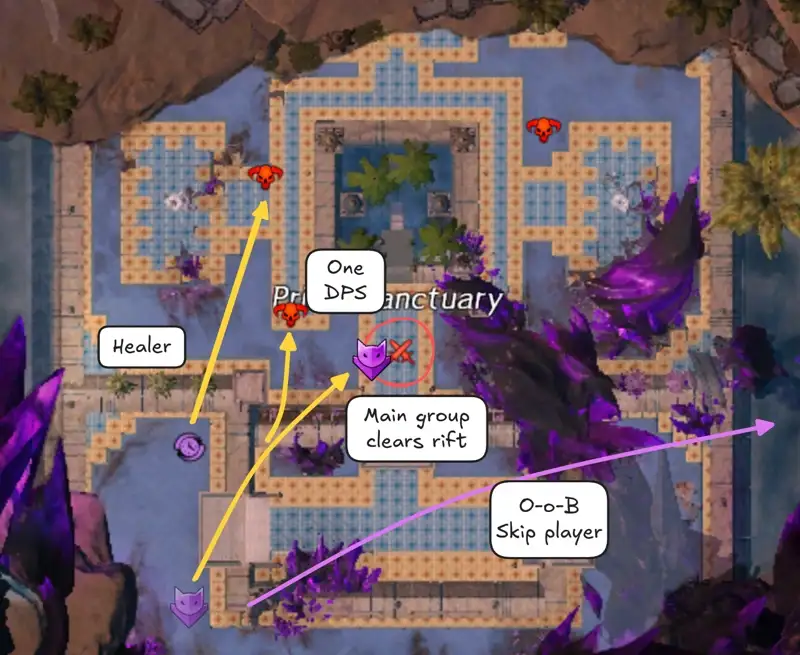
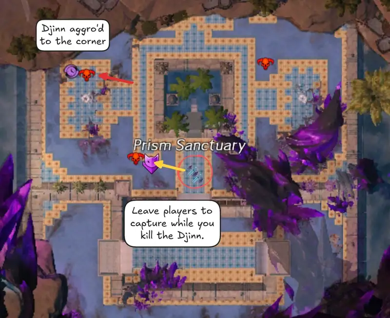
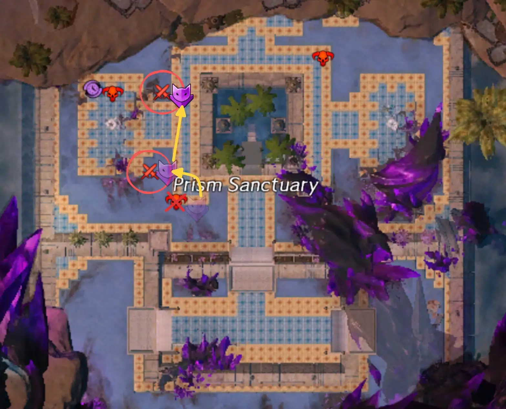
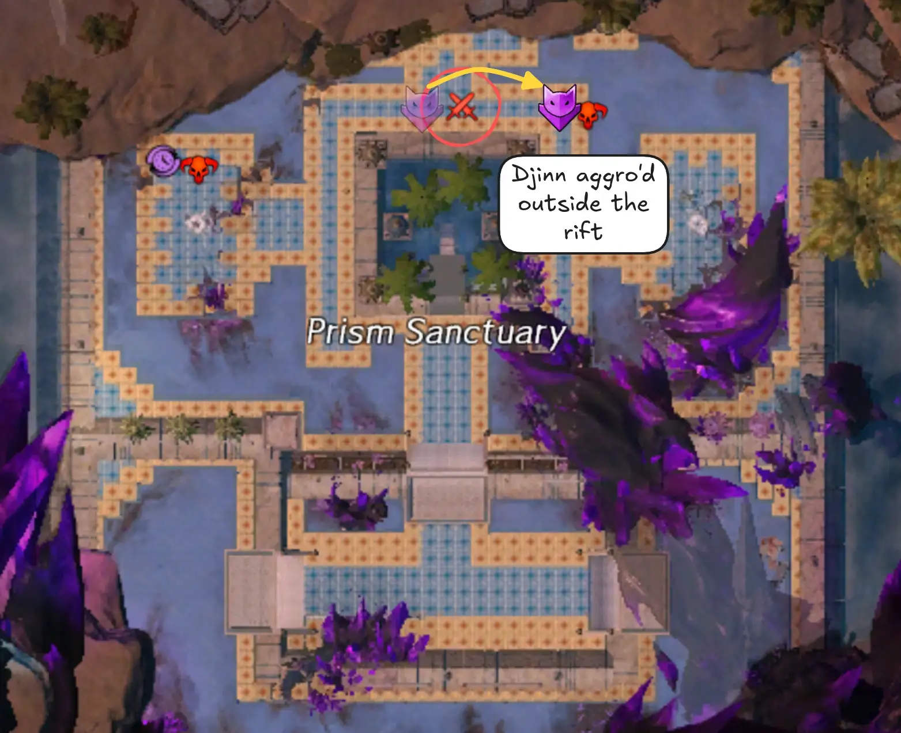
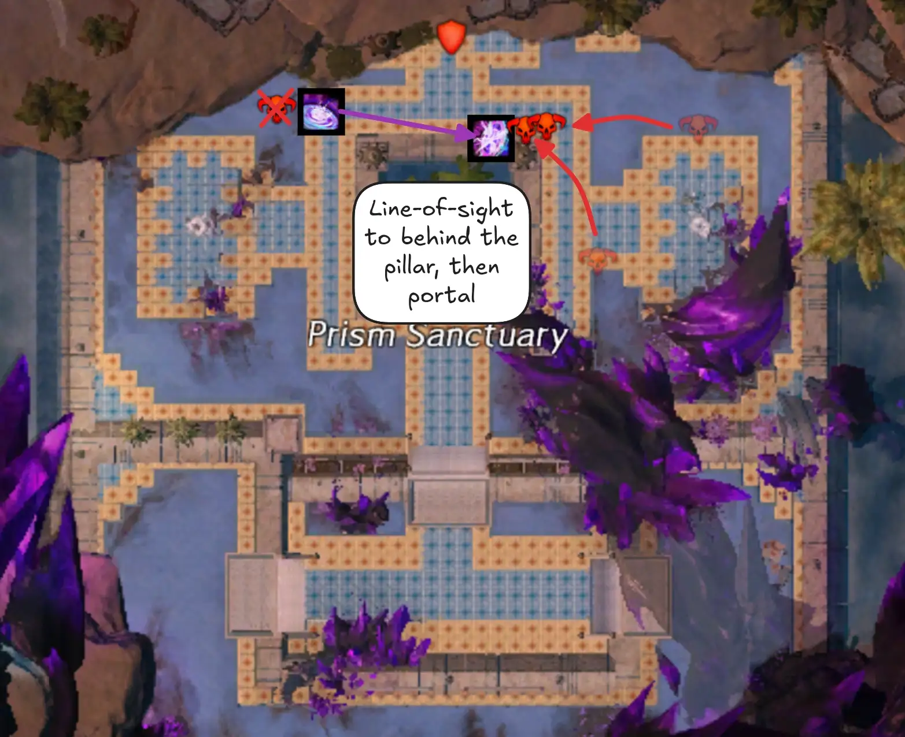
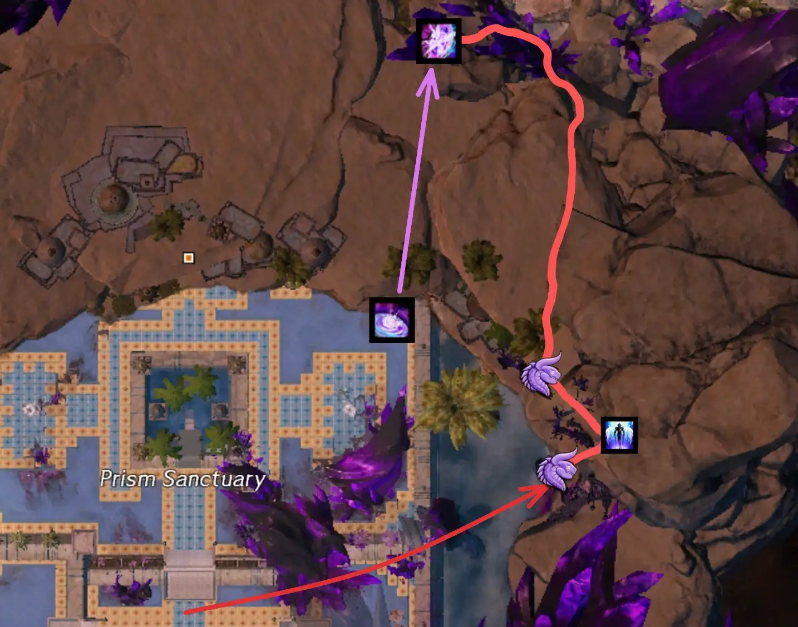

[< Wing 6](../wing-6/){: .btn } [Return to Home](../index.html){: .btn } [Wing 8 >](../wing-8/){: .btn } 
{: .center}

# The Key of Ahdashim
{: .no_toc}

| **Timer** |  18 minutes 30 seconds |
| **Timer Start** |  On approaching  [Glenna]. |

<b>Table of Contents</b>

1. TOC
{:toc}

---

The Key of Ahdashim is a balanced wing, with mix of bosses, events and transitions. As one of the more dialogue-heavy wings in the game, fast clears consistently use out-of-bounds skips to make the timer more manageable.

---

#### Main Points
{: .no_toc}

- Several out-of-bounds skips are used to skip dialogue.
- [Gate] is usually done twice, resetting the first pull to skip the initial dialogue.
- [Adina] is played assuming that players can skip pillars, and splitting the group to kill all hands simultaneously in the split phases.
- [Sabir] optimization revolves around portals for the platform transitions and group invulnerability to skip certain mechanics.
- [Qadim] can be made much faster through efficient tether management and boon strips.

---

## Composition

Compositions for the Key of Ahdashim usually run at least one  [Mesmer] is required for portals. Having two, or a  [Mesmer] and a  [Thief], opens up even more options.

Apart from this requirement, groups are usually free to run whatever they want to maximize their damage output and utility. Some general tips:

#### [Gate]
{: .no_toc}
- Bring classes with high  power burst and cleave.
-  Pulls can make killing groups of adds much faster.
-  Knockbacks can remove adds from rifts and make capturing faster.

#### [Adina]
{: .no_toc}
- Damage pressure is low enough to run a single celestial healer.
- Ensure you have as many sources of projectile reflection as possible.
- Classes that can hit multiple hands at once, such as  [Bladesworn], can greatly speed up the split phases.
- Classes with some ranged damage or that do not mind not hitting the boss for a few seconds are commonly used for baiting pillars.

#### [Sabir]
{: .no_toc}
- Bring abundant crowd control for the  [Defiance Bar].  [Thief] is commonly played due to  [Distracting Throw].
- Bring multiple portals to speed up movement between platforms.
- Projectile reflection or nullification is extremely useful for the final phase.
- Skills that grant group invulnerability or damage prevention let you tank the shockwave, greatly increasing DPS on the boss. These include  ["Rebound!"],  ["We Will Never Yield!"],  [Tale of the August Queen] and  [Xinrae's Weapon].

#### [Qadim]
{: .no_toc}
-  [Deadeye] is by far the best pylon class, bringing the highest damage, sustain and utility at the cost of being relatively hard to play.
-  [Scourge] is another common pylon pick, as it is tanky, easy to play and can provide  [Alacrity] while kiting.
- DPS classes with some ranged damage can be useful when optimizing good tethers.
- Bring abundant boonstrips for the final phase.

---

## Gate

Gate is a relatively long encounter that is optimized in four main ways:
- An initial dialogue skip
- Fast captures by distracting the [Champion Branded Djinns]
- Stacking [Djinns] to kill them faster in the final phase.
- An out-of-bounds break to skip the dialogue in the [Leystone Axis] after the encounter ends.

---

### Initial Dialogue Skip

This is at the same time one of the easiest and most annoying skips to execute, as it requires the squad to complete the encounter up until the point where [Glenna] and the [Key] are opening the door. At this point, make the encounter fail by letting enemies kill [Glenna].

{: .note}
`/gg`ing at this point does not work as you will respawn. Glenna has to die to damage for the encounter to fail.

When you respawn, both NPCs will be in position to immediately begin the encounter, skipping the normal dialogue. The timer will still begin once you approach [Glenna], so you should be ready to begin immediately.

---

### Strategy

The standard Gate speedrun strategy aims to aggro the [Champion Djinn] away from the capture zones so that they do not interfere with capturing.

Once the encounter begins, split up the squad by sending:
- One player to aggro onto the closest [Champion Djinn].
- Another player (usually a healer) to aggro the second [Champion Djinn].
- A player with a   portal to do the [out-of-bounds skip](#out-of-bounds-skip)
- The rest of the squad to quickly clear out the first rift.

Once the rift is clear, you can leave a couple of players on it to continue the capture while the rest of the group kills the [Djinn].

Meanwhile, the healer who aggro'd the furthest Djinn can pull them over to the corner where it cannot interfere for the rest of the event.

{: .note}
Capture speed is unaffected by the number of players in the rift. Capturing only requires for no enemies to be inside the rift's area.

With one [Champion Djinn] dead and the other distracted away, you should be able to easily capture the next two rifts without interference.

Once they are done, you can head over to the final rift. After it has been cleared, you can send the main group over to aggro the final [Djinn], once again preventing it from interfering.

Capturing all rifts progresses the event to the next phase and forcibly despawns all surviving Djinn.

You can then position in preparation for the rest of the event by sending the main group to the spawn location on the west side while a healer goes to the east side.

Once the last three champions spawn, the main group will be in position to kill the first.
Meanwhile, the healer aggros the next two and uses line-of-sight to attract them behind the pillar in front of the gate.

You can then portal in the main group and kill both of them quickly while they are still stacked.

At this point the encounter will be over, and you can either head into the [Leystone Axis] to trigger the dialogue or use a   portal provided via an out-of-bounds break to skip it.

---

### Out-of-Bounds Skip

This skip involves using the  [Skyscale] in combination with  [Bond of Faith] to break out of bounds and get to the location of [Adina]'s pre-event while Gate is still ongoing. You can then place a   portal down and retrace your steps to the gate, portaling the group over once the event ends.

This saves a lot of time, as you skip all the dialogue that occurs in the [Leystone Axis] before the door to [Adina] and [Sabir] are opened. While this time is not strictly necessary to clear the wing, it makes it significantly easier overall.

  OOB Skip PoV

<iframe class="youtube-video center bordered" width="100%" src="https://www.youtube.com/embed/ZeF_aE34Ntk?start=11&end=117" frameborder="0" allow="accelerometer; clipboard-write; encrypted-media; gyroscope; picture-in-picture; web-share" referrerpolicy="strict-origin-when-cross-origin" allowfullscreen></iframe>

{: .note}
[Marker packs] can show you the path to take during the skip for an easier overall experience, as shown in the PoV above.

---

## Cardinal Adina

Adina is a bursty boss with four relatively short phases. Most time gained here comes from optimized split phases and from having enough DPS to skip certain mechanics.

---

### Stacking Pillars

This is when the group aims to phase the boss before [Boulder Barrage], removing the need for moving out and hiding behind pillars. When doing this, the five players baiting the pillars will usually stack in one spot, spawning one single pillar.

Note that, contrary to common belief, this does not directly increase DPS on the boss, as  [Pillar Pandemonium](https://wiki.guildwars2.com/wiki/Pillar_Pandemonium) is only applied by damaged pillars. Instead, stacking has the benefit that baiting players can more easily share boons and support while far from the boss. For this reason, it's best if these players are all part of the same subgroup.

---

### Split Phases

Optimized split phases aim to kill all hands simultaneously. Squads will usually split into two subgroups, with one going north and the other going south. The subgroups can then split again into groups of 2 or 3 players, with each group focusing a hand.

Usually it's best to send the subgroup containing the tank to the south, so that they are in position when the split phase ends.

Any specializations who can damage both hands simultaneously, such as  [Bladesworn] and   [Virtuoso], are very high value. Healers or boon supports can similarly stand between the two hands to help both groups.

---

## Cardinal Sabir

---

## Qadim the Peerless

<!-- Links to other pages in the guide -->
[marker packs]: ../general.html#marker-packs
[Gate]: #gate
[Adina]: #cardinal-adina
[Sabir]: #cardinal-sabir
[Qadim]: #qadim-the-peerless

<!-- Links to classes and specializations -->
[Mesmer]: https://wiki.guildwars2.com/wiki/Mesmer
[Thief]: https://wiki.guildwars2.com/wiki/Thief
[Virtuoso]: https://wiki.guildwars2.com/wiki/Virtuoso
[Bladesworn]: https://wiki.guildwars2.com/wiki/Bladesworn
[Deadeye]: https://wiki.guildwars2.com/wiki/Deadeye
[Scourge]: https://wiki.guildwars2.com/wiki/Scourge

<!-- Links to skills -->
[Bond of Faith]: https://wiki.guildwars2.com/wiki/Bond_of_Faith
["Rebound!"]: https://wiki.guildwars2.com/wiki/%22Rebound!%22
["We Will Never Yield!"]: https://wiki.guildwars2.com/wiki/%22We_Will_Never_Yield!%22
[Tale of the August Queen]: https://wiki.guildwars2.com/wiki/Tale_of_the_August_Queen
[Xinrae's Weapon]: https://wiki.guildwars2.com/wiki/Xinrae's_Weapon
[Distracting Throw]: https://wiki.guildwars2.com/wiki/Distracting_Throw

<!-- Links to buffs and debuffs -->
[Alacrity]: https://wiki.guildwars2.com/wiki/Alacrity

<!-- Links to enemies and enemy skills -->
[Djinn]: https://wiki.guildwars2.com/wiki/Champion_Branded_Djinn
[Champion Djinn]: https://wiki.guildwars2.com/wiki/Champion_Branded_Djinn
[Djinns]: https://wiki.guildwars2.com/wiki/Champion_Branded_Djinn
[Champion Branded Djinns]: https://wiki.guildwars2.com/wiki/Champion_Branded_Djinn
[Boulder Barrage]: https://wiki.guildwars2.com/wiki/Boulder_Barrage

<!-- Other -->
[Leystone Axis]: https://wiki.guildwars2.com/wiki/Leystone_Axis
[Glenna]: https://wiki.guildwars2.com/wiki/Scholar_Glenna
[Key]: https://wiki.guildwars2.com/wiki/Key_of_Ahdashim
[Skyscale]: https://wiki.guildwars2.com/wiki/Skyscale
[Defiance Bar]: https://wiki.guildwars2.com/wiki/Defiance_bar