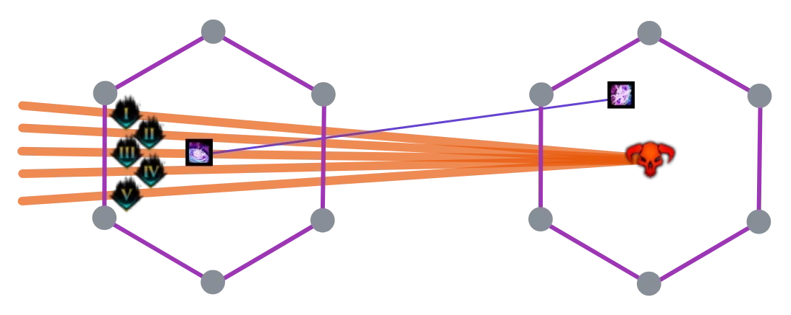
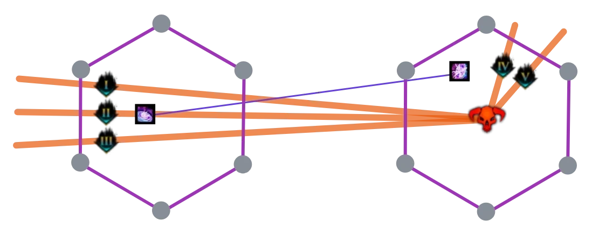

[< Wing 7](../wing-7/){: .btn } [Return to Home](../index.html){: .btn } [Wing 1 >](../wing-1/){: .btn }
{: .center}

# Mount Balrior
{: .no_toc}

| **Timer** |  27 minutes 45 seconds |
| **Timer Start** |  On beginning Decima's pre-event. |

<b>Table of Contents</b>

1. TOC
{:toc}

---

Mount Balrior is a unique wing since its bosses are noticeably longer and more difficult than in any other raid. Fast clears require good damage and clean execution of all three, including the fearsome Legendary Ura. The Infallible timer itself is not too harrying: most of the wing's difficulty comes from the high risk of  [Downstates] and the difficulty of maintaining focus for what is effectively half an hour of the most difficult PvE gameplay Guild Wars has to offer.

#### Main Points
{: .no_toc}
- Standard strategies for Balrior CMs are fairly optimized, so speedruns re-hash many of the same concepts and compositions.
- [Decima] is played with a standard strategy and celestial healers.
- [Greer] can be played in a safer manner, or can be optimized by compressing specialized roles.
- [Ura] can be played with either a [Solo CC] or a [4-man] composition.
- Portals are used to optimize transitions from pre-events into the various bosses.

---

## Composition

Most groups will run two  [Mesmers], as they provide irreplaceable utility. These are usually  [Troubadours], as they have the best healing and defensive skills. At least one  [Thief] is almost always present due to its unparalleled CC capabilities, which are useful on all three bosses.

The rest of the composition is mostly determined by your strategy on [Ura]:
- [Solo CC] compositions are much more flexible but require an experienced Solo CC player.
- [4-man] compositions are rigid but make ranged gameplay easier overall.

For Infallible runs, prioritize consistency and safety over raw damage: redundant defensive utility, [Trailblazer] builds, and comfort picks wherever possible will all improve your experience progressing this wing. 

---

#### Decima
{: .no_toc}
- Bring reliable sources of  [Stability] or  [Aegis] for [Seismic Crash], with  [Aegis] being better than  [Stability].
-   Portals are extremely useful, verging on mandatory, for the split phases.
-  [Troubadour] is the most commonly played healer, as it can run a celestial build to deal decent damage while still providing more than enough defensive capabilities.

#### Greer
{: .no_toc}
-  Condition compositions are preferred, since most DPS can then run full [Trailblazer] with little downside. The start position is also more convenient when transitioning from the pre-event.
- Classes with high cleave are extremely useful for speeding up the split phases and protoling phase.
-  [Troubadour] is the best healer here, as it can completely negate [Eruption of Rot] (greens) with  [Tale of the August Queen].
- Bring large amounts of projectile negation.
- Some special roles can be ignored or compressed into others. Check the [Greer Compositions](#compositions) section for more information.

#### Ura
{: .no_toc}
- Read the [Legendary Ura Composition Guide](https://silverhalf.github.io/mount-balrior/ura-lcm/strategy.html#composition).

---

## Decima, the Stormsinger

While being relatively scripted and thus predictable, this encounter has a large amount of potential downstates and failstates that need to be managed correctly in order to guarantee a smooth, reliable pull. The strategy is overall similar to the [standard turnaround strategy](https://silverhalf.github.io/mount-balrior/decima/strategy.html) with a few optimizations.

---

### Pre-Event - Legendary Conduit

{: .warning}
The Infallible timer starts upon triggering the pre-event. This means that you're essentially forced to begin on Decima, as completing [Greer] first will not count towards achievement completion.

One  [Mesmer] or  [Thief] should pre-position next to the challenge mote at Decima's arena beforehand.

Begin the event with mount skills such as  [Leap] and  [Roll Out]. Strip  [Resolution] from the [Conduit](https://wiki.guildwars2.com/wiki/Mount_Balrior#Legendary_Sentient_Conduit) and burst it down. The  [Mesmer] or  [Thief] will prepare a   portal as soon as the encounter begins, then join the rest of the squad. Open the portal when the miniboss is close to dying and hit the Challenge Mote as soon as possible once the event is complete.

You will have some time before Decima finishes spawning in: use it to swap templates and food and mount up in preparation for the fight.

---

### Strategy

Decima is played using the [standard turnaround strategy](https://silverhalf.github.io/mount-balrior/decima/strategy.html), dividing the squad into a ranged and a melee subgroup, with the melee group handling [Spreads] and [Greens](https://silverhalf.github.io/mount-balrior/decima/mechanics.html#dancing-sparks) and the ranged group baiting [Arrows].

The strategy is extremely scripted and should ideally play out the same way every pull. Players should be familiar with their role and practice in order to perform consistently and reliably.

---

#### High Damage Skips
{: .no_toc}

High damage is especially important in this fight as it will let you skip certain mechanics. In particular, in order of importance, you should try to phase before:
- *Green collection at 80% and 50%* - removes the need for the melee group to move to collect. This skip is one of the premises of the turnaround strategy, and not managing it is an indicator of a serious DPS issue.
- *Third arrows in split phases* - this deals a lot of damage right before the [Flux Nova](https://silverhalf.github.io/mount-balrior/decima/mechanics.html#flux-nova).
- *Final arrows* before 10% - again this can potentially deal a lot of damage and position your kiter far from the group just before the transition.

Additionally, at *70%*, *40%* and *10%*, the boss will become  [Invulnerable] and complete any ongoing mechanics before transitioning into the next phase of the encounter. This can artificially lengthen phase duration, especially in the case of [Arrows] as they have a long animation. Phasing before these mechanics will thus save a lot of time. 

---

#### Split Phase Management
{: .no_toc}

Split phases are one of the places where squads can optimize outside of pure DPS. Groups should have   portals for both subgroups, which should be pre-placed at Decima's location at the beginning of each split phase. They can then be opened once the [Boulders] are close to dying, around *30-40%*.

There are two approaches to managing the adds in this phase:
1. Do not CC them so as to not trigger their special attacks, especially [Sparkwave] at 50%. This is safe, but potentially slower.
2. CC the adds immediately and bait out [Sparkwave]. This is riskier, but also much faster since the adds will be  [Exposed].

The ranged group will have to manage [Arrows] while killing the add. The standard strategy involves spreading out with arrows, then waiting for the mechanic to finish before taking the portal.

With good DPS however, the add will often die before the mechanic is complete: this offers an opportunity to get some DPS back onto the boss faster. For this reason, *4* and *5* will often take the portal early and move off the exit, while *1*, *2* and *3* wait for their arrows to fire before doing so.

This has the double advantage of increasing DPS on the boss (potentially skipping mechanics) and reducing arrow overlap on the ranged add.

If the melee group gets spreads just before the adds die, they should dodge the spreads into the portal.

---

#### Speedrun Split Phases
{: .no_toc}

This is a very risky strategy that is usually only used in dedicated speedruns. The idea is to phase Decima by bringing her to the next health threshold at the same time as when both adds die. This can be done by having the group begin on Decima, then   portaling players out to each add.

This works because the [Boulders] only begin casting [Sparkling Reverberation](https://silverhalf.github.io/mount-balrior/decima/mechanics.html#sparking-reverberation) when enemies are nearby, allowing the group to start them later than usual without getting  [Debilitated](https://wiki.guildwars2.com/wiki/Debilitated_(raid)). However, executing this cleanly requires much more coordination and precise timing compared to the normal strategy. A PoV of this can be seen [here](https://www.youtube.com/watch?v=mKH3KTVqRNs).

---

#### Phase 3 Portal
{: .no_toc}

In phase 3, Decima's jump positions depend on your group's DPS. With good damage, the first jump will often be extremely short, thus not affecting uptime by much.

The second jump however will almost always cross the entire arena, requiring everyone to follow. Optimized groups often improve DPS uptime here by providing a  [Portal] to her new position. This portal can be pre-placed before the [Arrows] preceding her jump, and then opened after  [Blinking](https://wiki.guildwars2.com/wiki/Blink) to her new position.

{: .warning}
Make sure you are correctly providing  [Aegis] before blinking away, or that you have  [Aegis] before taking the portal.

---

### Additional Tips

-  [Tale of the August Queen] is very strong on the melee group as it completely negates the [Spreads]. Save it for when they overlap with the [Green Arrow](https://silverhalf.github.io/mount-balrior/decima/mechanics.html#focused-fluxlance).
- The safest way to play [Spreads] is to not overlap any: this greatly reduces the chances of wiping to a failed dodge.
- If you have to stack the [Spreads], it's convenient to have one person slightly off-group so that everyone can see the AoE filling.
- It's ok to double charge some pylons or let a few greens through. Triple charging is not ok, as it results in additional greens and spreads.
- Healers should train to out-heal the [Flux Nova] consistently, as it is one of the most common sources of  [Downstates]. On Celestial  [Troubadour], this can be done with the sequence:  [Singularity Shot] and  [Crescendo] just before the attack,  [Tale of the Second Scion](https://wiki.guildwars2.com/wiki/Tale_of_the_Second_Scion) during and  [Harmonious Harp] immediately after.
- A  [Mesmer] can provide a  [Portal] from the center of the boss arena to the ley rift to speed up the transition to [Greer].

---

## Greer, the Blightbringer

Greer as an encounter has a large amount of incoming damage and crowd control. [Most common strategies](https://silverhalf.github.io/mount-balrior/greer/strategy.html) therefore focus on mitigation and maintaining damage uptime. Speedrun compositions keep the framework of the standard "Cozy Strat" while focusing on role compression and positioning to improve DPS overall.

This encounter poses a significant  [Downstate] risk and can be a significant hurdle for Infallible clears. Squads attempting the achievement must focus on proper movement and stacking so that everyone benefits from defensive utilities and projectile negation.

---

### Pre-Event - Legendary Blighted Beast

{: .warning}
The Infallible timer starts upon triggering Decima's pre-event. This means that you're essentially forced to begin on Decima, as completing [Greer] first will not count towards achievement completion.

Once [Decima] dies, take the ley rift in her arena to the camp. From there, you can use mounts to quickly reach Greer's pre-event, the [Legendary Blighted Beast].

This miniboss hits hard and has a lot of HP. His *Corrupting Eruption* is a line attack that will often  [Downstate] any players it hits. The wind-up for this attack is identical to [Boneskinner](https://wiki.guildwars2.com/wiki/Boneskinner_(legendary))'s famous AoE smash, and must be treated in the same way: *everyone* dodges this attack.

The [Legendary Blighted Beast] spawns with  [Resolution] that is re-applied every 10 seconds. Try to strip it away as much as possible to kill him faster. The attack where it's sinking into the ground will corrupt boons: step out of its AoE or re-boon quickly.

When the miniboss is close to dying (~25% HP), one player can run to the South-East, prepare a  [Portal], then mount up and run to Greer's challenge mote. The portal can be opened as soon as the pre-event is over: activate the CM and run in to start the fight.

---

### Compositions

Based on the presence of the *bubble* and *10% tank* roles, we can build a table with the four most common Greer compositions.

#### Greer Composition Table
{: .center .no_toc}

| - | **With a bubble** | **Without a bubble** |
| **With a tank** | ["Cozy" Composition](#cozy-composition) | ["Lean" Composition](#lean-composition) |
| **Without a tank** | ["Heal Bubble" Composition](#heal-bubble-composition) | "Lean and Mean" Composition |

#### "Cozy" Composition
{: .no_toc}

This is the standard composition for Greer CM, and is often seen in PUGs. The use of both special roles simplifies the fight noticeably, at the cost of some DPS. The *bubble* is often played by a boonDPS, either a  [Herald] or  [Firebrand], white the *10% tank* is usually on a tanky class running either [Celestial] or [Trailblazer] gear. This composition is very safe: run it if you have no concerns about DPS.

---

#### "Heal Bubble" Composition
{: .no_toc}

This is another favourite in PUG runs. By not running a tank, you ensure an additional DPS on the group in the protoling phase. There is also no risk of the tank going  [Downstate] due to unlucky protoling spawns. However, you will likely have Greer jump on the group during the protoling phase, and will then have to manage the overlap between his attacks and the protos'.

{: .note}
Greer jumping on the group can be seen as an advantage overall, as it makes it much easier to pre-stack conditions on him before the end of the protoling phase.

To combat this issue, the *bubble* is almost always played by a third healer, often a  [Luminary] or  [Vindicator]. This is less of a DPS loss than one may expect, as boonDPS bubbles often have to make quite a few compromises in build and gameplay to fulfill their role.

---

#### "Lean" Composition
{: .no_toc}

These compositions get rid of the *bubble* role and distribute its responsibility over the rest of the squad. Most of the slack is picked up by the  [Mesmers] taking  [Warden's Feedback](https://wiki.guildwars2.com/wiki/Warden's_Feedback) and focus, letting them reflect by alternating  [Feedback] and  [Temporal Curtain](https://wiki.guildwars2.com/wiki/Temporal_Curtain). In this case, each  [Mesmer] reflects the [Empowering Blast] coming from one of the adds in the main phase (double/single).

It's highly recommended to have additional sources of backup nullification distributed through the squad. A common pick is  [Necromancers](https://wiki.guildwars2.com/wiki/Necromancer) with  [Corrosive Poison Cloud](https://wiki.guildwars2.com/wiki/Corrosive_Poison_Cloud).

With these compositions it's common to run a [Trailblazer] DPS as *10% tank*, often a  [Willbender]. This increases the overall safety of the protoling phase, as your two defensive supports can easily get overwhelmed if they have to contend with Greer's attacks on top of the protolings'. The tank will often rejoin the group before the first protoling dies, baiting out the jump in the process.

---

#### "Lean and Mean" Composition
{: .no_toc}

Identical to the "Lean" composition but played without a 10% tank. This will technically give you the best possible role compression and DPS potential overall. This is conditional, however, on your squad being able to maintain defensive capabilities throughout the fight, and especially in the proto phase. If you have experienced healers and feel confident, this composition may work for you.

---

### Additional Tips

- If running two  [Troubadours], you can solve all triple greens on the group using  [Tale of the August Queen]. When doing so, it's beneficial for one of the greens to be slightly off-stack so that the healers can see its progress and time the skill correctly.
- If you're not running a  [Chronomancer], the first reflect can be done by two players, with each taking a side.
-  [Harmonious Harp] differs from  [Distortion](https://wiki.guildwars2.com/wiki/Distortion) in that it always grants two seconds of  [Invulnerability] independent of the number of notes it consumes. This is often not enough to block all three [Blobs of Blight](https://silverhalf.github.io/mount-balrior/greer/mechanics.html#blob-of-blight): get used to dodging the third.
- During the split phases, try to pull Gree to the center of the arena instead of directly to Reeg. This will make it easier to bait Ereg and position the squad closer to Greer at the end of the split phase.
- Any greens or seekers that persist after the boss has died are real: players will need to solve them or they will  [Downstate].

---

## Legendary Ura, the Steamshrieker

Legendary Ura is an extreme challenge that will test the group's ability to focus and play at the top of their game. While clearing this encounter with no  [Downstates] may seem difficult, it can become very consistent with practice. There are no overt one-shots: the fight is more of a consistent build-up, remaining manageable as long as you can keep up, with the risk getting overwhelmed by mechanics if you start falling behind. 

---

### Transition from Greer

Once [Greer] dies and you have solved any lingering mechanics, you should take the ley rift to Camp. From there, the quickest way to Ura is by either using the  [Skyscale] or  [Skimmer] to fly up directly to the arena, or by using the  [Roller Beetle] through the cave. The beetle is faster overall, but also more difficult to maneuver.

Send one person to activate the Legendary mode before beginning the fight. Consider using a ready check if you have enough time.

---

### Composition and Strategy Choice

Strategy wise, speedrunning LCM Ura looks very similar to standard runs. Public strategies are fairly optimized already, as the difficulty of the encounter mandates competency from all involved players. For Infallible runs, groups will have to choose which composition to run.

- [Solo CC] compositions give the squad more leeway overall in class choice, as the only hard requirements are the presence of a CC player and a certain amount of  [Stability] and condition cleanse. Speedrunners often use this composition as it lets experienced groups play around with riskier playstyles, such as solo-healing.
- [4-man] compositions are often preferred by progression groups, especially on the EU server, and are therefore familiar to many players. For Infallible, these force you to run two  [Mesmers] and two  [Thieves]. This is often not an issue, as  [Troubadour] is extremely strong on all three bosses and  [Thief] has some good boonDPS options, but its viability depends strongly on your group's preferences and the current state of the meta.

Almost all Infallible runs ignore [Titanspawners]. The benefits of keeping the group stacked and simplifying the melee rotation are undeniable if your objective is to get a reliable kill.

For more in-depth information on this encounter, read the [Legendary Ura Strategy Guide](https://silverhalf.github.io/mount-balrior/ura-lcm/strategy.html).

---

## Additional Resources

#### PoVs

{: .note}
This is a non-comprehensive list meant to display a diverse selection of perspectives and roles. You do not have to copy them exactly, in fact we encourage you to find whatever strategy that suits your group best.

| Classes | Link | Date | Notes |
|  Cele, Heal |  [PoV](https://www.youtube.com/watch?v=YMYknZsWfhs) | July 2026 | Melee heal on Decima, [lean](#greer-composition-table) Greer, 3-heal rotation on Ura |
|  Cele, Heal |  [PoV](https://www.youtube.com/watch?v=STFUzQYnhNU) | July 2026 | Kite on Decima, [lean & mean](#greer-composition-table) Greer, Solo CC Ura |
|  Cele, Heal |  [PoV](https://www.youtube.com/watch?v=MTeejBsb_OA) | July 2026 | Kite on Decima, [lean](#greer-composition-table) Greer, 4-man Ura |
|   DPS, Solo CC |  [PoV](https://www.youtube.com/watch?v=AkgVw1UcgbM) | July 2026 | [lean & mean](#greer-composition-table) Greer, Solo CC Ura |
|  AlacDPS |  [PoV](https://www.youtube.com/watch?v=hO6LsC023zA) | July 2026 | [Cozy](#greer-composition-table) Greer, 4-man Ura |
|  AlacDPS |  [PoV](https://www.youtube.com/watch?v=HVkl2HJ32qE) | August 2026 | [Heal Bubble](#greer-composition-table) Greer, Solo CC Ura |
|  DPS |  [PoV](https://www.youtube.com/watch?v=og6XYUrdwsM) | August 2026 | [lean](#greer-composition-table) Greer, 4-man Ura |
|  DPS |  [PoV](https://www.youtube.com/watch?v=rHOAEz7L398) | August 2026 | [lean](#greer-composition-table) Greer, Solo CC Ura |

#### Other Useful Links

-  [Wing 8 Infallible Strategy](https://docs.google.com/document/d/1hvqI7ZHifOJ4hLlZUbqybbJXFLuW7qdVejjKIkvXMQY) by [WRDL] is one of the main references for this guide.
- [Complete Mount Balrior CM Guide](https://silverhalf.github.io/mount-balrior) - contains detailed mechanical breakdowns and strategy guides for all CM and LCM bosses in this wing.

[< Wing 7](../wing-7/){: .btn } [Return to Home](../index.html){: .btn } [Wing 1 >](../wing-1/){: .btn } [Return to Top](#mount-balrior){: .btn .fixed}
{: .center}

<!-- Links to other pages in the guide -->
[Decima]: #decima-the-stormsinger
[Greer]: #greer-the-blightbringer
[Ura]: #legendary-ura-the-steamshrieker

<!-- Links to classes and specializations -->
[Thief]: https://wiki.guildwars2.com/wiki/Thief
[Thieves]: https://wiki.guildwars2.com/wiki/Thief
[Mesmer]: https://wiki.guildwars2.com/wiki/Mesmer
[Mesmers]: https://wiki.guildwars2.com/wiki/Mesmer
[Troubadour]: https://wiki.guildwars2.com/wiki/Troubadour
[Troubadours]: https://wiki.guildwars2.com/wiki/Troubadour
[Vindicator]: https://wiki.guildwars2.com/wiki/Vindicator
[Luminary]: https://wiki.guildwars2.com/wiki/Vindicator
[Herald]: https://wiki.guildwars2.com/wiki/Herald
[Firebrand]: https://wiki.guildwars2.com/wiki/Firebrand
[Willbender]: https://wiki.guildwars2.com/wiki/Willbender
[Chronomancer]: https://wiki.guildwars2.com/wiki/Chronomancer

<!-- Links to skills -->
[Distracting Throw]: https://wiki.guildwars2.com/wiki/Distracting_Throw
[Tale of the August Queen]: https://wiki.guildwars2.com/wiki/Tale_of_the_August_Queen
[Portal]: https://wiki.guildwars2.com/wiki/Portal_Entre
[Portals]: https://wiki.guildwars2.com/wiki/Portal_Entre
[Portal Entre]: https://wiki.guildwars2.com/wiki/Portal_Entre
[Leap]: https://wiki.guildwars2.com/wiki/Leap_(Raptor)
[Roll Out]: https://wiki.guildwars2.com/wiki/Roll_Out
[Singularity Shot]: https://wiki.guildwars2.com/wiki/Singularity_Shot
[Crescendo]: https://wiki.guildwars2.com/wiki/Crescendo
[Harmonious Harp]: https://wiki.guildwars2.com/wiki/Harmonious_Harp
[Feedback]: https://wiki.guildwars2.com/wiki/Feedback

<!-- Links to buffs and debuffs -->
[Downstate]: https://wiki.guildwars2.com/wiki/Downstate
[Downstates]: https://wiki.guildwars2.com/wiki/Downstate
[Stability]: https://wiki.guildwars2.com/wiki/Stability
[Aegis]: https://wiki.guildwars2.com/wiki/Aegis
[Resolution]: https://wiki.guildwars2.com/wiki/Resolution
[Invulnerable]: https://wiki.guildwars2.com/wiki/Invulnerability
[Invulnerability]: https://wiki.guildwars2.com/wiki/Invulnerability
[Exposed]: https://wiki.guildwars2.com/wiki/Exposed

<!-- Links to enemies and enemy skills -->
[Seismic Crash]: https://silverhalf.github.io/mount-balrior/decima/mechanics.html#seismic-crash
[Eruption of Rot]: https://silverhalf.github.io/mount-balrior/greer/mechanics.html#eruption-of-rot
[Boulders]: https://silverhalf.github.io/mount-balrior/decima/mechanics.html#transcendent-boulders
[Sparkwave]: https://silverhalf.github.io/mount-balrior/decima/mechanics.html#sparkwave
[Arrows]: https://silverhalf.github.io/mount-balrior/decima/mechanics.html#fluxlances
[Spreads]: https://silverhalf.github.io/mount-balrior/decima/mechanics.html#chorus-of-thunder
[Flux Nova]: https://silverhalf.github.io/mount-balrior/decima/mechanics.html#flux-nova
[Legendary Blighted Beast]: https://wiki.guildwars2.com/wiki/Legendary_Blighted_Beast
[Empowering Blast]: https://silverhalf.github.io/mount-balrior/greer/mechanics.html#empowering-blast 
[Titanspawners]: https://silverhalf.github.io/mount-balrior/ura/mechanics.html#titanspawn-geysers

<!-- Other -->
[Defiance Bar]: https://wiki.guildwars2.com/wiki/Defiance_bar
[Solo CC]: https://silverhalf.github.io/mount-balrior/ura-lcm/strategy.html#solo-cc-compositions
[4-man]: https://silverhalf.github.io/mount-balrior/ura-lcm/strategy.html#4-man-compositions
[Trailblazer]: https://wiki.guildwars2.com/wiki/Trailblazer's
[Celestial]: https://wiki.guildwars2.com/wiki/Celestial
[Skyscale]: https://wiki.guildwars2.com/wiki/Skyscale
[Skimmer]: https://wiki.guildwars2.com/wiki/Skimmer
[Roller Beetle]: https://wiki.guildwars2.com/wiki/Roller_Beetle

[pov tank]: https://www.youtube.com/watch?v=Qeimiyhcrho